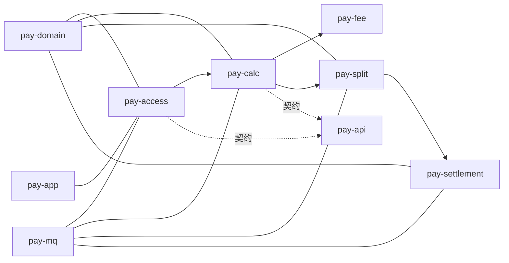

# ai-pay-settle — 支付清算结算系统

支付平台清算、计费分润、中间户结算全链路系统设计方案。

## 文档索引

| 文档 | 说明 | 适用读者 |
|------|------|----------|
| [docs/01-架构设计.md](docs/01-架构设计.md) | 业务架构、分层、主流程、监控、非功能需求 | 架构师、产品、评审 |
| [docs/02-开发手册.md](docs/02-开发手册.md) | 建表 SQL、接口骨架、伪代码、MQ、Redis | 后端开发、AI 代码生成 |
| [docs/03-领域模型与枚举字典.md](docs/03-领域模型与枚举字典.md) | ER 图、聚合边界、全量枚举、单号/金额/时区规范 | 全员统一语言 |
| [docs/04-计费引擎详细设计.md](docs/04-计费引擎详细设计.md) | 规则匹配算法、Pipeline、算例、退款冲销、缓存 | 计费模块开发 |
| [docs/05-结算引擎详细设计.md](docs/05-结算引擎详细设计.md) | T1/D0/H0 批处理、账户操作矩阵、银行适配、对账 | 结算模块开发 |
| [docs/06-清分与账务详细设计.md](docs/06-清分与账务详细设计.md) | 清分规则、科目映射、Outbox、ERP 同步 | 清分/财务对接 |
| [docs/07-接口契约全量规范.md](docs/07-接口契约全量规范.md) | HTTP/RPC/MQ 全量 Schema、错误码 | 前后端联调 |
| [docs/08-单据接入与状态机规范.md](docs/08-单据接入与状态机规范.md) | 8 类单据、状态机转移表、重试策略 | 接入层/算账开发 |
| [docs/09-异常与容错设计.md](docs/09-异常与容错设计.md) | 异常分类、场景矩阵、补偿引擎、挂账/掉单 SOP、差错调整 | 全员必读（清算专家视角） |
| [docs/分库分表.md](docs/分库分表.md) | MySQL 7 库垂直拆分、分表策略、迁移方案 | 架构师、DBA |

## 阅读路径

```
评审/产品  → 01 架构设计 + 09 异常容错（概要）
后端开工   → 03 领域字典 → 02 开发手册 → 分库分表 → 按模块读 04~08
上线前必审 → 09 异常与容错设计（全文）
AI 生成代码 → 02 + 04/05/06 + 07 + 09 补偿 Job
联调       → 07 接口契约
```

## 系统范围

```
上游（交易/支付） → 清算（接入→算账→计费→清分→账务） → 结算（中间户→出款） → 下游（ERP/银行）
```

## Maven 模块说明

每个模块目录下有 `README.md`，描述职责与主数据流。

| 模块 | 职责摘要 | 文档 |
|------|----------|------|
| pay-common | 枚举、异常、分片工具、指标 | [README](pay-common/README.md) |
| pay-api | Service/DTO 契约（无实现） | [README](pay-api/README.md) |
| pay-domain | Entity/Mapper/Repository、分片路由 | [README](pay-domain/README.md) |
| pay-mq | MQ Producer/消费基础设施、积压熔断 | [README](pay-mq/README.md) |
| pay-access | HTTP/MQ 接入落单、触发清算 | [README](pay-access/README.md) |
| pay-calc | 清算编排（计费→清分） | [README](pay-calc/README.md) |
| pay-fee | 计费引擎与规则匹配 | [README](pay-fee/README.md) |
| pay-split | 分账/凭证/Outbox 投递 | [README](pay-split/README.md) |
| pay-settlement | 中间户入账、提现、T+1、对账 | [README](pay-settlement/README.md) |
| pay-control | 商户校验、规则管理、告警工单 | [README](pay-control/README.md) |
| pay-app | Spring Boot 启动与配置聚合 | [README](pay-app/README.md) |
| pay-test | HTTP/MQ 压测工具 | [README](pay-test/README.md) |



## 核心能力

- 全渠道交易单据统一接入清算（收款、退款、充值、奖惩、分账等 8 类）
- 可视化计费规则引擎（固定比例 / 固定金额 / 阶梯递减）
- 多级代理商 + 商户合伙人分润自动计算
- 中间户资金隔离托管，T1 自动结算 + D0 自主提现
- 业财一体化会计凭证对接 ERP
- 全链路监控告警与双人审批

## 技术栈建议

| 层次 | 选型 |
|------|------|
| 语言 | Java 17+ / Spring Boot 3 |
| RPC | Dubbo 3 |
| 消息 | RocketMQ 5 |
| 缓存 | Redis 7 |
| 数据库 | MySQL 8（7 库垂直拆分，开发环境单库 `pay_settle`） |
| 调度 | XXL-Job |
| 监控 | Prometheus + Grafana |

## 版本

- **V1.3** — 2026-07-14 — 对照代码更新设计 + [分库分表设计](docs/分库分表.md)
- **V1.2** — 2026-07-05 — 细化设计 + [异常与容错设计](docs/09-异常与容错设计.md)
- V1.1 — 2026-07-05 — 完善架构、补全附录、修复流程图
