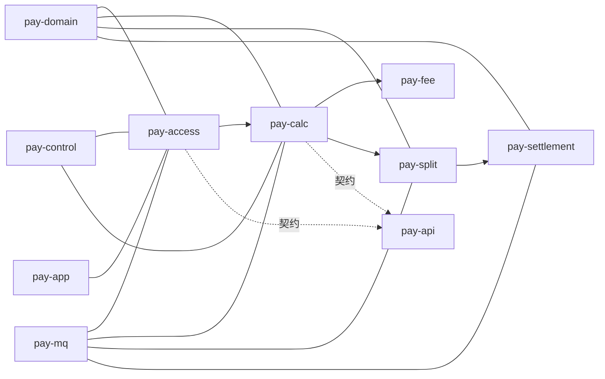

# ai-pay-settle 项目说明

## 一、项目做什么

`ai-pay-settle` 是一套**支付清算与结算**系统：把上游交易/支付产生的各类单据接入后，完成计费分润、清分记账，再进入中间户入账、提现与 T+1 结算，并对接下游 ERP/银行。

主链路可以概括为：

```
上游（交易/支付）
  → 接入落单
  → 清算编排（计费 → 清分）
  → 中间户入账 / 提现 / 批结
  → 下游（ERP / 银行渠道）
```

核心能力包括：

- 多类交易单据统一接入清算（收款、退款、充值、奖惩、分账等）
- 可视化计费规则（比例 / 固定金额 / 阶梯）与多级代理、合伙人分润
- 中间户资金托管：T+1 自动结算、D0 自主提现
- 会计凭证与 Outbox 可靠投递，支撑业财对接
- 分库分表、MQ 有序消费、重试/补偿与监控告警

代码按 Maven 多模块拆分：契约与领域在底层，业务能力按阶段拆模块，`pay-app` 负责组装启动。

---

## 二、模块总览

| 模块 | 一句话职责 |
|------|------------|
| [pay-common](#pay-common) | 公共枚举、异常、分片与工具，无业务编排 |
| [pay-api](#pay-api) | 跨模块 Service/DTO 契约，无实现 |
| [pay-domain](#pay-domain) | Entity/Mapper/Repository、分片路由与数据访问 |
| [pay-mq](#pay-mq) | MQ 生产/消费基础设施、积压熔断与 DLQ |
| [pay-access](#pay-access) | HTTP/MQ 接入落单，触发清算 |
| [pay-calc](#pay-calc) | 清算任务编排：校验 → 计费 → 清分 |
| [pay-fee](#pay-fee) | 计费引擎与规则匹配、分润计算 |
| [pay-split](#pay-split) | 分账明细、凭证、Outbox 投递入账消息 |
| [pay-settlement](#pay-settlement) | 中间户账户、提现、T+1、对账 |
| [pay-control](#pay-control) | 商户校验、规则管理、告警与异常工单 |
| [pay-app](#pay-app) | Spring Boot 启动入口与配置聚合 |
| [pay-test](#pay-test) | 独立 HTTP/MQ 压测工具（不参与运行时装配） |

模块协作关系（简图）：



---

## 三、各模块说明

### pay-common

**公共基础库**。提供枚举、业务异常、金额/序列号工具、分片路由常量（如 `merchant_id % 16`）、业务指标等横切能力。

- 不含业务编排，不做持久化
- 几乎被所有 `pay-*` 模块依赖

### pay-api

**跨模块契约层**。只定义 Service 接口与 DTO，不写实现，用来切断循环依赖、稳定模块边界。

典型接口视角上的调用链：

1. `BillAccessService` — 接入落单  
2. `ClearanceTaskService` — 清算编排  
3. `FeeCalcService` — 计费  
4. `SplitService` — 清分 + Outbox  
5. `SettleAccountService` — 入账 / 提现 / T+1  
6. `MerchantValidateService` — 商户与单据校验  

实现分别落在 access / calc / fee / split / settlement / control。

### pay-domain

**领域持久化层**。承载 Entity、MyBatis Mapper、Repository，以及 `ShardRouteService` 等分片路由能力。

- 统一访问配置库（`pay_config`：规则、路由等）与业务分片库（`pay_data_*`：账单、任务、账户等）
- 业务模块通过 Repository 读写，不直接散落 SQL

### pay-mq

**消息基础设施**。封装 Topic/Tag/ConsumerGroup、统一 Producer、Local MQ 与 RocketMQ 双模式、消费异常分类、积压熔断与 DLQ 巡检。

主链路 Topic 大致包括：

| Topic | 作用 |
|-------|------|
| `trade_pay_topic` / `trade_refund_topic` | 交易 / 退款接入 |
| `clearance_task_topic` | 清算任务（按商户有序） |
| `settle_amount_topic` | 清分后入账 |
| `payment_result_topic` | 出款结果回调 |

业务模块只依赖本模块的发送与监听封装，不直接耦合 MQ 细节。

### pay-access

**接入层**。对外暴露 HTTP API，并消费交易/退款 MQ；负责落 `trade_bill`、注册 `bill_route`、触发清算任务，同时提供提现、控制台、DLQ 重放等入口。

- 典型入口：`POST /api/v1/clearance/bill/submit`，以及 `TradePayConsumer` / `TradeRefundConsumer`
- 含接入前商户校验、积压熔断、路由补偿 Job

### pay-calc

**清算编排（算账）**。创建/抢占/执行 `clearance_task`，按顺序串联「商户校验 → 计费 → 清分」，维护账单与任务状态，并做失败重试与超时看门狗。

- MQ：`ClearanceTaskConsumer` 消费清算任务
- 同步调用 `pay-fee`、`pay-split`
- 补偿：`ClearanceRetryJob` 等对 FAILED 任务重投或本地重试

### pay-fee

**计费引擎**。按商户与业务维度匹配 `fee_share_rule`，计算平台费、代理/合伙人分润与商户净收入，幂等写入 `fee_calc_result`。

- 正向：平台 → 一级代理 → 二级代理 → 合伙人 → 商户净额
- 退款：按原单冲销或按比例回退
- 主要由 `pay-calc` 在清算流程中同步调用

### pay-split

**清分与可靠投递**。根据计费结果生成分账明细与会计凭证，写入 Outbox；再由 Job 把 Outbox 投递到 `settle_amount_topic`，保证「清分落库 → 入账消息」最终一致。

- 主实现：`SplitServiceImpl`、凭证生成、`OutboxDispatchJob`
- 补偿：有分账无 Outbox、计费成功缺分账等场景的补偿 Job

### pay-settlement

**结算与资金账户**。中间户入账/出账、冻结提现、T+1 批结、渠道回调、日终对账。同一商户账户变更在同分片内串行（有序消费 + 乐观锁）。

| 流程 | 说明 |
|------|------|
| 入账 | 消费 `settle_amount_topic`，增加待结算余额与流水 |
| 提现 | 冻结合额 → 调支付渠道 → 回调解冻/扣减 |
| T+1 | 定时扫描可结算商户批量出款 |
| 对账 | 按商户日生成对账单 |

### pay-control

**管控与校验横切层**。提供商户/单据校验、计费规则管理、告警、异常工单、库容量监控等，不直接跑清算主链路。

- 接入前门禁：`MerchantValidateService`
- 运维侧：规则维护、告警、异常落库工单

### pay-app

**可运行启动模块（Spring Boot 宿主）**。聚合各业务模块依赖，加载数据源、分片初始化、HTTP 与 Actuator；本身几乎不含业务逻辑，是部署与联调入口。

常用 Profile：

| Profile | 用途 |
|---------|------|
| `mysql` | 单库开发（如 `pay_settle`） |
| `h2` | 内存库单测 |
| `mq` | 启用 RocketMQ |
| `sharding` | 配置库 + ShardingSphere 业务分片 |

启动示例：

```bash
# 单库 + MQ
java -jar pay-app/target/pay-app-*.jar --spring.profiles.active=mysql,mq

# 分片联调（可用 Local MQ，避免积压）
java -jar pay-app/target/pay-app-*.jar --spring.profiles.active=mysql,sharding
```

### pay-test

**独立压测工具**。不参与 `pay-app` 运行时装配。提供 HTTP 清算灌单与 MQ `trade_pay_topic` 压测，输出 TPS/延迟等报告。

- HTTP：`ClearanceLoadTestMain` / `run-load-test.sh`
- MQ：`MqLoadTestMain` / `run-mq-load-test.sh`

---

## 四、端到端数据流（串起来看）

1. **接入**：HTTP 或交易 MQ → `pay-access` 落账单、写路由 → 发布清算任务  
2. **算账**：`pay-calc` 抢任务 → 校验（`pay-control`）→ `pay-fee` 计费 → `pay-split` 清分并写 Outbox  
3. **投递**：Outbox Job 发 `settle_amount_topic`  
4. **结算**：`pay-settlement` 入账中间户；后续提现 / T+1 / 对账  
5. **横切**：`pay-mq` 承载消息，`pay-domain`/`pay-common` 提供数据与基础类型，`pay-app` 把以上模块装成一个进程

更细的职责与类级说明见各模块目录下的 `README.md`；架构与详细设计见根目录 `README.md` 中的 `docs/` 索引。
