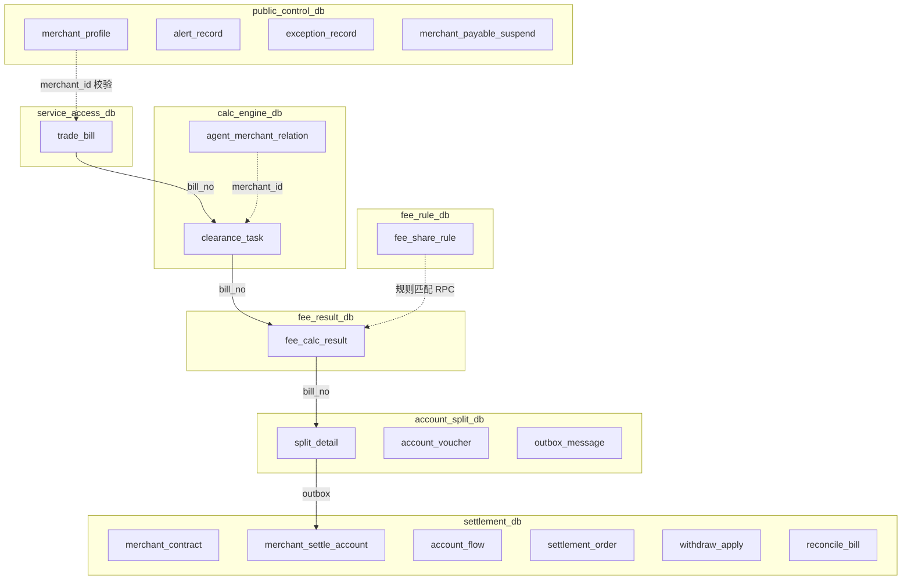
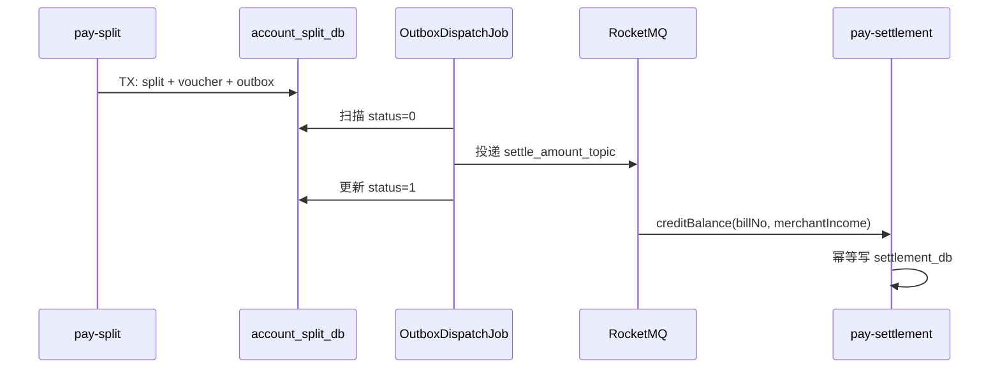

# MySQL 7 库垂直拆分设计

> 版本：V1.0 | 日期：2026-07-14 | 类型：数据库架构 / DBA 交付  
> 依据：[01-架构设计](docs/01-架构设计.md) · [02-开发手册](docs/02-开发手册.md) · [03-领域模型](docs/03-领域模型与枚举字典.md) · 当前代码 `pay-app/src/main/resources/db/schema.sql`

---

## 1. 背景与目标

### 1.1 现状（代码实现）

当前为 **单体 Spring Boot**（`pay-app`），全部数据落在单库 `pay_settle`，共 **18 张表**：

| # | 表名 | Entity |
|---|------|--------|
| 1 | trade_bill | TradeBillEntity |
| 2 | clearance_task | ClearanceTaskEntity |
| 3 | fee_share_rule | FeeShareRuleEntity |
| 4 | agent_merchant_relation | AgentMerchantRelationEntity |
| 5 | merchant_profile | MerchantProfileEntity |
| 6 | merchant_contract | MerchantContractEntity |
| 7 | fee_calc_result | FeeCalcResultEntity |
| 8 | split_detail | SplitDetailEntity |
| 9 | outbox_message | OutboxMessageEntity |
| 10 | merchant_settle_account | MerchantSettleAccountEntity |
| 11 | account_flow | AccountFlowEntity |
| 12 | settlement_order | SettlementOrderEntity |
| 13 | withdraw_apply | WithdrawApplyEntity |
| 14 | merchant_payable_suspend | MerchantPayableSuspendEntity |
| 15 | account_voucher | AccountVoucherEntity |
| 16 | reconcile_bill | ReconcileBillEntity |
| 17 | alert_record | AlertRecordEntity |
| 18 | exception_record | ExceptionRecordEntity |

数据源配置见 `application-mysql.yml`，单 Hikari 连接池指向 `pay_settle`。

### 1.2 目标（生产架构）

按业务域 **垂直拆分为 7 个独立 MySQL 库**，与架构文档 §2.4 部署拓扑一致：

```
service_access_db  → 接入域
public_control_db  → 管控域
calc_engine_db     → 算账域
fee_rule_db        → 规则域
fee_result_db      → 计费结果域
account_split_db   → 清分账务域
settlement_db      → 结算域
```

**拆分原则：**

1. **按限界上下文（Bounded Context）切库**，而非按读写比例或表大小随意组合
2. **禁止跨库 JOIN / 跨库事务**；跨域关联仅通过业务键（`bill_no` / `merchant_id` / `settle_no`）+ MQ / Dubbo RPC
3. **资金域（settlement_db）与清算域物理隔离**，降低清算热点冲击结算账户
4. **开发环境保留单库** `pay_settle` 以降低本地复杂度；生产走 7 库

---

## 2. 七库总览



### 2.1 库清单速查

| 库名 | 中文名 | 表数（已实现） | 主写服务 | 预估日增量 |
|------|--------|---------------|----------|-----------|
| service_access_db | 接入库 | 1 | pay-access | 与交易 TPS 同量级 |
| public_control_db | 管控库 | 4 | pay-control | 低（万级/日） |
| calc_engine_db | 算账库 | 2 | pay-calc | 与清算任务同量级 |
| fee_rule_db | 规则库 | 1 | pay-fee / pay-control | 极低（配置变更） |
| fee_result_db | 计费结果库 | 1 | pay-calc / pay-fee | 与订单同量级 |
| account_split_db | 清分库 | 3 | pay-split | 清分行 ≈ 订单 × 3~5 |
| settlement_db | 结算库 | 6 | pay-settlement | 账户流水 + 结算单 |

---

## 3. 各库详细设计

### 3.1 service_access_db — 接入库

**职责：** 原始清算单据接入、幂等落库、状态维护（PENDING → CLEARED / WAIT_ORIGIN）。

**归属表：**

| 表 | 说明 | 主键/幂等键 |
|----|------|------------|
| trade_bill | 8 类清算单据 | `bill_no` UK |

**读写特征：**

- 写：MQ/HTTP 接入时 INSERT；清算完成后 UPDATE status
- 读：接入幂等校验、运营查询、T+1 渠道对账
- 热点索引：`uk_bill_no`、`idx_merchant_date`、`idx_order_no`

**服务映射：** `pay-access`（BillAccessServiceImpl、TradePayConsumer、TradeRefundConsumer）

**跨库依赖：**

| 方向 | 依赖 | 方式 |
|------|------|------|
| 写出 | calc_engine_db | MQ `clearance_task_topic` 投递清算任务 |
| 读入 | public_control_db | Dubbo 校验 merchant_profile.status |

```sql
-- 建库
CREATE DATABASE IF NOT EXISTS service_access_db
  DEFAULT CHARACTER SET utf8mb4 COLLATE utf8mb4_unicode_ci;

USE service_access_db;
-- 建表 DDL 见 docs/02-开发手册.md §2.2
```

---

### 3.2 public_control_db — 管控库

**职责：** 主数据、审批、告警、异常工单、应付挂账、补偿日志。

**归属表：**

| 表 | 说明 | 代码状态 |
|----|------|----------|
| merchant_profile | 商户档案 | ✅ 已实现 |
| alert_record | 告警记录 | ✅ 已实现 |
| exception_record | 异常工单 | ✅ 已实现 |
| merchant_payable_suspend | 退款余额不足挂账 | ✅ 已实现 |
| approval_record | 审批记录（规则/出款） | 🔲 设计预留 |
| compensate_log | 补偿 Job 幂等日志 | 🔲 设计预留 |
| adjustment_order | 差错调整单 | 🔲 设计预留 |

**读写特征：**

- 写频率低，读频率中（接入校验、操作台查询）
- `exception_record` 与 `alert_record` 由 DbCapacityMonitorJob 巡检

**服务映射：** `pay-control`（MerchantValidateServiceImpl、FeeRuleServiceImpl、AlertService、ExceptionRecordService）

**跨库依赖：**

| 方向 | 场景 | 方式 |
|------|------|------|
| 被读 | 接入层商户冻结校验 | Dubbo `validateMerchant(merchantId)` |
| 被读 | 计费规则审批 | 操作台 HTTP → control 写 approval_record |
| 写出 | settlement_db | 挂账抵扣触发 MQ 通知结算入账 |

> **设计决策：** `merchant_payable_suspend` 归管控库而非结算库，因其属于异常/挂账域（EX-04xx），与 exception_record 同属人机协同处置链路，见 [09-异常与容错设计](docs/09-异常与容错设计.md)。

```sql
CREATE DATABASE IF NOT EXISTS public_control_db
  DEFAULT CHARACTER SET utf8mb4 COLLATE utf8mb4_unicode_ci;
-- 建表 DDL 见 docs/02-开发手册.md §2.8
```

---

### 3.3 calc_engine_db — 算账库

**职责：** 清算任务调度、分片领取、代理关系模型、任务状态机。

**归属表：**

| 表 | 说明 | 主键/幂等键 |
|----|------|------------|
| clearance_task | 清算任务 | `bill_no` UK |
| agent_merchant_relation | 代理-商户-合伙人关系 | `rel_id` |

**读写特征：**

- 写：任务创建（PENDING）、CAS 领取（RUNNING）、结果回写（SUCCESS/FAILED/DEAD）
- 读：分片扫描 `idx_status_shard`、重试扫描 `idx_clearance_next_retry`
- 关系表：启动时预加载 + Redis 缓存，变更事件刷新

**服务映射：** `pay-calc`（ClearanceTaskServiceImpl、ClearanceTaskConsumer、ClearanceRetryJob）

**分片键：** `shard_id = merchant_id % shard_count`（默认 shard_count=16，可配置）

**跨库依赖：**

| 方向 | 场景 | 方式 |
|------|------|------|
| 读入 | fee_rule_db | Dubbo 规则匹配 RPC |
| 读入 | calc 关系 | 本地 agent_merchant_relation + Redis |
| 写出 | fee_result_db | 同事务域内 RPC 后写 fee_calc_result |
| 写出 | pay-split | Dubbo `generateSplitDetail` |

```sql
CREATE DATABASE IF NOT EXISTS calc_engine_db
  DEFAULT CHARACTER SET utf8mb4 COLLATE utf8mb4_unicode_ci;
-- 建表 DDL 见 docs/02-开发手册.md §2.3
```

---

### 3.4 fee_rule_db — 规则库

**职责：** 计费分润规则配置、审批后生效、规则版本管理。

**归属表：**

| 表 | 说明 | 代码状态 |
|----|------|----------|
| fee_share_rule | 分润规则主表 | ✅ 已实现 |
| fee_rule_audit_log | 规则变更审计 | 🔲 设计预留 |

**读写特征：**

- 写：极低（运营配置 + 审批通过后 UPDATE status）
- 读：极高（每笔清算 RPC 匹配）；**必须 Redis 缓存**，DB 为权威源
- 索引：`idx_match_dim (business_line, category, city_code, status)`

**服务映射：** `pay-fee`（FeeCalcServiceImpl、FeeCalcPipeline、RuleMatcher）

**缓存策略：**

```
Redis Key: fee:rule:{targetType} → ZSet(维度键, 规则 JSON)
刷新时机: 审批通过 → 删 Key → 下次读穿透加载
```

**跨库依赖：** 纯只读被 calc/fee 服务 Dubbo 调用，无主动跨库写。

```sql
CREATE DATABASE IF NOT EXISTS fee_rule_db
  DEFAULT CHARACTER SET utf8mb4 COLLATE utf8mb4_unicode_ci;
-- 建表 DDL 见 docs/02-开发手册.md §2.4
```

---

### 3.5 fee_result_db — 计费结果库

**职责：** 每笔订单完整计费明细持久化，供清分、对账、审计。

**归属表：**

| 表 | 说明 | 主键/幂等键 |
|----|------|------------|
| fee_calc_result | 计费结果 | `bill_no` UK |

**读写特征：**

- 写：清算成功时 INSERT（一次写入，不更新）
- 读：清分服务 RPC 入参、日终清算对账（trade_bill vs fee_calc_result）
- `rule_snapshot` 存 JSON 快照，保证规则变更后可追溯

**服务映射：** `pay-fee` 计算 + `pay-calc` 落库（当前单体中 Calc 与 Fee 同进程）

**跨库约束：**

- 清分半成功时 **禁止删除** fee_calc_result（EX-0207），补偿 Job 仅续跑 split
- 与 trade_bill 通过 `bill_no` 逻辑关联，不做物理外键

```sql
CREATE DATABASE IF NOT EXISTS fee_result_db
  DEFAULT CHARACTER SET utf8mb4 COLLATE utf8mb4_unicode_ci;
-- 建表 DDL 见 docs/02-开发手册.md §2.5
```

---

### 3.6 account_split_db — 清分账务库

**职责：** 多方应收应付拆分、会计凭证、可靠消息 Outbox。

**归属表：**

| 表 | 说明 | 事务边界 |
|----|------|----------|
| split_detail | 清分明细 | 与 voucher、outbox 同事务 |
| account_voucher | 会计凭证 | 同上 |
| outbox_message | 可靠消息发件箱 | 同上 |

**核心事务（单库本地）：**

```java
@Transactional  // account_split_db 单库事务
void generateSplit(FeeCalcResult r) {
    insert split_detail × N;
    insert account_voucher × M;
    insert outbox_message;   // topic = settle_amount_topic
}
```

**服务映射：** `pay-split`（SplitServiceImpl、OutboxDispatchJob、SplitCompensateJob、VoucherGenerator）

**跨库协作（Outbox 模式）：**



**监控指标（已实现）：** `pay_table_pending_count{table=outbox_message}`、`pay_outbox_pending_age_seconds`

```sql
CREATE DATABASE IF NOT EXISTS account_split_db
  DEFAULT CHARACTER SET utf8mb4 COLLATE utf8mb4_unicode_ci;
-- 建表 DDL 见 docs/02-开发手册.md §2.6
```

---

### 3.7 settlement_db — 结算库

**职责：** 商户签约、中间户余额、账户流水、结算出款、提现、对账。

**归属表：**

| 表 | 说明 | 一致性要求 |
|----|------|-----------|
| merchant_contract | 签约合同（阶梯月数、结算模式） | 与 profile 逻辑关联 |
| merchant_settle_account | 中间户（wait/frozen + version） | 乐观锁，资金核心 |
| account_flow | 账户流水 | 每次余额变更必写 |
| settlement_order | 结算单 | settle_no 幂等 |
| withdraw_apply | D0 提现申请 | apply_no 幂等 |
| reconcile_bill | 商户日对账单 | merchant_id + bill_date UK |

**资金不变量（日终校验）：**

```
wait_balance >= 0
frozen_balance >= 0
wait_balance + frozen_balance = Σ(account_flow 净额)
```

**服务映射：** `pay-settlement`（SettleAccountServiceImpl、SettleAmountConsumer、PaymentResultConsumer、ReconcileServiceImpl、AccountOperator）

**并发控制：**

- `merchant_settle_account.version` 乐观锁，失败重试 3 次
- 高并发 D0 可选 Redis 分布式锁 `settle:lock:{merchantId}`

**跨库依赖：**

| 方向 | 场景 | 方式 |
|------|------|------|
| 读入 | account_split_db | MQ `settle_amount_topic` 入账 |
| 读入 | public_control_db | 挂账抵扣时查 merchant_payable_suspend |
| 被读 | 操作台 | Dubbo 查询余额/结算单 |

```sql
CREATE DATABASE IF NOT EXISTS settlement_db
  DEFAULT CHARACTER SET utf8mb4 COLLATE utf8mb4_unicode_ci;
-- 建表 DDL 见 docs/02-开发手册.md §2.7
```

---

## 4. 服务与数据源映射

生产拆服务后，各模块仅持有本域数据源（管控服务可读多库通过 Dubbo 聚合，不直连他人库）。

| Maven 模块 | 主数据源 | 辅读（RPC/缓存） |
|------------|----------|-----------------|
| pay-access | service_access_db | public_control（商户校验） |
| pay-control | public_control_db | — |
| pay-calc | calc_engine_db + fee_result_db | fee_rule_db（RPC）、Redis |
| pay-fee | fee_rule_db | Redis |
| pay-split | account_split_db | fee_result_db（RPC 入参） |
| pay-settlement | settlement_db | public_control（挂账） |
| pay-app（过渡期单体） | pay_settle（全部） | — |

### 4.1 多数据源配置草案

```yaml
# application-prod.yml（拆分后）
spring:
  datasource:
    dynamic:
      primary: access
      strict: true
      datasource:
        access:
          url: jdbc:mysql://mysql-access:3306/service_access_db
        control:
          url: jdbc:mysql://mysql-control:3306/public_control_db
        calc:
          url: jdbc:mysql://mysql-calc:3306/calc_engine_db
        fee-rule:
          url: jdbc:mysql://mysql-fee:3306/fee_rule_db
        fee-result:
          url: jdbc:mysql://mysql-fee:3306/fee_result_db
        split:
          url: jdbc:mysql://mysql-split:3306/account_split_db
        settlement:
          url: jdbc:mysql://mysql-settle:3306/settlement_db
```

**实现建议：** MyBatis-Plus + `dynamic-datasource-spring-boot-starter`，Mapper 按包路径绑定数据源：

```
com.payment.domain.mapper.TradeBillMapper        → access
com.payment.domain.mapper.MerchantProfileMapper  → control
com.payment.domain.mapper.ClearanceTaskMapper    → calc
...
```

---

## 5. 跨库逻辑关联

物理外键全部移除，通过业务键维持逻辑一致性：

| 逻辑关联 | 左表（库） | 右表（库） | 关联键 |
|----------|-----------|-----------|--------|
| 单据 → 任务 | trade_bill (access) | clearance_task (calc) | bill_no |
| 任务 → 计费 | clearance_task (calc) | fee_calc_result (result) | bill_no |
| 计费 → 清分 | fee_calc_result (result) | split_detail (split) | bill_no |
| 清分 → 入账 | outbox (split) | account_flow (settlement) | bill_no（MQ 载荷） |
| 结算单 → 提现 | settlement_order (settlement) | withdraw_apply (settlement) | settle_no |
| 商户主数据 | merchant_profile (control) | *（全域） | merchant_id |
| 签约 → 账户 | merchant_contract (settlement) | merchant_settle_account (settlement) | merchant_id |
| 关系 → 计费 | agent_merchant_relation (calc) | fee_calc_result (result) | merchant_id |

**禁止操作：**

- ❌ `SELECT ... FROM trade_bill JOIN fee_calc_result`
- ❌ 跨库 `@Transactional` 两阶段提交
- ✅ 应用层组装 + 运营台分步查询
- ✅ 日终对账 Job 分库拉取后在数仓/对账服务 JOIN

---

## 6. 分表策略（按需）

**默认不分表。** 7 库垂直拆分已隔离写入热点，单表预估 3 年内 < 3000 万行。

| 表 | 库 | 分表触发条件 | 推荐方案 |
|----|-----|-------------|----------|
| trade_bill | access | > 3000 万行 | 按月 RANGE 分区 `PARTITION BY RANGE (TO_DAYS(create_time))` |
| account_flow | settlement | > 3000 万行 | 按月分区或冷数据归档至 OSS |
| split_detail | split | > 5000 万行 | 按月分区 |
| fee_calc_result | result | > 3000 万行 | 按月分区 + 两年以上归档 |
| clearance_task | calc | 任务完成后 | 定期归档 SUCCESS 行到 history 表 |

**不推荐：** ShardingSphere 水平分片（当前业务无跨商户热点，垂直拆分足够）。

**冷数据归档：**

```
SUCCESS 状态 clearance_task > 90 天 → calc_clearance_task_hist（同库或 ClickHouse）
account_flow > 2 年 → 归档库，结算库保留近 13 个月
```

---

## 7. 数据一致性保障

### 7.1 单库内

| 场景 | 机制 |
|------|------|
| 清分三表写入 | account_split_db 本地事务 |
| 余额 + 流水 | settlement_db 本地事务 |
| 账户并发 | version 乐观锁 |

### 7.2 跨库

| 链路 | 模式 | 幂等键 |
|------|------|--------|
| 接入 → 算账 | MQ `clearance_task_topic` | bill_no |
| 算账 → 清分 | Dubbo 同步调用 | bill_no |
| 清分 → 结算 | Outbox + MQ `settle_amount_topic` | bill_no |
| 结算 → 银行 | HTTP + MQ `payment_result_topic` | settle_no |
| 补偿 Job | compensate_log（control 库） | biz_key + comp_type |

### 7.3 对账兜底

| 对账类型 | 频率 | 参与库 |
|----------|------|--------|
| 渠道对账 | T+1 | access vs 渠道文件 |
| 清算对账 | 日 | access.trade_bill vs result.fee_calc_result |
| 清分对账 | 日 | result.fee_calc_result vs split.split_detail |
| 资金对账 | 日 | split 商户应付合计 vs settlement 入账流水 |
| 结算对账 | T+1 | settlement.settlement_order vs 银行回单 |

---

## 8. 从单库迁移方案

### 8.1 迁移阶段


| 阶段 | 动作 | 回滚 |
|------|------|------|
| Phase 0 | 现状；schema.sql 建 18 表 | — |
| Phase 1 | 配置 7 数据源；写操作双写 pay_settle + 目标库 | 关闭双写即可 |
| Phase 2 | 读流量按模块切到目标库；对账校验一致性 | 读切回 pay_settle |
| Phase 3 | 停写 pay_settle；保留只读副本 30 天 | 从副本恢复 |
| Phase 4 | 拆分为独立 K8s 服务，各持本库连接 | 服务合并 |

### 8.2 数据搬迁 SQL 示例

```sql
-- 以 trade_bill 为例（全量搬迁）
INSERT INTO service_access_db.trade_bill
SELECT * FROM pay_settle.trade_bill;

-- 增量双写期校验
SELECT COUNT(*) FROM pay_settle.trade_bill;
SELECT COUNT(*) FROM service_access_db.trade_bill;
-- 抽样 bill_no 逐字段比对
```

### 8.3 表 → 库搬迁清单

| 源表 (pay_settle) | 目标库 |
|-------------------|--------|
| trade_bill | service_access_db |
| merchant_profile, alert_record, exception_record, merchant_payable_suspend | public_control_db |
| clearance_task, agent_merchant_relation | calc_engine_db |
| fee_share_rule | fee_rule_db |
| fee_calc_result | fee_result_db |
| split_detail, account_voucher, outbox_message | account_split_db |
| merchant_contract, merchant_settle_account, account_flow, settlement_order, withdraw_apply, reconcile_bill | settlement_db |

---

## 9. 容量与部署建议

### 9.1 实例规格（生产起步）

| 库 | CPU/内存 | 磁盘 | 副本 |
|----|----------|------|------|
| service_access_db | 8C16G | 500GB SSD | 1 主 2 从 |
| calc_engine_db | 8C16G | 200GB SSD | 1 主 2 从 |
| fee_result_db | 8C16G | 1TB SSD | 1 主 2 从 |
| account_split_db | 8C16G | 1TB SSD | 1 主 2 从 |
| settlement_db | 16C32G | 500GB SSD | 1 主 2 从（资金域加强） |
| fee_rule_db | 4C8G | 50GB SSD | 1 主 1 从 |
| public_control_db | 4C8G | 100GB SSD | 1 主 1 从 |

### 9.2 连接池

| 服务 | 目标库 | maxPoolSize |
|------|--------|-------------|
| pay-access | access | 30 |
| pay-calc | calc + result | 各 40 |
| pay-split | split | 30 |
| pay-settlement | settlement | 50 |
| pay-control | control | 20 |
| pay-fee | fee-rule | 20 |

### 9.3 备份策略

- 全量备份：每日 03:00；settlement_db binlog 实时同步备库
- 恢复演练：季度一次，重点验证 settlement_db 时间点恢复
- **RPO ≤ 5min，RTO ≤ 30min**（资金域）

---

## 10. 监控与告警

沿用 `DbCapacityMonitorJob` 逻辑，按库拆分指标：

| 指标 | 库.表 | 告警阈值 |
|------|-------|----------|
| outbox 堆积 | account_split_db.outbox_message | pending > 1000 或 age > 600s |
| 清算堆积 | calc_engine_db.clearance_task | PENDING > 10000 |
| 未关工单 | public_control_db.exception_record | open > 0（WARN） |
| 账户不一致 | settlement_db | 日终校验 ≠ 0（P0） |
| 慢查询 | 全部 | P99 > 500ms |

---

## 11. 附录

### A. 完整表归属一览（含预留）

| 表名 | 目标库 | 状态 |
|------|--------|------|
| trade_bill | service_access_db | ✅ |
| merchant_profile | public_control_db | ✅ |
| alert_record | public_control_db | ✅ |
| exception_record | public_control_db | ✅ |
| merchant_payable_suspend | public_control_db | ✅ |
| approval_record | public_control_db | 🔲 |
| compensate_log | public_control_db | 🔲 |
| adjustment_order | public_control_db | 🔲 |
| clearance_task | calc_engine_db | ✅ |
| agent_merchant_relation | calc_engine_db | ✅ |
| fee_share_rule | fee_rule_db | ✅ |
| fee_rule_audit_log | fee_rule_db | 🔲 |
| fee_calc_result | fee_result_db | ✅ |
| split_detail | account_split_db | ✅ |
| account_voucher | account_split_db | ✅ |
| outbox_message | account_split_db | ✅ |
| merchant_contract | settlement_db | ✅ |
| merchant_settle_account | settlement_db | ✅ |
| account_flow | settlement_db | ✅ |
| settlement_order | settlement_db | ✅ |
| withdraw_apply | settlement_db | ✅ |
| reconcile_bill | settlement_db | ✅ |

### B. MQ Topic 与库边界

| Topic | 生产者库 | 消费者库 |
|-------|----------|----------|
| trade_pay_topic | — | access 写 trade_bill |
| trade_refund_topic | — | access 写 trade_bill |
| clearance_task_topic | access | calc 写 clearance_task |
| settle_amount_topic | split（outbox） | settlement 写 account |
| payment_result_topic | — | settlement 更新结算单 |

### C. 开发环境兼容

本地开发继续使用单库，无需启动 7 个 MySQL 实例：

```yaml
# application.yml / application-mysql.yml
spring.datasource.url: jdbc:mysql://127.0.0.1:3306/pay_settle
```

`schema.sql` 保持 18 表不变；CI 集成测试走 H2 内存库（`application-h2.yml`）。

### D. 相关文档

- 建表 DDL 全文：[docs/02-开发手册.md](docs/02-开发手册.md) §2.2 ~ §2.8
- 聚合边界与跨库约束：[docs/03-领域模型与枚举字典.md](docs/03-领域模型与枚举字典.md) §1.2
- Outbox 与清分事务：[docs/06-清分与账务详细设计.md](docs/06-清分与账务详细设计.md)
- 补偿与挂账：[docs/09-异常与容错设计.md](docs/09-异常与容错设计.md)

---

**变更记录**

| 版本 | 日期 | 说明 |
|------|------|------|
| V1.0 | 2026-07-14 | 初版：对照 schema.sql 18 表 + 架构文档 7 库方案 |
