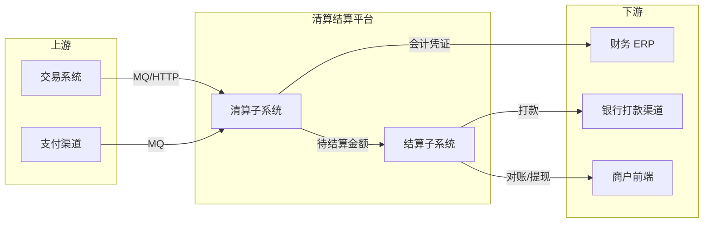
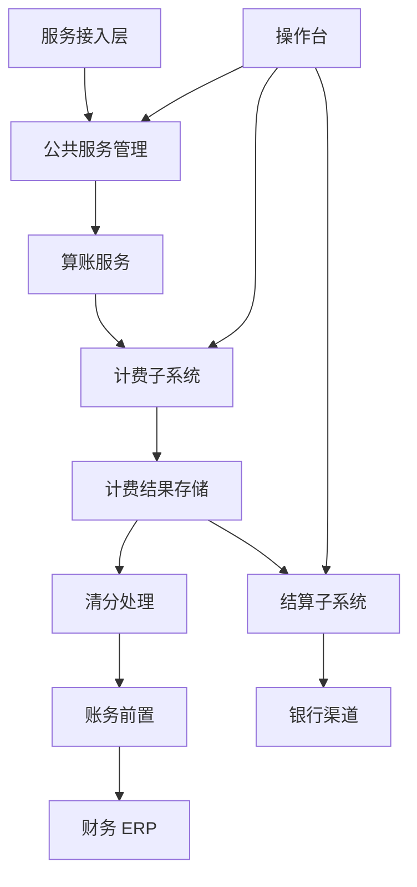
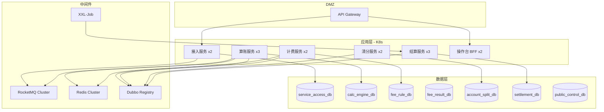
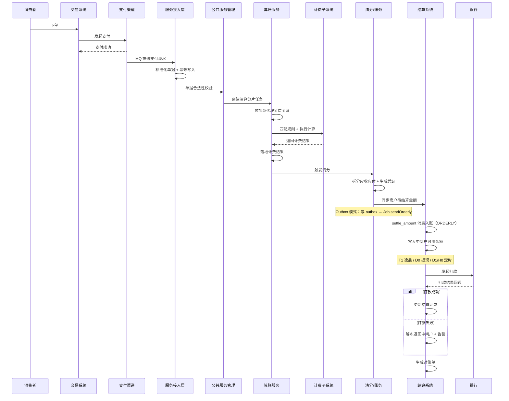
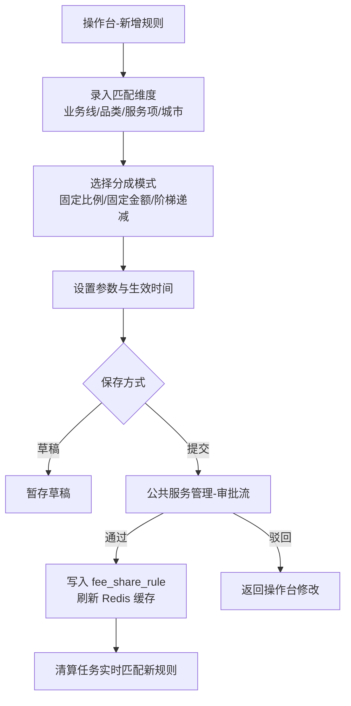
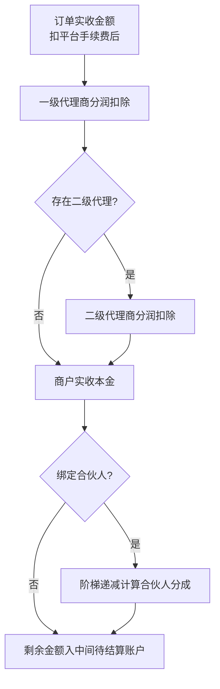
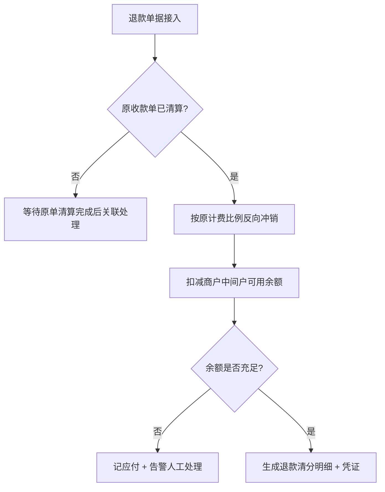
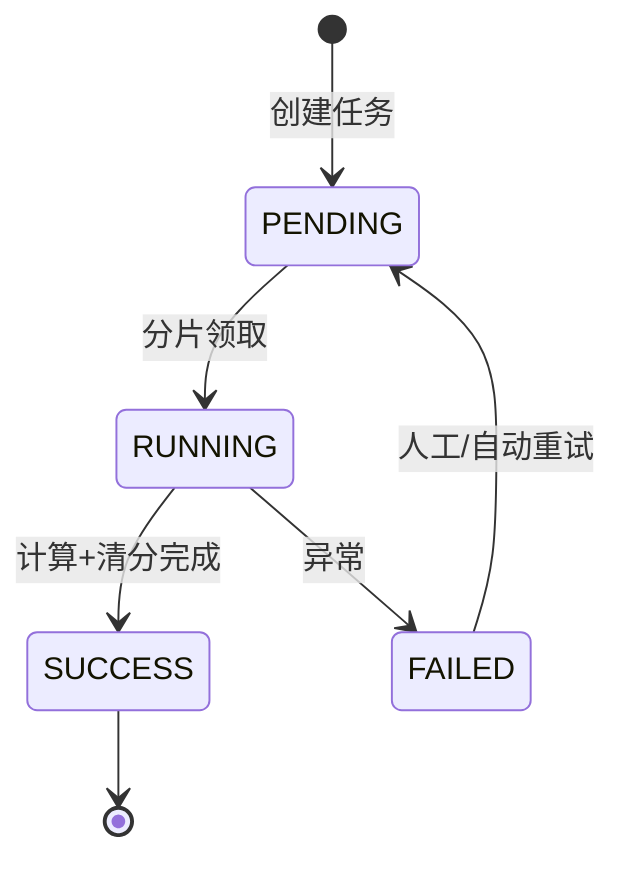
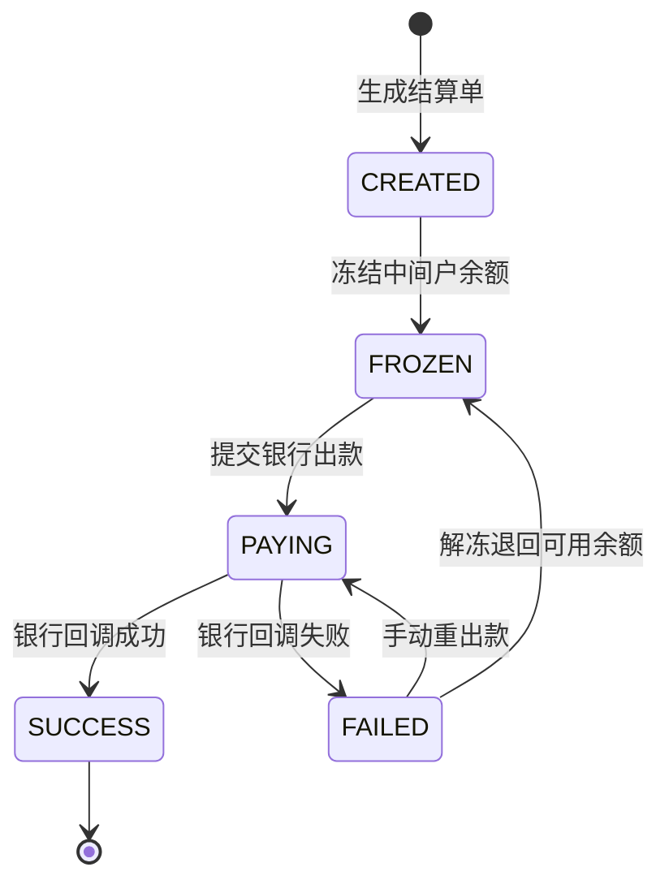
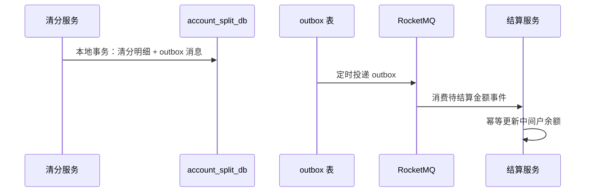

# 支付清算结算系统 — 架构设计文档

> 版本：V1.4 | 日期：2026-07-17 | 类型：架构 / 业务 / 评审交付

**规格说明书：** [00-规格说明书.md](00-规格说明书.md)（功能/非功能/模块/接口验收基线）

**细化设计文档：** [03-领域模型](03-领域模型与枚举字典.md) · [04-计费引擎](04-计费引擎详细设计.md) · [05-结算引擎](05-结算引擎详细设计.md) · [06-清分账务](06-清分与账务详细设计.md) · [07-接口契约](07-接口契约全量规范.md) · [08-单据状态机](08-单据接入与状态机规范.md) · [09-异常容错](09-异常与容错设计.md) · [分库分表](分库分表.md)

**实现状态（V1.4）：** 当前代码为 **单体 Spring Boot**（`pay-app`），Maven 12 模块；默认单库 `pay_settle`（18 表），可选 `sharding` Profile 启用 ShardingSphere 16 分片；MQ 支持本地同步与 RocketMQ 双模式；已落地 **分层短事务**、**Outbox 分片派发**、**账户 CAS 更新**、**@DbRateLimit 分层限流**。生产目标为 K8s 多服务 + **7 库垂直拆分** + Dubbo + Redis，详见 [分库分表.md](分库分表.md) 与 [02-开发手册](02-开发手册.md)。

---

## 第1章 项目概述

### 1.1 业务背景

平台存在多层经营主体：一级代理商、二级代理商、商户、商户合伙人。不同业务线、城市、品类需要差异化分润与手续费规则。系统需实现订单自动清算、多方分账、资金统一托管、商户自动/自主提现，覆盖交易接收、算费、清分、会计记账、资金出款全流程。

### 1.2 设计目标

1. 标准化全渠道交易单据统一接入清算
2. 可视化配置分润计费规则，支持三种分成模式
3. 多级代理商、商户合伙人多层分润自动计算，规则实时生效
4. 中间户资金隔离托管，支持 T1 自动结算、D0 实时提现
5. 业财一体化，自动生成会计凭证对接财务 ERP
6. 全链路监控告警，异常单据自动重试，打款失败资金自动回流
7. 运营可视化操作台，支持清算查询、规则配置、对账下载、结算手动处理

### 1.3 系统边界



---

## 第2章 系统分层架构

### 2.1 清算业务分层（7 层 + 结算子系统）

| 层级 | 模块 | 职责 |
|------|------|------|
| L1 | 服务接入层 | 接收原始单据，标准化、基础校验 |
| L2 | 操作台 | 运营后台：规则配置、查询、审批、对账 |
| L3 | 公共服务管理 | 校验、审批流、监控告警 |
| L4 | 算账服务 | 清算任务调度、关系模型加载、分片计算 |
| L5 | 计费子系统 | 规则引擎：多维度匹配、三种分成模式 |
| L6 | 计费结果存储 | 每笔订单完整计算明细持久化 |
| L7 | 清分处理 | 多方应收应付拆分 |
| L8 | 账务前置 | 业务金额 → 会计分录 → ERP |
| — | **结算子系统**（独立部署） | 中间户托管、多时效结算、出款、对账 |

### 2.2 模块依赖关系



### 2.3 结算子系统分层

| 模块 | 职责 |
|------|------|
| 结算服务 | 数据接收、结算请求、查询、对账下载、签约管理 |
| 结算任务管理 | T1/D0 定时任务维护、执行、重试 |
| 业务数据层 | 待结算数据汇总前置处理 |
| 结算运营后台 | 数据管理、手动发起结算、记录管理 |
| 结算信息管理 | 商户签约、银行卡、结算模式、通用规则 |
| 结算处理引擎 | T1/D0/D1/H0/S0 多时效结算 |
| 出款管理 | 银行渠道出款、重出款、结果确认、失败退回 |
| 商户对账模块 | 对账单生成、模板管理、下载发送 |
| 结算结果存储 | 结算明细、失败记录、打款申请、打款监听 |
| 辅助模块 | 垫资处理、结算计费处理 |

### 2.4 部署拓扑



### 2.5 代码模块映射（Maven → 业务层）

当前仓库以 Maven 多模块在单进程内实现第 2.1 节分层，依赖单向收敛至 `pay-domain` / `pay-api` / `pay-common`：

| Maven 模块 | 对应架构层 | 核心类 |
|------------|------------|--------|
| pay-access | L1 服务接入 | `BillAccessServiceImpl`, `TradePayConsumer` |
| pay-control | L3 公共服务 | `MerchantValidateService`, `AlertService` |
| pay-calc | L4 算账 | `ClearanceTaskServiceImpl`, `ClearanceTaskTxSupport` |
| pay-fee | L5 计费 | `FeeCalcServiceImpl`, `FeeCalcPipeline` |
| pay-split | L7/L8 清分账务 | `SplitServiceImpl`, `OutboxDispatchJob` |
| pay-settlement | 结算子系统 | `SettleAccountServiceImpl`, `AccountOperator` |
| pay-mq | 消息基础设施 | `PayMqProducer`, `MqBacklogMonitorJob` |
| pay-domain | 数据访问 | Repository / Mapper / `ShardRouteService` |
| pay-app | 启动聚合 | `PaySettleApplication` |

### 2.6 性能与持连优化（V1.4 已落地，PR-E 延续）

压测过程中对 **DB 连接池竞争** 做分层治理，原则：**MQ/外部调用在事务外，单 SQL 优先于 find→save，Job 按分片扫描避免广播**。

| 层级 | 手段 | 实现位置 |
|------|------|----------|
| 接入 | 落库短事务 + ACCESS 限流 30 TPS | `BillAccessServiceImpl.persistNewBill`, `@DbRateLimit` |
| 算账 | 清算分阶段短事务 + 单 SQL 标状态 | `ClearanceTaskTxSupport` |
| 算账 | **PR-E** `INSERT IGNORE` 建任务、fee+split 合并事务、retry `resetToPending` | `ClearanceTaskRepository`, `ClearanceTaskServiceImpl` |
| 算账 | CALC 限流 30 TPS | `ClearanceTaskServiceImpl` |
| 清分 | Outbox 16 分片扫描 + MQ 外发 | `OutboxDispatchJob`, `ShardScanSupport` |
| 清分 | markSent 独立短事务 | `OutboxDispatchTxSupport` |
| 清分 | **PR-E** 分账幂等时补写缺失 Outbox | `SplitServiceImpl.ensureOutboxIfNeeded` |
| 结算 | CAS 余额 UPDATE + 流水幂等 | `AccountOperator`, `MerchantSettleAccountMapper` |
| 结算 | **PR-E** 入账/回调短事务组件 + 流水前置幂等 | `SettleAccountTxSupport` |
| 结算 | 挂账冲抵单 SQL | `MerchantPayableSuspendMapper.applySettlementOffset` |
| 结算 | **PR-E** 回调单 SQL 更新结算单 + 告警事务外 | `SettlementOrderMapper.updatePaymentResult` |
| 结算 | **PR-E** `existsPayingByMerchantId` / `findTopNByStatus` 减查询 | `SettlementOrderEntityRepository` |
| 结算 | SETTLEMENT 限流 30 TPS | `SettleAccountServiceImpl` |
| MQ | **PR-E** calc 10 / settlement 6 线程，outbox batch 300 | `application-mq.yml` |

---

## 第3章 核心业务流程

### 3.1 主流程：下单 → 支付 → 清算 → 结算打款



### 3.2 计费规则配置审批流程



### 3.3 多层代理商分润计算



**计算顺序（不可变）：** 平台手续费 → 一级代理 → 二级代理 → 合伙人 → 商户实收

**边界约束：**
- 各分润方金额之和 + 平台手续费 ≤ 交易本金
- 任一方计算结果为负时，标记异常单，不写入结算账户，触发告警

### 3.4 退款清算流程（新增）



---

## 第4章 对象关系模型

### 4.1 代理商层级结构

```
一级代理商
  └── 二级代理商
        └── 商户
              └── 合伙人分账方（可多个）
```

一级代理商可直接绑定专属分润方，独立于二级代理链路。

### 4.2 关系缓存策略

| 数据 | 存储 | 缓存 | 刷新 |
|------|------|------|------|
| agent_merchant_relation | MySQL | Redis Hash（merchantId → 关系树） | 变更事件 + 每小时全量 |
| fee_share_rule | MySQL | Redis ZSet（维度键 → 规则列表） | 审批通过后即时刷新 |

---

## 第5章 计费规则引擎

### 5.1 规则匹配优先级

```
城市专属 > 品类细分 > 业务线全局 > 平台默认兜底
```

匹配算法：按维度 specificity 打分，取最高分；同分取 valid_start 最新。

### 5.2 三种分成模式

| 模式 | 公式 | 适用 |
|------|------|------|
| 固定比例 | 实收 × 比例 | 代理商分润 |
| 固定金额 | 每笔固定扣减 | 平台服务费 |
| 阶梯递减 | max(min_share, first - (n-1)×step) | 合伙人分成 |

### 5.3 阶梯递减示例

配置：首月 2.0%，每月递减 0.1%，最低 0.5%

| 入驻月数 | 计算 | 结果 |
|----------|------|------|
| 1 | 2.0 - 0×0.1 | 2.0% |
| 10 | 2.0 - 9×0.1 | 1.1% |
| 16 | 2.0 - 15×0.1 | 0.5%（触底） |
| 20+ | — | 0.5%（不再递减） |

---

## 第6章 状态机设计（新增）

### 6.1 清算任务状态机



### 6.2 结算单状态机



### 6.3 中间户余额操作类型

| 操作 | wait_balance | frozen_balance | 触发场景 |
|------|-------------|----------------|----------|
| 清算入账 | +amount | — | 日终清分同步 |
| 提现冻结 | -amount | +amount | D0 提现申请 |
| 打款成功 | — | -amount | 银行回调成功 |
| 打款失败解冻 | +amount | -amount | 银行回调失败 |
| 退款扣减 | -amount | — | 退款清算 |

**并发控制：** merchant_settle_account 使用 version 乐观锁；更新失败重试 3 次。

---

## 第7章 数据一致性方案（新增）

### 7.1 跨库协作模式

清算与结算分属不同数据库，采用 **本地事务 + 可靠消息（Outbox）** 模式：



### 7.2 幂等设计

| 场景 | 幂等键 | 实现 |
|------|--------|------|
| MQ 消费 | bill_no | trade_bill.uk_bill_no |
| RPC 调用 | bill_no + method | Redis SETNX 24h |
| 银行打款 | settlement_no | settlement_order.uk_settle_no |
| 余额更新 | bill_no + op_type | account_flow.uk_biz |

### 7.3 对账体系

| 对账类型 | 频率 | 参与方 |
|----------|------|--------|
| 渠道对账 | T+1 | 支付渠道 vs trade_bill |
| 清算对账 | 日 | trade_bill vs fee_calc_result |
| 资金对账 | 日 | 备付金余额 vs 中间户总额 |
| 结算对账 | T+1 | settlement_order vs 银行回单 |

---

## 第8章 中间户结算方案

### 8.1 资金隔离模型

- 平台在银行开立合规备付金账户，收单资金物理归集
- 系统内每个商户独立中间待结算账户（账面余额）
- 商户仅能通过自动结算/自主提现划至自有银行卡

### 8.2 多时效结算引擎

| 模式 | 触发 | 说明 |
|------|------|------|
| T1 | 每日 02:00 | 前日订单，批量打款 |
| D0 | 商户实时申请 | 冻结 → 出款 → 成功扣减/失败解冻 |
| D1 | 每日 02:00 | 隔日结算 |
| H0 | 每小时 | 高频商户小时汇总结算 |
| S0 | 商户手动 | 任意时间发起 |

**截单规则：** T1 以每日 23:59:59 为截单点；截单后订单计入次日批次。

### 8.3 打款失败容错

1. 解冻 frozen_balance，退回 wait_balance
2. 写入 settlement_fail_record + 告警
3. 操作台支持手动重出款（需财务审批）

---

## 第9章 监控、告警、权限

### 9.1 监控指标

| 域 | 指标 | 阈值 |
|----|------|------|
| 清算 | 待清算堆积量 | > 10000 告警 |
| 清算 | 任务执行 P99 延迟 | > 30s 告警 |
| 计费 | 规则匹配失败率 | > 0.1% 告警 |
| 计费 | 负收益订单数 | > 0 告警 |
| 结算 | 打款失败率 | > 5% 告警 |
| 资金 | 备付金账实差异 | ≠ 0 告警 |

### 9.2 告警渠道

操作台站内消息 → 企业微信群 → 邮件（P0 电话）

### 9.3 角色与审批

| 角色 | 权限 |
|------|------|
| 运营操作员 | 规则配置（提交）、查询、对账下载 |
| 财务审核员 | 规则审批、大额手动出款审批 |
| 超级管理员 | 全部权限 + 系统配置 |

双人审批场景：计费规则变更、结算方案调整、单笔 > 5 万手动出款。

---

## 第10章 非功能性需求

### 10.1 性能目标

| 场景 | 目标 |
|------|------|
| 清算吞吐 | 5000 TPS（分片并行） |
| 计费 RPC P99 | < 50ms |
| D0 提现端到端 | < 3s |
| T1 批量结算 | 100 万商户 < 2h |

### 10.2 分库分表

> 完整设计见 **[分库分表.md](分库分表.md)**（V2.0 简化版）。

**分库（必做）：** 7 库垂直拆分 — service_access · public_control · calc_engine · fee_rule · fee_result · account_split · settlement

**分表（按需）：** 默认 **不分表**；单表超 3000 万行时，仅对 `trade_bill`、`account_flow` 启用 MySQL 原生按月分区，或冷数据归档

**当前代码：** 开发环境单库 `pay_settle`，无分表

### 10.3 定时任务

| 时间 | 任务 |
|------|------|
| 02:00 | T1 自动结算 |
| 04:00 | 商户对账单生成 |
| 每小时 | 失败清算重试、失败打款重试 |
| 每小时 | 代理关系/规则缓存刷新 |
| 06:00 | 资金账实核对 |

### 10.4 安全

- 操作台：RBAC + 操作审计日志（永久留存）
- 商户 API：JWT + merchantId 绑定校验
- 银行接口：RSA 签名 + HTTPS + IP 白名单
- 敏感字段（银行卡号）：AES 加密存储，展示脱敏

---

## 第11章 异常与容错（概要）

> 完整设计见 **[09-异常与容错设计.md](09-异常与容错设计.md)**

### 11.1 四条铁律

资金不错 · 状态可追溯 · 幂等可重放 · 人机协同

### 11.2 关键异常场景

| 场景 | 策略 |
|------|------|
| 退款乱序 | WAIT_ORIGIN 挂起，原单完成后自动激活 |
| 清分半成功 | 补偿 Job 续跑 split，不删 fee_result |
| 退款余额不足 | merchant_payable_suspend 挂账，后续入账优先抵扣 |
| 打款掉单（长款） | 标记 DISPUTE，**禁止自动重出**，双人核实 |
| 冻结泄漏 | FrozenLeakJob 自动 unfreeze |
| 备付金/账实不平 | P0 封账，暂停 T1/D0 |

### 11.3 补偿 Job 摘要

SplitCompensate · CreditCompensate · OutboxRedispatch · FrozenLeak · WaitOriginScan · PaymentQuery · RunningWatchdog

---

## 附录 A：错误码规范

| 码段 | 含义 |
|------|------|
| 1xxxx | 接入层（10001 重复单据） |
| 2xxxx | 清算/计费（20001 规则未匹配） |
| 3xxxx | 结算（30001 余额不足） |
| 4xxxx | 出款（40001 银行渠道超时） |
| 5xxxx | 审批（50001 审批驳回） |

统一响应格式：

```json
{
  "code": 0,
  "message": "success",
  "data": {},
  "traceId": "abc123"
}
```
