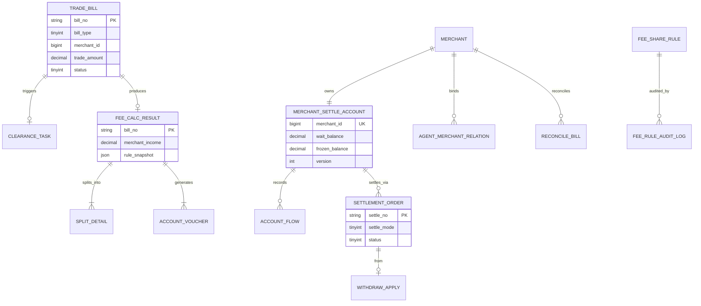

# 领域模型与枚举字典

> 版本：V1.3 | 日期：2026-07-14 | 所有服务共享的领域语言（Ubiquitous Language）

---

## 1. 核心领域对象

### 1.1 对象关系 ER 图



### 1.2 聚合根边界

| 聚合根 | 包含实体 | 一致性边界 |
|--------|----------|------------|
| TradeBill | — | 接入层单库事务 |
| ClearanceTask | FeeCalcResult（引用） | 算账服务：任务 + 结果写入 |
| FeeShareRule | FeeRuleAuditLog | 规则库：规则 + 审批日志 |
| SplitBatch | SplitDetail, AccountVoucher, OutboxMessage | 清分服务：本地事务 |
| SettleAccount | AccountFlow | 结算服务：账户 + 流水 |
| SettlementOrder | WithdrawApply | 结算单生命周期 |

**跨聚合协作：** 仅通过 `bill_no` / `settle_no` 关联 + MQ 事件，禁止跨库 JOIN。

---

## 2. 全局枚举字典

### 2.1 BillType — 清算单据类型

| 值 | 名称 | 说明 | 是否参与分润 | 是否影响中间户 |
|----|------|------|-------------|---------------|
| 1 | PAY | 收款清算 | 是 | 入账 + |
| 2 | REFUND | 退款清算 | 反向冲销 | 扣减 - |
| 3 | RECHARGE | 充值清算 | 否 | 不入中间户 |
| 4 | PROFIT_SHARE | 分账分润 | 是 | 按分润方 |
| 5 | REWARD_PUNISH | 奖惩清算 | 按配置 | 入账/扣减 |
| 6 | AUTH | 鉴权清算 | 否 | 否 |
| 7 | PAYOUT | 付款清算 | 否 | 出款侧 |
| 8 | ORDER_CLEAR | 订单清算抵扣 | 是 | 扣减 - |

### 2.2 BillStatus — 清算单据状态

| 值 | 名称 | 可转移自 |
|----|------|----------|
| 0 | PENDING | 新建 |
| 1 | CLEARING | PENDING |
| 2 | CLEARED | CLEARING |
| 3 | FAILED | CLEARING |
| 4 | WAIT_ORIGIN | REFUND 专用，等原单 |

### 2.3 TaskStatus — 清算任务状态

| 值 | 名称 | 说明 |
|----|------|------|
| 0 | PENDING | 待分片领取 |
| 1 | RUNNING | 执行中（含 CAS 锁） |
| 2 | SUCCESS | 完成 |
| 3 | FAILED | 失败待重试 |
| 4 | DEAD | 重试超限，需人工介入（`TaskStatus.DEAD`，见 08 §3） |

### 2.4 ShareMode — 分成模式

| 值 | 名称 | 基数 | 单位 |
|----|------|------|------|
| 1 | FIXED_RATE | 当前剩余净额 | 比例（0~1） |
| 2 | FIXED_AMOUNT | — | 元/笔 |
| 3 | STEP_DOWN | 当前剩余净额 | 比例（动态） |

### 2.5 TargetType — 规则适用对象

| 值 | 名称 | 计算顺序 |
|----|------|----------|
| 1 | PLATFORM | 第 1 步 |
| 2 | AGENT_L1 | 第 2 步 |
| 3 | AGENT_L2 | 第 3 步 |
| 4 | PARTNER | 第 4 步 |
| 5 | MERCHANT | 剩余归属 |

### 2.6 SettleMode — 结算时效

| 值 | 名称 | 触发方式 | 截单/周期 |
|----|------|----------|-----------|
| 1 | T1 | 定时 02:00 | 前自然日 23:59:59 |
| 2 | D0 | 商户实时 | 无 |
| 3 | D1 | 定时 02:00 | 订单日 +1 |
| 4 | H0 | 定时每小时 :05 | 上一小时 |
| 5 | S0 | 商户手动 | 无 |

### 2.7 SettleOrderStatus — 结算单状态

| 值 | 名称 | 允许操作 |
|----|------|----------|
| 0 | CREATED | 冻结余额 |
| 1 | FROZEN | 提交出款 |
| 2 | PAYING | 等待银行回调 |
| 3 | SUCCESS | 终态 |
| 4 | FAILED | 解冻 / 重出款 |
| 5 | DISPUTE | 长款争议，禁止自动重出（枚举已定义，流程待接入） |

### 2.8 AccountFlowOpType — 账户流水操作

| 值 | 名称 | wait_balance | frozen_balance |
|----|------|-------------|----------------|
| 1 | CREDIT | + | — |
| 2 | FREEZE | - | + |
| 3 | DEDUCT | — | - |
| 4 | UNFREEZE | + | - |
| 5 | REFUND_DEBIT | - | — |
| 6 | ADJUST | ± | — |

### 2.9 PartyType — 清分方类型

| 值 | 名称 | party_id 含义 |
|----|------|---------------|
| 1 | PLATFORM | 固定 0 |
| 2 | AGENT_L1 | agent_id |
| 3 | AGENT_L2 | second_agent_id |
| 4 | PARTNER | split_party_id |
| 5 | MERCHANT | merchant_id |

### 2.10 ApprovalBizType / AlertLevel / RuleStatus

略，与 02-开发手册一致；RuleStatus：0 草稿 1 待审 2 生效 3 失效 4 驳回。

---

## 3. 单号生成规范

### 3.1 格式定义

| 单号类型 | 格式 | 示例 | 生成方 |
|----------|------|------|--------|
| bill_no | `CL{yyyyMMdd}{6位seq}` | CL20260705000001 | 上游或接入层 |
| task_id | DB 自增 | — | 算账服务 |
| settle_no | `ST{yyyyMMdd}{8位seq}` | ST2026070500000001 | 结算服务 |
| apply_no | `WD{yyyyMMdd}{8位seq}` | WD2026070500000001 | 结算服务 |
| voucher_no | `VT{yyyyMMdd}{8位seq}` | VT2026070500000001 | 清分服务 |
| approval_no | `AP{yyyyMMdd}{6位seq}` | AP20260705000001 | 管控服务 |

### 3.2 序号生成

```java
// Redis INCR，按日归零
String key = "seq:bill:" + LocalDate.now(ZoneId.of("Asia/Shanghai"));
long seq = redis.incr(key);
if (seq == 1) redis.expire(key, Duration.ofDays(2));
return prefix + date + String.format("%06d", seq);
```

**约束：** bill_no 由上游生成时必须全局唯一；接入层校验格式 `^CL\d{14,20}$`。

---

## 4. 金额与精度规范

### 4.1 存储精度

| 场景 | 类型 | 精度 | 示例 |
|------|------|------|------|
| 交易/分润金额 | DECIMAL(18,2) | 2 位小数 | 1000.00 |
| 比例/费率 | DECIMAL(18,4) | 4 位小数 | 0.0200 |
| 累计统计 | DECIMAL(18,2) | 2 位小数 | — |

### 4.2 舍入规则

```java
public static final RoundingMode ROUND = RoundingMode.HALF_UP;

// 比例计算：先乘后舍入到 2 位
BigDecimal share = net.multiply(rate).setScale(2, ROUND);

// 固定金额：直接与 net 比较，不足则取 net（不能为负）
BigDecimal share = fixedAmount.min(net).setScale(2, ROUND);
```

### 4.3 尾差处理

多方分润舍入后可能出现 `sum(shares) + platformFee != tradeAmount` 的 ±0.01 尾差：

**规则：** 尾差归商户实收（merchant_income 吸收 ±0.01）。

```java
BigDecimal total = platformFee.add(l1).add(l2).add(partner).add(merchant);
BigDecimal diff = tradeAmount.subtract(total);
merchantIncome = merchantIncome.add(diff); // diff 仅可能 ±0.01
```

### 4.4 时区

- 所有业务时间存储：`DATETIME`，语义为 **Asia/Shanghai（UTC+8）**
- 截单、对账、T1 批次均以北京时间自然日为准
- API 传输：ISO-8601 `2026-07-05T14:30:00+08:00`

---

## 5. 商户入驻月数计算

用于合伙人阶梯递减：

```java
/**
 * joinDate: 商户首次签约日（merchant_contract.sign_date）
 * calcDate: 清算单据 create_time 所在日
 * 入驻月数 = 完整自然月差 + 1
 */
public int calcJoinMonths(LocalDate joinDate, LocalDate calcDate) {
    int months = (calcDate.getYear() - joinDate.getYear()) * 12
               + (calcDate.getMonthValue() - joinDate.getMonthValue());
    // 若 calcDate.day < joinDate.day，尚未满当月，不计入
    if (calcDate.getDayOfMonth() < joinDate.getDayOfMonth()) {
        months--;
    }
    return Math.max(1, months + 1);
}
```

**示例：** 签约日 2026-01-15，清算日 2026-07-05 → 月数 = 6（1月算第1月，7月5日未满7月15日）

---

## 6. 账户余额不变量

对任意商户中间户，任意时刻必须满足：

```
wait_balance >= 0
frozen_balance >= 0
wait_balance + frozen_balance = 历史入账累计 - 历史成功出款累计 - 历史退款扣减
```

**校验 SQL（日终）：**

```sql
SELECT m.merchant_id,
       m.wait_balance + m.frozen_balance AS account_total,
       COALESCE(SUM(CASE WHEN f.op_type=1 THEN f.amount
                         WHEN f.op_type IN (5,3) THEN -f.amount
                         WHEN f.op_type=2 THEN 0 END), 0) AS flow_net
FROM merchant_settle_account m
LEFT JOIN account_flow f ON f.merchant_id = m.merchant_id
GROUP BY m.merchant_id
HAVING account_total <> flow_net;
```

---

## 7. 扩展表（领域补充）

### 7.1 merchant_contract — 商户签约

```sql
CREATE TABLE `merchant_contract` (
  `contract_id`   bigint       NOT NULL AUTO_INCREMENT,
  `merchant_id`   bigint       NOT NULL,
  `sign_date`     date         NOT NULL COMMENT '签约日期，用于阶梯月数',
  `settle_mode`   tinyint      NOT NULL COMMENT '1T1 2D0 3D1 4H0 5S0',
  `min_withdraw`  decimal(18,2) NOT NULL COMMENT '最低提现额',
  `status`        tinyint      NOT NULL COMMENT '0失效 1有效',
  PRIMARY KEY (`contract_id`),
  UNIQUE KEY `uk_merchant_id` (`merchant_id`)
) ENGINE=InnoDB DEFAULT CHARSET=utf8mb4;
```

### 7.2 merchant_profile — 商户资质

```sql
CREATE TABLE `merchant_profile` (
  `merchant_id`   bigint       NOT NULL,
  `merchant_name` varchar(128) NOT NULL,
  `status`        tinyint      NOT NULL COMMENT '0冻结 1正常',
  PRIMARY KEY (`merchant_id`)
) ENGINE=InnoDB DEFAULT CHARSET=utf8mb4;
```

> **当前代码**为简化版（无 license_no / risk_level）。扩展字段可在 Phase 2 追加。

库归属：`public_control_db`（profile）、`settlement_db`（contract）。详见 [分库分表.md](分库分表.md)。
