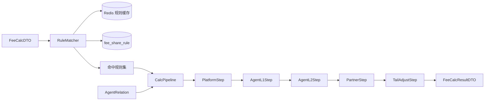
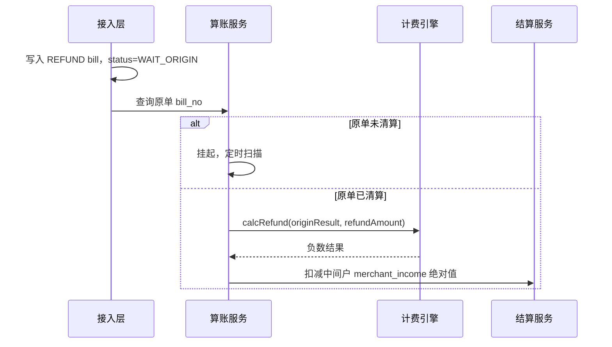

# 计费引擎详细设计

> 版本：V1.2 | 服务：pay-fee | 职责：规则匹配 + 分润计算

---

## 1. 引擎架构



**设计模式：** 责任链（Pipeline）+ 策略（ShareMode）

---

## 2. 规则匹配算法

### 2.1 维度 specificity 打分

每个规则在四个维度上匹配，维度值为 `*` 表示通配：

| 维度 | 字段 | 精确匹配得分 | 通配得分 |
|------|------|-------------|----------|
| D1 | city_code | 8 | 0 |
| D2 | service_item | 4 | 0 |
| D3 | category | 2 | 0 |
| D4 | business_line | 1 | 0 |

**总分** = D1 + D2 + D3 + D4，范围 0~15。

### 2.2 匹配流程

```
输入: req(businessLine, category, serviceItem, cityCode), targetType
1. 从缓存加载 targetType 下所有 status=生效 且 valid_start <= now < valid_end 的规则
2. 过滤：四个维度 req 值等于 rule 值，或 rule 值为 '*'
3. 计算每条规则 specificity 分数
4. 取最高分；同分取 valid_start 最大（最新规则）
5. 无匹配 → 加载 platform 默认兜底规则（rule_id = 系统配置 DEFAULT_RULE_{targetType}）
6. 仍无 → 抛 BizException(20001) 并告警
```

### 2.3 匹配示例

请求：`line=A, cat=A01, item=A0101, city=110000`

| rule_id | line | cat | item | city | 得分 |
|---------|------|-----|------|------|------|
| 101 | A | A01 | * | 110000 | 8+2+1=11 |
| 102 | A | * | * | * | 1 |
| 103 | * | * | * | 110000 | 8 |

→ 选中 rule 101。

---

## 3. 计算管道（Pipeline）

### 3.1 执行顺序（固定）

```
tradeAmount (本金)
  → [Platform] platformFee, net = amount - platformFee
  → [AgentL1]  if agentId != null
  → [AgentL2]  if secondAgentId != null
  → [Partner]  if splitPartyId != null (仅 STEP_DOWN 或 FIXED_RATE)
  → [TailAdjust] 尾差归商户
  → merchantIncome = net
```

### 3.2 各 Step 计算逻辑

#### PlatformStep / AgentL1Step / AgentL2Step

```java
BigDecimal calc(BigDecimal net, FeeShareRule rule) {
    return switch (rule.getShareMode()) {
        case FIXED_RATE -> net.multiply(rule.getFirstMonthValue()).setScale(2, HALF_UP);
        case FIXED_AMOUNT -> rule.getFirstMonthValue().min(net).setScale(2, HALF_UP);
        case STEP_DOWN -> throw new IllegalStateException("代理不支持阶梯递减");
    };
}
```

#### PartnerStep

```java
BigDecimal calc(BigDecimal net, FeeShareRule rule, int joinMonths) {
    BigDecimal rate = switch (rule.getShareMode()) {
        case STEP_DOWN -> calcStepDown(rule, joinMonths);
        case FIXED_RATE -> rule.getFirstMonthValue();
        case FIXED_AMOUNT -> throw new IllegalStateException("合伙人不用固定金额");
    };
    return net.multiply(rate).setScale(2, HALF_UP);
}

BigDecimal calcStepDown(FeeShareRule rule, int months) {
    BigDecimal cur = rule.getFirstMonthValue()
        .subtract(rule.getStepDownVal().multiply(BigDecimal.valueOf(months - 1)));
    return cur.compareTo(rule.getMinShare()) < 0 ? rule.getMinShare() : cur;
}
```

### 3.3 负值与超额保护

```java
void assertAfterStep(String stepName, BigDecimal net, BigDecimal share) {
    if (share.compareTo(BigDecimal.ZERO) < 0)
        throw new CalcException(20002, stepName + "分润为负");
    if (net.compareTo(BigDecimal.ZERO) < 0)
        throw new CalcException(20003, stepName + "扣减后净额为负");
}
```

---

## 4. 完整算例

### 4.1 收款单算例

**输入：**
- tradeAmount = 1000.00
- 一级代理存在，规则：固定比例 5%（基于本金后净额）
- 二级代理存在，规则：固定比例 3%
- 合伙人存在，阶梯：首月 2%，递减 0.1%/月，最低 0.5%，入驻第 10 月 → 1.1%
- 平台手续费：固定比例 0.6%（基于本金）

**计算过程：**

| 步骤 | 基数 | 费率/金额 | 分出 | 剩余 |
|------|------|-----------|------|------|
| 本金 | 1000.00 | — | — | 1000.00 |
| 平台费 | 1000.00 | 0.6% | 6.00 | 994.00 |
| 一级代理 | 994.00 | 5% | 49.70 | 944.30 |
| 二级代理 | 944.30 | 3% | 28.33 | 915.97 |
| 合伙人 | 915.97 | 1.1% | 10.08 | 905.89 |
| 商户实收 | — | — | **905.89** | 0 |

**校验：** 6.00 + 49.70 + 28.33 + 10.08 + 905.89 = 1000.00 ✓

### 4.2 固定金额模式算例

- tradeAmount = 50.00，平台固定手续费 = 2.00/笔
- 一级代理固定 = 10.00/笔

| 步骤 | 分出 | 剩余 |
|------|------|------|
| 平台 | 2.00 | 48.00 |
| 一级代理 | 10.00 | 38.00 |
| 商户 | — | **38.00** |

---

## 5. 退款反向冲销

### 5.1 原则

- 按 **原收款单 fee_calc_result 快照** 同比例冲销，不用最新规则
- 部分退款：各分润方按 `refundAmount / originalTradeAmount` 比例冲销

### 5.2 算法

```java
public FeeCalcResult calcRefund(FeeCalcResult origin, BigDecimal refundAmount) {
    BigDecimal ratio = refundAmount.divide(origin.getTradeAmount(), 8, HALF_UP);
    return FeeCalcResult.builder()
        .platformFee(origin.getPlatformFee().multiply(ratio).setScale(2, HALF_UP).negate())
        .agentL1Share(origin.getAgentL1Share().multiply(ratio).setScale(2, HALF_UP).negate())
        // ... 其余字段同理
        .merchantIncome(origin.getMerchantIncome().multiply(ratio).setScale(2, HALF_UP).negate())
        .build();
}
```

### 5.3 退款时序



---

## 6. 规则快照（rule_snapshot）

每次计算写入 `fee_calc_result.rule_snapshot`，结构：

```json
{
  "calcTime": "2026-07-05T14:30:00+08:00",
  "joinMonths": 10,
  "rules": {
    "PLATFORM": { "ruleId": 1, "shareMode": 1, "value": 0.0060 },
    "AGENT_L1": { "ruleId": 21, "shareMode": 1, "value": 0.0500 },
    "AGENT_L2": { "ruleId": 22, "shareMode": 1, "value": 0.0300 },
    "PARTNER": { "ruleId": 55, "shareMode": 3, "effectiveRate": 0.0110 }
  },
  "pipeline": [
    { "step": "PLATFORM", "base": 1000.00, "share": 6.00, "remain": 994.00 },
    { "step": "AGENT_L1", "base": 994.00, "share": 49.70, "remain": 944.30 }
  ]
}
```

**用途：** 退款冲销、审计追溯、争议仲裁。

---

## 7. 缓存结构

### 7.1 Redis Key

```
fee:rules:{targetType}  →  Hash
  field: {businessLine}:{category}:{serviceItem}:{cityCode}  →  JSON[List<RuleCacheDTO>]
```

RuleCacheDTO 含：ruleId, shareMode, firstMonthValue, stepDownVal, minShare, validStart, specificity（预计算）

### 7.2 热更新

```
审批通过 → DELETE fee:rules:*
         → 可选 WARM-UP：加载 Top 1000 维度组合
清算任务 → Cache-Aside 读
```

---

## 8. 异常与降级

| 场景 | 处理 |
|------|------|
| 规则未匹配 | 默认兜底规则；无兜底则任务 FAILED + 告警 |
| 分润为负 | 任务 FAILED，不写结算 |
| 计费 RPC 超时 | 算账服务重试 3 次，仍失败入 FAILED |
| 缓存不可用 | 降级直查 DB，RT 上升可接受 |

---

## 9. 接口行为补充

### FeeCalcService#calcShareFee

| 项 | 说明 |
|----|------|
| 幂等 | 同 billNo 重复调用返回已存 fee_calc_result |
| 超时 | 500ms，不重试（由调用方重试） |
| 并发 | 同 billNo 分布式锁 `fee:lock:{billNo}` |

### FeeCalcService#previewShareFee（新增，只读）

运营台试算，不写库，入参与 calcShareFee 相同，额外支持传入假设 joinMonths。
