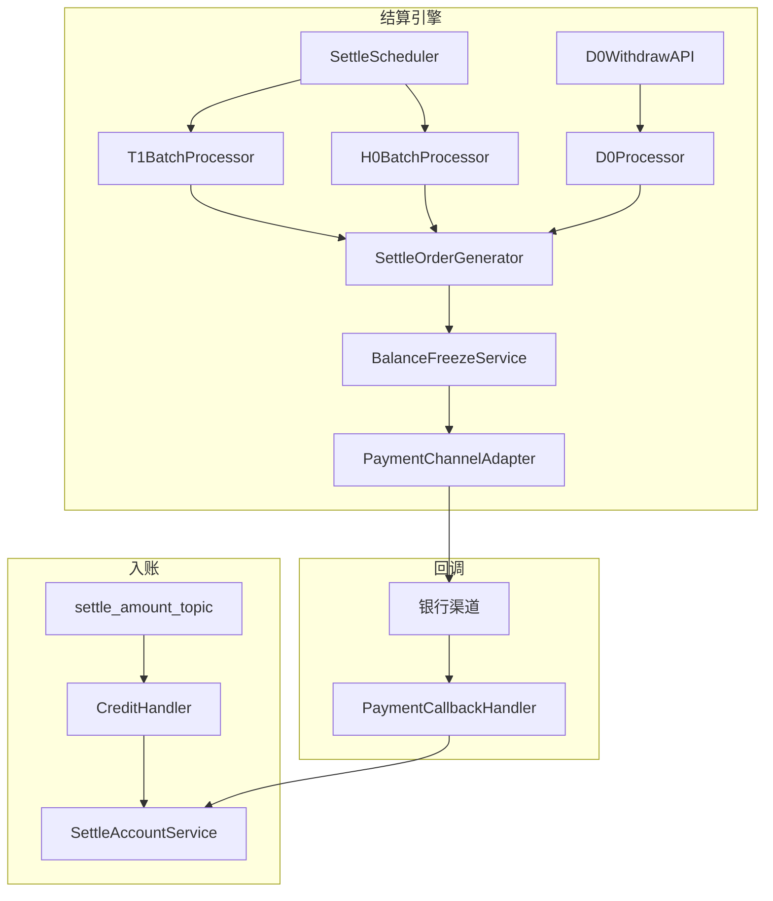
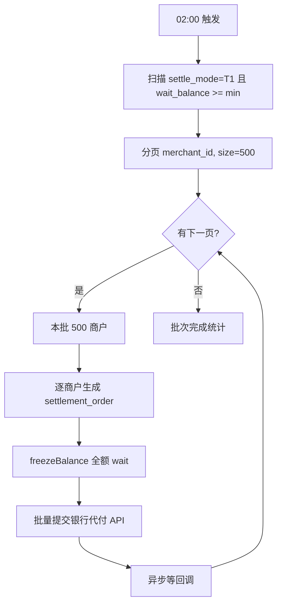
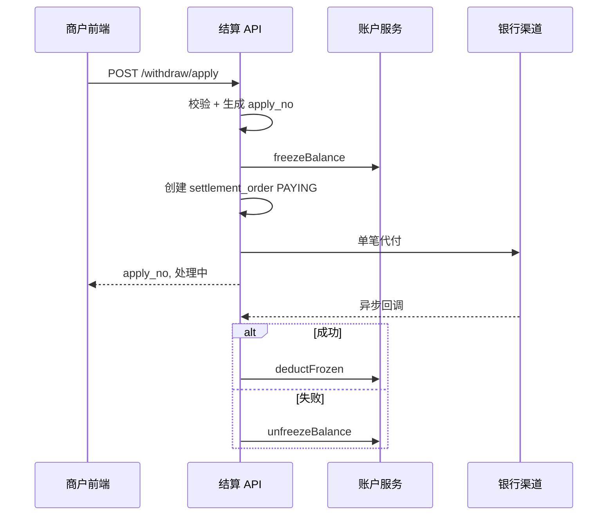
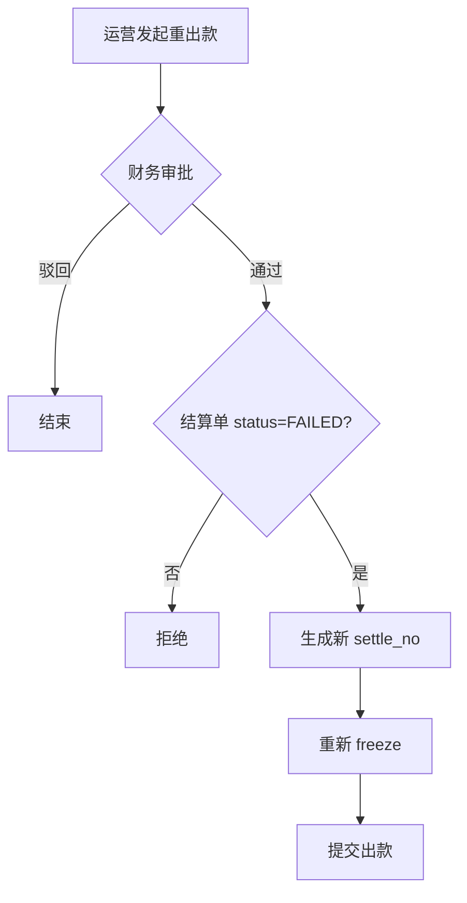

# 结算引擎详细设计

> 版本：V1.2 | 服务：pay-settlement | 职责：中间户管理 + 多时效出款

---

## 1. 引擎组件



---

## 2. 中间户账户服务

### 2.1 操作矩阵（完整）

| op_type | 方法 | SQL 语义 | 前置条件 |
|---------|------|----------|----------|
| CREDIT | creditBalance | wait += amt | billNo 幂等 |
| FREEZE | freezeBalance | wait -= amt, frozen += amt | wait >= amt |
| DEDUCT | deductFrozen | frozen -= amt | frozen >= amt, 打款成功 |
| UNFREEZE | unfreezeBalance | wait += amt, frozen -= amt | frozen >= amt |
| REFUND_DEBIT | debitBalance | wait -= amt | wait >= amt |
| ADJUST | adjustBalance | wait ± amt | 需审批单号 |

### 2.2 乐观锁更新模板

```sql
UPDATE merchant_settle_account
SET wait_balance = #{waitBalance},
    frozen_balance = #{frozenBalance},
    version = version + 1,
    update_time = NOW()
WHERE merchant_id = #{merchantId}
  AND version = #{expectedVersion};
```

失败重试：最多 3 次，间隔 50ms/100ms/200ms，仍失败抛 30005 并发冲突。

### 2.3 分布式锁（可选加强）

高并发 D0 提现对同一 merchantId 加锁：

```
SET settle:lock:{merchantId} {uuid} NX EX 30
```

---

## 3. T1 批量结算

### 3.1 批次定义

| 字段 | 值 |
|------|-----|
| 批次日 batch_date | 运行日 D 的 T1 结算对应 D-1 日入账 |
| 截单点 | D-1 23:59:59.999 CST |
| 启动时间 | D 日 02:00:00 |
| 纳入金额 | account_flow 中 op_type=CREDIT 且 create_time ∈ (D-2 02:00, D-1 02:00] 的净额* |

\* 实际以商户 settle_mode=T1 且 wait_balance > min_settle_amount 为准，简化实现可直接取当前 wait_balance 全量。

### 3.2 T1 批处理流程



### 3.3 最低结算额

```java
// merchant_contract.min_settle_amount，默认 1.00 元
if (account.getWaitBalance().compareTo(minSettle) < 0) {
    skip("低于最低结算额");
}
```

### 3.4 T1 伪代码

```java
public void runT1Batch(LocalDate batchDate) {
    String batchNo = "BATCH-T1-" + batchDate;
    if (batchRepo.exists(batchNo)) return; // 幂等

    Long lastId = 0L;
    while (true) {
        List<MerchantSettleAccount> page = accountRepo.scanT1(lastId, 500);
        if (page.isEmpty()) break;

        for (MerchantSettleAccount acc : page) {
            try {
                processOneT1(acc, batchNo);
            } catch (Exception e) {
                failRepo.record(acc.getMerchantId(), batchNo, e.getMessage());
            }
        }
        lastId = page.get(page.size()-1).getMerchantId();
    }
}

@Transactional
void processOneT1(MerchantSettleAccount acc, String batchNo) {
    BigDecimal amount = acc.getWaitBalance();
    if (amount.compareTo(minSettle) < 0) return;

    String settleNo = seqGen.settleNo();
    freezeBalance(acc.getMerchantId(), amount, settleNo); // op FREEZE
    settlementOrderRepo.insert(settleNo, acc, amount, MODE_T1, batchNo);
    paymentChannel.submitBatch(new PaymentRequest(settleNo, acc.getSettleCardNo(), amount));
}
```

---

## 4. D0 实时提现

### 4.1 前置校验

| 校验项 | 错误码 |
|--------|--------|
| merchant_contract.status = 有效 | 30010 |
| settle_mode 含 D0 | 30011 |
| wait_balance >= withdrawAmount | 30001 |
| withdrawAmount >= min_withdraw | 30002 |
| 当日提现次数 < daily_limit（默认 5） | 30012 |
| 当日提现累计 + amount <= daily_amount_limit（默认 50万） | 30013 |
| settle_card_no 与签约卡一致 | 30014 |
| 无 PAYING 状态在途结算单 | 30015 |

### 4.2 D0 时序



### 4.3 同步超时处理

银行同步返回超时（>5s）时：
- 结算单保持 PAYING
- 启动 `PaymentStatusQueryJob` 每 30s 主动查单，最多 10 次
- 仍未知 → 告警 + 人工介入

---

## 5. H0 / D1 / S0 差异摘要

| 模式 | 扫描条件 | 金额来源 |
|------|----------|----------|
| H0 | settle_mode=4，每小时 | 上一小时 CREDIT 净额或当前 wait |
| D1 | settle_mode=3，02:00 | 订单完成日+1 的入账 |
| S0 | 商户 API 触发 | 指定 amount ≤ wait_balance |

S0 流程与 D0 相同，仅触发方不同。

---

## 6. 银行渠道适配器

### 6.1 接口抽象

```java
public interface PaymentChannelAdapter {
    /** 单笔代付 */
    PaymentSubmitResult submit(PaymentRequest req);
    /** 批量代付（T1） */
    BatchPaymentSubmitResult submitBatch(List<PaymentRequest> reqs);
    /** 主动查单 */
    PaymentQueryResult query(String channelTradeNo, String settleNo);
    /** 验签回调 */
    PaymentCallback parseCallback(HttpRequest raw);
}
```

### 6.2 PaymentRequest

```java
public record PaymentRequest(
    String settleNo,
    String merchantId,
    String cardNo,      // 解密后
    String cardHolder,
    BigDecimal amount,
    String remark
) {}
```

### 6.3 渠道错误映射

| 银行返回码 | 内部 status | 是否可重试 |
|-----------|-------------|-----------|
| SUCCESS | SUCCESS | — |
| ACCOUNT_ERROR | FAILED | 否，需换卡 |
| BALANCE不足 | FAILED | 是（平台侧） |
| TIMEOUT | PAYING | 查单 |
| DUPLICATE | SUCCESS | 幂等 |

---

## 7. 打款回调处理

### 7.1 状态转移

```java
@Transactional
public void handleCallback(PaymentCallback cb) {
    SettlementOrder order = orderRepo.findBySettleNo(cb.settleNo());
    if (order.getStatus() == SUCCESS) return; // 幂等
    if (order.getStatus() != PAYING && order.getStatus() != FROZEN)
        throw new IllegalStateException("非法状态转移");

    switch (cb.status()) {
        case SUCCESS -> {
            deductFrozen(order.getMerchantId(), order.getSettleAmount(), order.getSettleNo());
            orderRepo.updateSuccess(order.getSettleNo(), cb.channelTradeNo());
            withdrawApplyRepo.updateSuccess(order.getSettleNo());
        }
        case FAILED -> {
            unfreezeBalance(order.getMerchantId(), order.getSettleAmount(), order.getSettleNo());
            orderRepo.updateFailed(order.getSettleNo(), cb.failReason());
            alertService.send(PAYMENT_FAIL, order);
        }
        case PAYING -> { /* 忽略 */ }
    }
}
```

### 7.2 手动重出款



原 FAILED 单保留审计，新单 `origin_settle_no` 指向原单。

---

## 8. 对账单生成

### 8.1 内容结构

| 区块 | 字段 |
|------|------|
| 汇总 | 期初余额、本期入账、本期出款、期末余额 |
| 明细 | 日期、bill_no、类型、金额、余额 |
| 结算 | settle_no、金额、状态、银行卡尾号 |

### 8.2 生成逻辑

```java
// 04:00 生成 D-1 对账单
ReconcileBill bill = ReconcileBill.builder()
    .merchantId(mid)
    .billDate(yesterday)
    .totalIncome(flowRepo.sumCredit(mid, yesterday))
    .totalSettle(flowRepo.sumSettle(mid, yesterday))
    .openingBalance(calcOpening(mid, yesterday))
    .closingBalance(account.getWaitBalance())
    .build();
pdfService.render(bill, template);
oss.upload(bill);
```

---

## 9. 配置项（Nacos）

| key | 默认值 | 说明 |
|-----|--------|------|
| settle.t1.cron | 0 0 2 * * ? | T1 调度 |
| settle.min_amount | 1.00 | 最低结算/提现 |
| settle.d0.daily_limit | 5 | 日提现次数 |
| settle.d0.daily_amount_limit | 500000 | 日提现额度 |
| settle.payment.query.max_retry | 10 | 查单次数 |
| settle.batch.page_size | 500 | T1 分页 |
