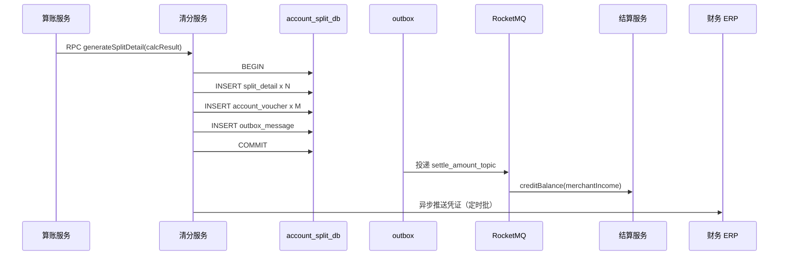

# 清分与账务详细设计

> 版本：V1.2 | 服务：pay-split | 职责：清分明细 + 会计凭证 + ERP 同步

---

## 1. 清分处理流程



---

## 2. 清分明细生成规则

### 2.1 输入

`FeeCalcResultDTO` + `AgentRelation` + `bill_no`

### 2.2 输出行（收款单）

| party_type | party_id | amount | direction | 来源字段 |
|------------|----------|--------|-----------|----------|
| PLATFORM | 0 | platformFee | 应收(1) | platformFee |
| AGENT_L1 | agentId | agentL1Share | 应付(2) | agentL1Share |
| AGENT_L2 | secondAgentId | agentL2Share | 应付(2) | agentL2Share |
| PARTNER | splitPartyId | partnerShare | 应付(2) | partnerShare |
| MERCHANT | merchantId | merchantIncome | 应付(2) | merchantIncome |

**约束：**
- 所有 amount > 0（退款单为负数冲销行）
- `sum(应收) = sum(应付) = tradeAmount`（收款单）
- 零值行不写入（减少存储）

### 2.3 退款清分

各字段取 `calcRefund` 负数结果，direction 与收款相反：
- 平台：应付（退还手续费）
- 商户：应收（扣减商户实收）

### 2.4 伪代码

```java
public List<SplitDetail> buildSplitDetails(FeeCalcResult r, AgentRelation rel) {
    List<SplitDetail> list = new ArrayList<>();
    addIfPositive(list, PLATFORM, 0L, r.getPlatformFee(), RECEIVABLE);
    addIfPositive(list, AGENT_L1, rel.getAgentId(), r.getAgentL1Share(), PAYABLE);
    addIfPositive(list, AGENT_L2, rel.getSecondAgentId(), r.getAgentL2Share(), PAYABLE);
    addIfPositive(list, PARTNER, rel.getSplitPartyId(), r.getPartnerShare(), PAYABLE);
    addIfPositive(list, MERCHANT, r.getMerchantId(), r.getMerchantIncome(), PAYABLE);
    validateBalance(list, r.getTradeAmount());
    return list;
}
```

---

## 3. 会计凭证（复式记账）

### 3.1 科目映射表

| 业务场景 | 借方科目 | 贷方科目 | 金额 |
|----------|----------|----------|------|
| 收款-交易款 | 1002 银行存款-备付金 | 2203 应付商户款 | tradeAmount |
| 收款-平台手续费 | 2203 应付商户款 | 6001 手续费收入 | platformFee |
| 收款-一级代理分润 | 2203 应付商户款 | 2204 应付代理款-L1 | agentL1Share |
| 收款-二级代理分润 | 2203 应付商户款 | 2205 应付代理款-L2 | agentL2Share |
| 收款-合伙人分成 | 2203 应付商户款 | 2206 应付合伙人款 | partnerShare |
| 结算出款 | 2203 应付商户款 | 1002 银行存款-备付金 | settleAmount |
| 退款-冲销 | 反向上述分录 | — | 负数 |

科目编码可配置于 `subject_mapping` 表。

### 3.2 凭证生成（收款单）

一笔 1000 元订单（见计费算例）生成凭证：

| voucher_no | 借方 | 贷方 | 金额 |
|------------|------|------|------|
| VT...001 | 1002 备付金 | 2203 应付商户 | 1000.00 |
| VT...002 | 2203 应付商户 | 6001 手续费 | 6.00 |
| VT...003 | 2203 应付商户 | 2204 应付代理L1 | 49.70 |
| VT...004 | 2203 应付商户 | 2205 应付代理L2 | 28.33 |
| VT...005 | 2203 应付商户 | 2206 应付合伙人 | 10.08 |

商户实收 905.89 体现在 2203 应付商户净额 = 905.89。

### 3.3 subject_mapping 表

```sql
CREATE TABLE `subject_mapping` (
  `id`            bigint       NOT NULL AUTO_INCREMENT,
  `biz_scene`     varchar(32)  NOT NULL COMMENT 'PAY_PLATFORM_FEE等',
  `debit_subject` varchar(32)  NOT NULL,
  `credit_subject` varchar(32) NOT NULL,
  `status`        tinyint      NOT NULL DEFAULT 1,
  PRIMARY KEY (`id`),
  UNIQUE KEY `uk_scene` (`biz_scene`)
) ENGINE=InnoDB DEFAULT CHARSET=utf8mb4;
```

---

## 4. Outbox 可靠消息

### 4.1 写入时机

与 split_detail、account_voucher 同一本地事务：

```java
outboxRepo.insert(OutboxMessage.builder()
    .bizKey(calcResult.getBillNo())
    .topic("settle_amount_topic")
    .payload(json(Map.of(
        "merchantId", calcResult.getMerchantId(),
        "billNo", calcResult.getBillNo(),
        "amount", calcResult.getMerchantIncome(),
        "bizTime", calcResult.getCalcTime()
    )))
    .build());
```

### 4.2 投递 Job

```java
@Scheduled(cron = "0/5 * * * * ?") // 每 5 秒
public void dispatchOutbox() {
    List<OutboxMessage> batch = outboxRepo.fetchPending(100);
    for (OutboxMessage msg : batch) {
        try {
            mqProducer.send(msg.getTopic(), msg.getPayload());
            outboxRepo.markSent(msg.getId());
        } catch (Exception e) {
            log.warn("outbox send fail id={}", msg.getId());
        }
    }
}
```

### 4.3 消费端幂等

结算服务 `creditBalance(merchantId, billNo, amount)`，`account_flow.uk_biz(bill_no, op_type=CREDIT)`。

---

## 5. ERP 同步

### 5.1 同步模式

**异步批量：** 每 5 分钟扫描 `account_voucher.sync_status=0`，打包推送 ERP。

### 5.2 推送报文

```json
{
  "batchNo": "ERP202607050001",
  "vouchers": [
    {
      "voucherNo": "VT2026070500000001",
      "billNo": "CL20260705000001",
      "bizDate": "2026-07-05",
      "entries": [
        { "subject": "1002", "direction": "DEBIT", "amount": 1000.00 },
        { "subject": "2203", "direction": "CREDIT", "amount": 1000.00 }
      ]
    }
  ]
}
```

### 5.3 失败重试

| sync_status | 含义 |
|-------------|------|
| 0 | 待同步 |
| 1 | 已同步 |
| 2 | 失败，retry_count++ |

失败 5 次 → 告警，人工补推。

### 5.4 ERP 接口

```
POST {erp_host}/api/v1/voucher/batch
Authorization: Bearer {service_token}
Idempotency-Key: {batchNo}
```

---

## 6. 业财核对

### 6.1 日终核对公式

```
备付金银行余额
  ≈ SUM(merchant.wait_balance + merchant.frozen_balance)
  + SUM(代理应付未结)
  + 平台手续费累计未转
```

差异 ≠ 0 → P0 告警。

### 6.2 清分 vs 计费核对

```sql
SELECT f.bill_no,
       f.trade_amount,
       (SELECT SUM(amount) FROM split_detail s WHERE s.bill_no=f.bill_no AND direction=1) AS recv,
       (SELECT SUM(amount) FROM split_detail s WHERE s.bill_no=f.bill_no AND direction=2) AS pay
FROM fee_calc_result f
WHERE DATE(calc_time) = CURDATE() - INTERVAL 1 DAY
HAVING recv <> pay OR recv <> trade_amount;
```

---

## 7. 奖惩 / 分账特殊清分

### 7.1 奖惩单（REWARD_PUNISH）

| reward_type | 清分 |
|-------------|------|
| 奖励 | MERCHANT 应付 +amount |
| 惩罚 | MERCHANT 应收 -amount（扣 wait_balance） |

### 7.2 分账分润单（PROFIT_SHARE）

上游已指定各方金额，清分服务 **跳过计费引擎**，直接按消息体拆分：

```json
{
  "billNo": "CL...",
  "splits": [
    { "partyType": 5, "partyId": 100001, "amount": 800.00 },
    { "partyType": 4, "partyId": 300001, "amount": 200.00 }
  ]
}
```

校验：`sum(splits.amount) == tradeAmount`。

---

## 8. Outbox 派发实现（V1.4 代码对齐）

### 8.1 写入

`SplitServiceImpl.generateSplitDetail` 在分账/凭证成功后写入 `outbox_message`（status=0，bizKey=billNo，merchantId 分片键）。

### 8.2 派发 `OutboxDispatchJob`

1. `ShardScanSupport.forEachShard` + `findTopNByStatusAndShardIdOrderByCreateTimeAsc`，避免全库广播  
2. `payMqProducer.sendOrderly(settle_amount_topic, merchantId, payload)` — **事务外**  
3. `OutboxDispatchTxSupport.markSent` — 短事务单 SQL `UPDATE status=1`  

### 8.3 补偿

- `OutboxCompensateJob`：有 split 无 outbox 时补写  
- `SplitCompensateJob`：有 fee_result 无 split 时补清分  

### 8.4 配置

| key | mq profile 典型值 |
|-----|-------------------|
| pay.outbox.dispatch-interval-ms | 1000 |
| pay.outbox.dispatch-batch-size | 200 |
| pay.mq.outbox-via-mq | true |
