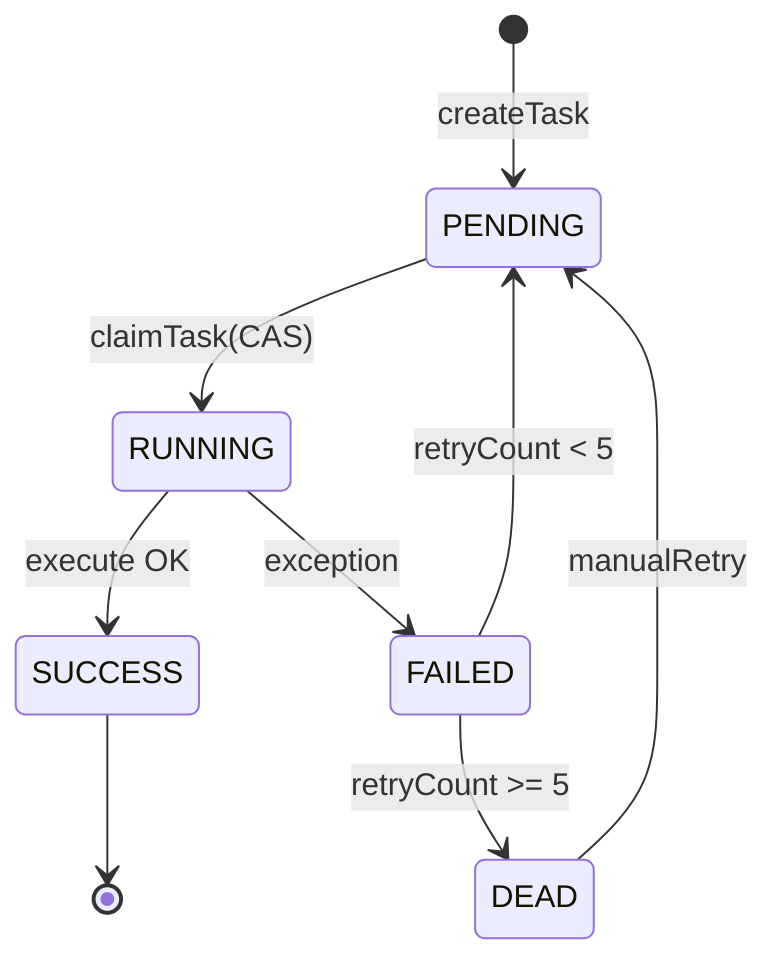
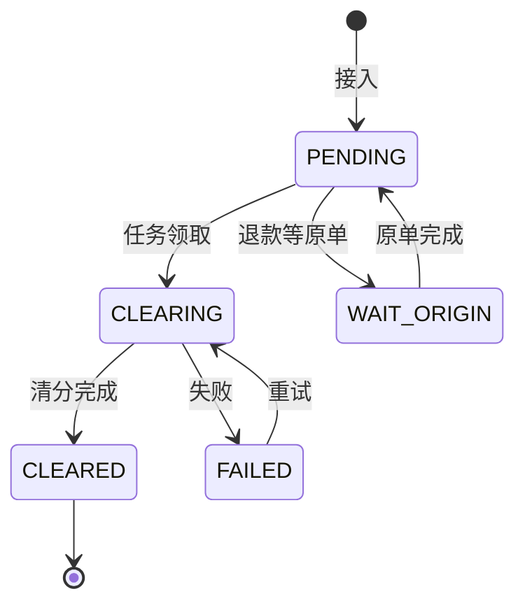
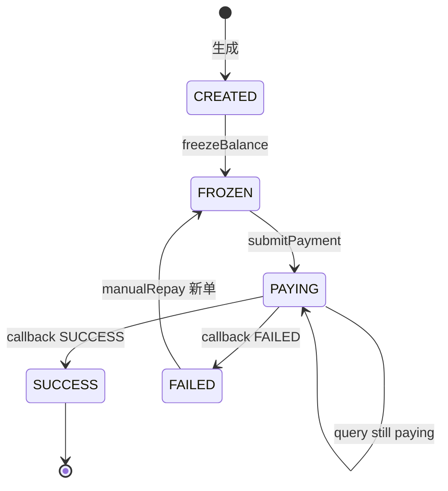
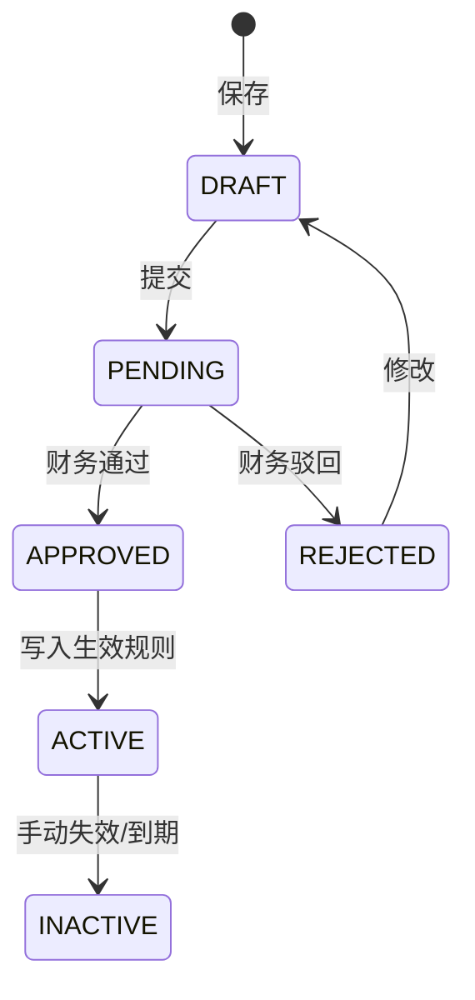

# 单据接入与状态机规范

> 版本：V1.2 | 服务：pay-access + pay-calc + pay-control

---

## 1. 八大单据类型详细规范

### 1.1 PAY — 收款清算（bill_type=1）

| 项 | 说明 |
|----|------|
| 来源 | 支付渠道 MQ / HTTP |
| 必填 | billNo, orderNo, merchantId, tradeAmount, 四维匹配字段 |
| 后续 | 清算 → 计费 → 清分 → 中间户入账 |
| bill_no 生成 | 上游生成，格式 CL+日期+序号 |

**校验规则：**
- tradeAmount > 0
- merchant_profile.status = 正常
- orderNo 在 PAY 类型下同一 merchant 唯一（防重复支付）

### 1.2 REFUND — 退款清算（bill_type=2）

| 项 | 说明 |
|----|------|
| 必填 | originBillNo, tradeAmount（退款金额） |
| 约束 | refundAmount ≤ 原单 tradeAmount - 已退累计 |
| 初始 status | WAIT_ORIGIN(4) 若原单未清算 |

**部分退款：**
- 同一 originBillNo 可多次退款
- 累计退款不得超过原单本金

### 1.3 RECHARGE — 充值（bill_type=3）

| 项 | 说明 |
|----|------|
| 用途 | 商户预充值，不走分润 |
| 清分 | 仅平台应收，不进中间户待结算 |
| 凭证 | 借备付金 贷预收账款 |

### 1.4 PROFIT_SHARE — 分账分润（bill_type=4）

| 项 | 说明 |
|----|------|
| 特点 | 上游指定 splits[]，跳过计费引擎 |
| 校验 | sum(splits) = tradeAmount |
| 场景 | 微信/支付宝分账结果同步 |

### 1.5 REWARD_PUNISH — 奖惩（bill_type=5）

| 字段 | 说明 |
|------|------|
| rewardDirection | 1奖励 2惩罚 |
| tradeAmount | 绝对值 |
| 审批 | 惩罚 >1000 需运营审批后生效 |

### 1.6 AUTH — 鉴权（bill_type=6）

仅记录，不计费不清分，用于对账留痕。

### 1.7 PAYOUT — 付款（bill_type=7）

平台主动向用户付款，与结算出款不同，走付款渠道模块。

### 1.8 ORDER_CLEAR — 订单清算抵扣（bill_type=8）

| 场景 | 订单取消、拒单后从商户待结算扣款 |
| 计算 | 按订单金额固定扣减，不走代理分润 |

---

## 2. 接入层处理流水线


### 2.1 校验清单（公共服务）

```java
public ValidateResult validate(TradeBillDTO bill) {
    if (bill.getTradeAmount().scale() > 2) return fail(10002);
    if (merchantService.isFrozen(bill.getMerchantId())) return fail(10003);
    if (bill.getBillType() == REFUND) {
        return validateRefund(bill);
    }
    if (bill.getBillType() == PROFIT_SHARE) {
        return validateSplits(bill.getSplits(), bill.getTradeAmount());
    }
    return success();
}
```

---

## 3. 清算任务状态机（完整）



### 3.1 状态转移表

| 当前 | 事件 | 目标 | 动作 |
|------|------|------|------|
| PENDING | claimTask | RUNNING | UPDATE status WHERE status=PENDING |
| RUNNING | calcSuccess | SUCCESS | 写 fee_result, 调 split |
| RUNNING | calcFail | FAILED | retry_count++, error_msg |
| FAILED | autoRetry | PENDING | 定时 Job |
| FAILED | retry>=5 | DEAD | 告警，人工介入 |
| DEAD | manualRetry | PENDING | 运营台触发 |

### 3.2 claimTask CAS

```sql
UPDATE clearance_task
SET status = 1, update_time = NOW()
WHERE bill_no = #{billNo} AND status = 0;
-- affected rows = 1 才继续执行
```

---

## 4. 清算单据状态机



---

## 5. 结算单状态机（完整）



| 当前 | 禁止操作 |
|------|----------|
| PAYING | 再次提现、再次冻结 |
| SUCCESS | 任何变更 |
| FAILED | 自动扣款（需重出款） |

---

## 6. 审批流状态机



双人原则：提交人与审批人不能为同一 userId。

---

## 7. 算账服务 executeTask 详细步骤

```
1. claimTask(billNo) → RUNNING
2. load trade_bill
3. load agent_merchant_relation from cache
4. switch bill_type:
     PAY/ORDER_CLEAR → feeCalcService.calcShareFee
     REFUND → feeCalcService.calcRefundFee
     PROFIT_SHARE → splitService.generateSplitFromFixed
     REWARD_PUNISH → calcRewardPunish
5. persist fee_calc_result (if applicable)
6. splitService.generateSplitDetail
7. update trade_bill.status = CLEARED
8. update task.status = SUCCESS
```

任一步失败 → task FAILED，trade_bill.status = FAILED，不回滚已写 split（靠 bill_no 幂等重跑）。

---

## 8. 失败重试策略

| 组件 | 策略 |
|------|------|
| MQ 消费 | 16 次，退避 1s→2m，入 DLQ |
| 清算任务 | 5 次，指数退避 1m/5m/15m/30m/60m |
| Outbox | 无限重试，5s 间隔 |
| ERP 同步 | 5 次，10m 间隔 |
| 银行查单 | 10 次，30s 间隔 |

---

## 9. 接入示例（HTTP）

```bash
curl -X POST https://api.example.com/api/v1/clearance/bill/submit \
  -H "Content-Type: application/json" \
  -H "X-App-Id: pay-channel-001" \
  -H "X-Signature: ..." \
  -d '{
    "billNo": "CL20260705000001",
    "billType": 1,
    "businessLine": "A",
    "category": "A01",
    "serviceItem": "A0101",
    "merchantId": 100001,
    "orderNo": "OD20260705123456",
    "tradeAmount": 1000.00,
    "cityCode": "110000",
    "payChannel": "ALI_PAY",
    "payTime": "2026-07-05T14:30:00+08:00"
  }'
```

---

## 10. 监控埋点

| 埋点 | 位置 | 标签 |
|------|------|------|
| clearance_bill_received_total | 接入层 | bill_type |
| clearance_task_duration_seconds | 算账服务 | status |
| fee_calc_duration_seconds | 计费服务 | target_type |
| settle_credit_total | 结算服务 | — |
| payment_submit_total | 出款 | channel, status |

Prometheus histogram buckets：5ms, 10ms, 50ms, 100ms, 500ms, 1s, 5s, 30s。
