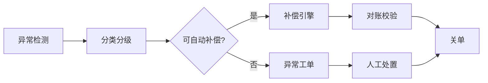
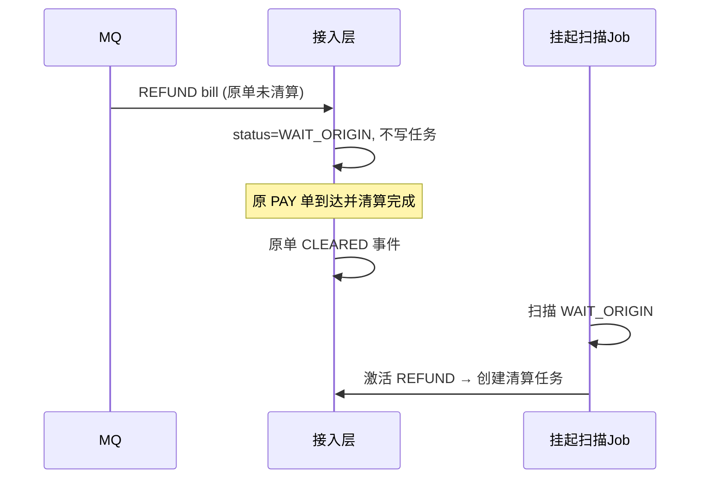
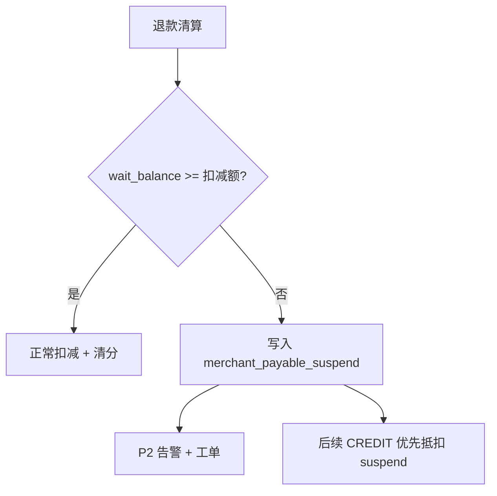
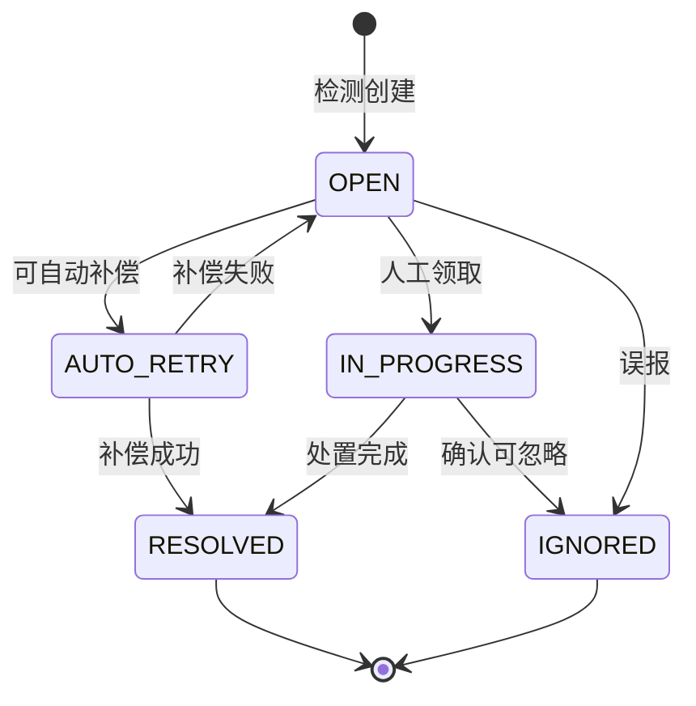
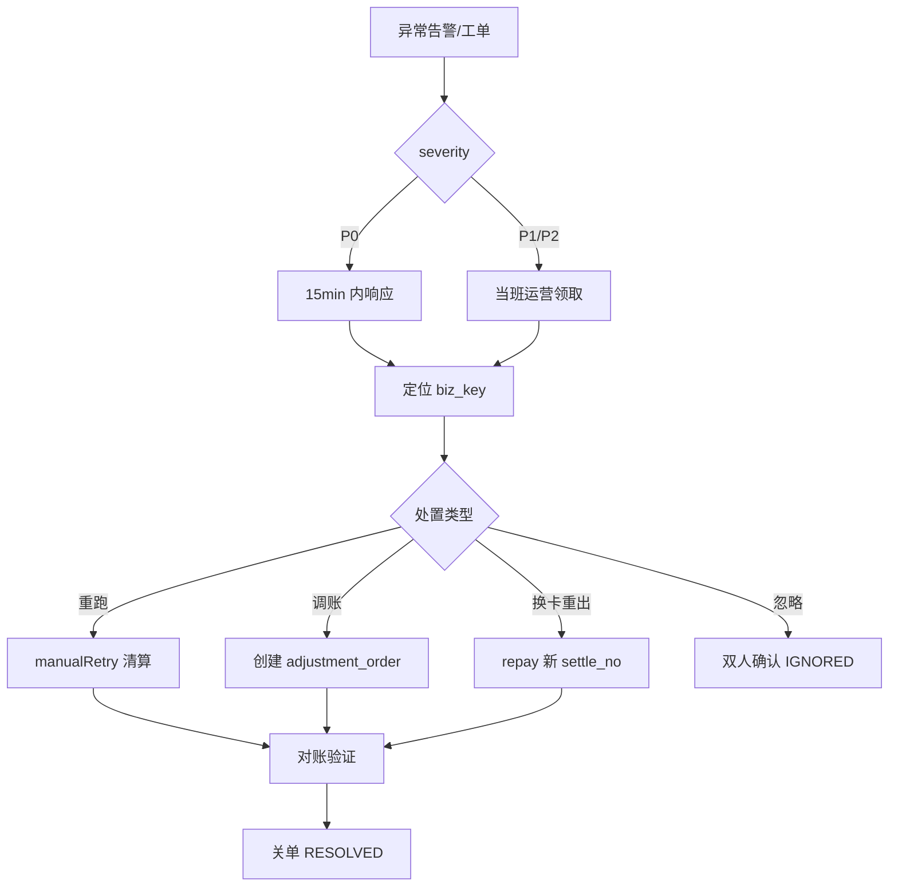

# 异常与容错设计（清算专家视角）

> 版本：V1.2 | 日期：2026-07-05 | 定位：清算结算全链路异常分类、检测、补偿、人工介入规范

---

## 1. 设计原则

清算系统的异常处理遵循四条铁律：

| 原则 | 含义 | 落地要求 |
|------|------|----------|
| **资金不错** | 宁可延迟，不可错账 | 异常单挂账，不强行入账/出款 |
| **状态可追溯** | 每笔异常有单号、有状态、有操作人 | exception_record 全量留痕 |
| **幂等可重放** | 重试/补偿不改变已正确结果 | 全局 bill_no / settle_no 幂等 |
| **人机协同** | 自动能处理的自动处理，不能的进工单 | 分级 SLA + 双人复核 |



---

## 2. 异常分类体系

### 2.1 按严重程度（P 级）

| 级别 | 定义 | 响应 SLA | 通知 |
|------|------|----------|------|
| **P0** | 资金安全风险、账实不平、备付金差异 | 15 分钟 | 电话 + 企微 + 邮件 |
| **P1** | 清算/出款大面积失败、DLQ 堆积 | 30 分钟 | 企微 + 邮件 |
| **P2** | 单笔异常、规则匹配失败、ERP 同步失败 | 4 小时 | 企微 |
| **P3** | 可自动重试成功、信息类告警 | 下一工作日 | 站内信 |

### 2.2 按异常域（EX 码）

| 码段 | 域 | 典型场景 |
|------|-----|----------|
| EX-01xx | 接入层 | 重复单、乱序、脏数据、渠道多报 |
| EX-02xx | 清算/计费 | 规则缺失、负分润、关系断裂、算费超时 |
| EX-03xx | 清分/账务 | 借贷不平、Outbox 积压、ERP 拒收 |
| EX-04xx | 结算/账户 | 余额不足、并发冲突、冻结泄漏 |
| EX-05xx | 出款/渠道 | 打款失败、长款、短款、掉单 |
| EX-06xx | 对账 | 渠道差异、银行差异、业财差异 |
| EX-07xx | 配置/主数据 | 代理关系过期、规则审批冲突 |

### 2.3 按是否可自动恢复

| 类型 | 说明 | 处理方式 |
|------|------|----------|
| **瞬态异常** | 网络超时、锁冲突、MQ 暂不可用 | 指数退避重试 |
| **可补偿异常** | 半成功（写了 result 未 split） | 补偿 Job 续跑 |
| **业务拒单** | 余额不足退款、超额退款 | 挂账 + 工单 |
| **不可自愈异常** | 数据篡改、科目缺失、银行账号非法 | 人工 + 双人复核 |

---

## 3. 全链路异常场景矩阵

### 3.1 接入层（EX-01xx）

| 场景 ID | 场景 | 触发条件 | 系统行为 | 补偿 |
|---------|------|----------|----------|------|
| EX-0101 | MQ 重复投递 | 同 bill_no 二次消费 | 幂等返回成功，不重复建任务 | — |
| EX-0102 | HTTP 与 MQ 双写 | 同 order 两通道 | 以 bill_no 幂等，第二路 10001 | — |
| EX-0103 | 乱序到达 | 退款先于收款 | REFUND → WAIT_ORIGIN，定时扫描 | 原单 CLEARED 后自动触发 |
| EX-0104 | 渠道多报（长款） | 渠道有、业务无 | 接入挂起 status=SUSPEND，不进清算 | 人工核实后补单或退渠道 |
| EX-0105 | 渠道漏报（短款） | 业务有、渠道无 | T+1 对账差异单 | 补推送或关单 |
| EX-0106 | 金额精度异常 | scale>2 或科学计数 | 拒单 10002，进 DLQ | 上游修正重推 |
| EX-0107 | 商户已冻结仍进单 | status=冻结 | 拒单 10003，告警 P2 | 解冻后手动重推 |
| EX-0108 | 未知 bill_type | type 不在 1-8 | 拒单，DLQ | 版本升级后重放 |

**乱序退款处理时序：**



### 3.2 清算/计费（EX-02xx）

| 场景 ID | 场景 | 触发条件 | 系统行为 | 补偿 |
|---------|------|----------|----------|------|
| EX-0201 | 规则全部未匹配 | 无兜底规则 | task FAILED, P2 告警 | 配置兜底规则后重跑 |
| EX-0202 | 负分润/负净额 | 固定金额>净额 | task FAILED, 不写结算 | 运营调规则或人工分润 |
| EX-0203 | 代理关系缺失 | relation 空 | 跳过代理步，WARN 日志 | 补关系后重跑 |
| EX-0204 | 关系过期 | valid_end < now | 按无代理清算 | — |
| EX-0205 | 清算中途规则变更 | 任务 RUNNING 时规则生效 | **以任务创建时刻快照** | 不重算在途单 |
| EX-0206 | 计费 RPC 超时 | >500ms | 重试 3 次 → FAILED | 自动重试 Job |
| EX-0207 | 部分成功 | fee_result 已写，split 失败 | task FAILED，**不删 result** | 补偿 Job 仅调 split |
| EX-0208 | 尾差超限 | \|diff\| > 0.01 | FAILED，P2 | 人工确认舍入规则 |
| EX-0209 | 重复清算 | 同 bill SUCCESS 再执行 | 幂等直接返回 | — |
| EX-0210 | 任务僵死 | RUNNING > 30min |  watchdog 改 FAILED | 自动 rePending |

**EX-0207 部分成功补偿（关键）：**

```java
// CompensationJob 扫描：fee_calc_result 存在 && task.status=FAILED && 无 split_detail
public void compensateSplit(String billNo) {
    if (splitRepo.exists(billNo)) return;
    FeeCalcResult result = feeResultRepo.get(billNo);
    splitService.generateSplitDetail(result); // 幂等
    taskRepo.updateSuccess(billNo);
}
```

### 3.3 清分/账务（EX-03xx）

| 场景 ID | 场景 | 触发条件 | 系统行为 | 补偿 |
|---------|------|----------|----------|------|
| EX-0301 | 借贷不平 | sum(debit)≠sum(credit) | 事务回滚，task FAILED | 修 mapping 后重跑 |
| EX-0302 | Outbox 积压 | pending > 1000 条 | P1 告警 | 扩容投递线程 |
| EX-0303 | Outbox 投递成功但消费失败 | MQ 丢失（极低） | 对账发现未入账 | 手动重发或补 credit |
| EX-0304 | 重复 credit | 同 bill 二次消费 | account_flow 幂等跳过 | — |
| EX-0305 | ERP 科目不存在 | ERP 拒收 | voucher sync_status=2 | 补科目映射后重推 |
| EX-0306 | ERP 批部分失败 | batch 内部分拒 | 失败行 retry | 5 次后进工单 |
| EX-0307 | 清分与计费金额不一致 | 日终核对 | P1 告警 | 差错调整单 |

### 3.4 结算/账户（EX-04xx）

| 场景 ID | 场景 | 触发条件 | 系统行为 | 补偿 |
|---------|------|----------|----------|------|
| EX-0401 | 退款余额不足 | wait < 退款扣减额 | **记商户应付挂账**，不扣成负 | 后续入账抵扣或人工追偿 |
| EX-0402 | 乐观锁冲突 | version 不匹配 | 重试 3 次 → 30005 | 客户端重试 |
| EX-0403 | 冻结泄漏 | FAILED 未解冻 | 日终 frozen 账龄扫描 | 自动 unfreeze Job |
| EX-0404 | 双重冻结 | 重复提现申请 | 30015 在途拦截 | — |
| EX-0405 | credit 丢失 | Outbox 消费失败 | wait 少于应入账 | 补账 Job |
| EX-0406 | 账户穿透 | wait+frozen 与 flow 不平 | P0 告警，冻结出款 | 财务封账排查 |
| EX-0407 | T1 批部分失败 | 500 中部分 freeze 失败 | 失败进 batch_fail，成功继续 | 下批次或手动 |

**EX-0401 退款余额不足 — 挂账模型：**



```sql
CREATE TABLE `merchant_payable_suspend` (
  `id`           bigint        NOT NULL AUTO_INCREMENT,
  `merchant_id`  bigint        NOT NULL,
  `bill_no`      varchar(64)   NOT NULL,
  `suspend_amount` decimal(18,2) NOT NULL COMMENT '挂账应付（退款缺口）',
  `settled_amount` decimal(18,2) NOT NULL DEFAULT 0 COMMENT '已抵扣金额',
  `status`       tinyint       NOT NULL DEFAULT 0 COMMENT '0挂账中 1已结清',
  `create_time`  datetime      NOT NULL DEFAULT CURRENT_TIMESTAMP,
  PRIMARY KEY (`id`),
  UNIQUE KEY `uk_bill_no` (`bill_no`),
  KEY `idx_merchant_status` (`merchant_id`, `status`)
) ENGINE=InnoDB DEFAULT CHARSET=utf8mb4 COMMENT='商户应付挂账（退款不足等）';
```

**后续入账抵扣逻辑：**

```java
public void creditBalance(Long merchantId, String billNo, BigDecimal amount) {
    BigDecimal remain = amount;
    // 1. 优先抵扣挂账
    List<Suspend> suspends = suspendRepo.listOpen(merchantId);
    for (Suspend s : suspends) {
        BigDecimal deduct = remain.min(s.getRemain());
        suspendRepo.deduct(s.getId(), deduct);
        remain = remain.subtract(deduct);
        if (remain.signum() == 0) break;
    }
    // 2. 剩余入 wait_balance
    if (remain.signum() > 0) {
        doCredit(merchantId, billNo, remain);
    }
}
```

### 3.5 出款/渠道（EX-05xx）

| 场景 ID | 场景 | 触发条件 | 系统行为 | 补偿 |
|---------|------|----------|----------|------|
| EX-0501 | 打款失败-卡号错误 | 银行 ACCOUNT_ERROR | unfreeze + FAILED | 商户换卡后重出 |
| EX-0502 | 打款超时 | 同步无响应 | 保持 PAYING，查单 Job | 查单 10 次后工单 |
| EX-0503 | 掉单（长款） | 我方 FAILED，银行已成功 | 对账发现 | **禁止自动重出**，人工核实 |
| EX-0504 | 短款 | 我方 SUCCESS，银行无 | P0 告警 | 查单 + 银行追款 |
| EX-0505 | 重复回调 | 同 settle_no 二次 SUCCESS | 幂等忽略 | — |
| EX-0506 | 回调验签失败 | 签名不对 | 401 拒收 + P1 | 安全排查 |
| EX-0507 | 备付金不足 | 银行返回余额不足 | 批次暂停 P0 | 补足备付金后续跑 |
| EX-0508 | 重出款重复打款 | 运营误操作 | origin_settle_no 关联校验 | 防重复冻结 |

**EX-0503 掉单（Critical）处理规程：**

```
1. 对账发现：settlement_order=FAILED 但银行回单有记录
2. 立即标记 settle_no 为 DISPUTE，冻结该商户新的 D0/T1
3. 财务 + 运营双人核实银行流水
4. 确认银行已打款 → 本地改 SUCCESS，deductFrozen（若已 unfreeze 则调账）
5. 禁止对同一 origin_settle_no 自动重出
```

### 3.6 对账差异（EX-06xx）

| 场景 ID | 场景 | 处理 |
|---------|------|------|
| EX-0601 | 渠道多账 | 生成 channel_surplus，挂账待查 |
| EX-0602 | 渠道少账 | 生成 channel_shortage，补推或关单 |
| EX-0603 | 清算漏单 | trade 有 bill 无 | 补建 clearance_task |
| EX-0604 | 清算多单 | bill 有 trade 无 | SUSPEND + 核实 |
| EX-0605 | 业财差异 | 凭证≠清分 | 差错调整凭证 |
| EX-0606 | 备付金差异 | 银行≠账面 | P0 封账 |

---

## 4. 异常单数据模型

### 4.1 exception_record — 统一异常工单

```sql
CREATE TABLE `exception_record` (
  `exception_id`   bigint        NOT NULL AUTO_INCREMENT,
  `exception_no`   varchar(32)   NOT NULL COMMENT 'EX202607050001',
  `exception_code` varchar(16)   NOT NULL COMMENT 'EX-0401',
  `severity`       tinyint       NOT NULL COMMENT '0P0 1P1 2P2 3P3',
  `biz_domain`     varchar(16)   NOT NULL COMMENT 'CLEAR/SETTLE/PAYMENT',
  `biz_key`        varchar(64)   NOT NULL COMMENT 'bill_no或settle_no',
  `merchant_id`    bigint        DEFAULT NULL,
  `title`          varchar(128)  NOT NULL,
  `detail`         json          NOT NULL COMMENT '上下文快照',
  `status`         tinyint       NOT NULL DEFAULT 0 COMMENT '0待处理 1处理中 2已解决 3已忽略',
  `assignee_id`    bigint        DEFAULT NULL,
  `resolver_id`    bigint        DEFAULT NULL,
  `resolution`     varchar(512)  DEFAULT NULL,
  `auto_retry_count` int         NOT NULL DEFAULT 0,
  `next_retry_time` datetime     DEFAULT NULL,
  `create_time`    datetime      NOT NULL DEFAULT CURRENT_TIMESTAMP,
  `resolve_time`   datetime      DEFAULT NULL,
  PRIMARY KEY (`exception_id`),
  UNIQUE KEY `uk_exception_no` (`exception_no`),
  KEY `idx_biz_key` (`biz_key`),
  KEY `idx_status_severity` (`status`, `severity`),
  KEY `idx_next_retry` (`status`, `next_retry_time`)
) ENGINE=InnoDB DEFAULT CHARSET=utf8mb4 COMMENT='清算结算异常工单';
```

库归属：`public_control_db`

### 4.2 异常状态机



### 4.3 异常与业务单关联

| biz_domain | biz_key | 关联表 |
|------------|---------|--------|
| ACCESS | bill_no | trade_bill |
| CLEAR | bill_no | clearance_task |
| SETTLE | settle_no | settlement_order |
| ACCOUNT | merchant_id | merchant_settle_account |
| RECONCILE | batch_no | reconcile_diff |

---

## 5. 补偿引擎设计

### 5.1 补偿任务清单

| Job | Cron | 扫描条件 | 动作 |
|-----|------|----------|------|
| SplitCompensateJob | */5 * * * * | result 有、split 无、task FAILED | 补 split + outbox |
| OutboxRedispatchJob | */5 * * * * | outbox pending > 5min | 重投递 |
| CreditCompensateJob | */10 * * * * | split 有、flow CREDIT 无 | 补 credit |
| FrozenLeakJob | 0 */1 * * * | FAILED 单 frozen>0 超 1h | unfreeze |
| WaitOriginScanJob | */5 * * * * | bill WAIT_ORIGIN + 原单 CLEARED | 激活退款任务 |
| RunningWatchdogJob | */5 * * * * | task RUNNING > 30min | 改 FAILED + 告警 |
| SuspendDeductJob | 0 * * * * | suspend 未结清 + 有新 CREDIT | 自动抵扣 |
| PaymentQueryJob | */30 * * * * | PAYING > 5min | 银行查单 |

### 5.2 补偿幂等保证

```
补偿动作前：检查目标状态是否已达成
补偿动作中：同一 biz_key + compensate_type 唯一
补偿动作后：写 compensate_log(biz_key, type, result)
```

```sql
CREATE TABLE `compensate_log` (
  `id`         bigint       NOT NULL AUTO_INCREMENT,
  `biz_key`    varchar(64)  NOT NULL,
  `comp_type`  varchar(32)  NOT NULL COMMENT 'SPLIT/CREDIT/UNFREEZE',
  `result`     tinyint      NOT NULL COMMENT '1成功 2失败',
  `message`    varchar(256) DEFAULT NULL,
  `create_time` datetime    NOT NULL DEFAULT CURRENT_TIMESTAMP,
  PRIMARY KEY (`id`),
  UNIQUE KEY `uk_biz_type` (`biz_key`, `comp_type`)
) ENGINE=InnoDB DEFAULT CHARSET=utf8mb4;
```

---

## 6. 差错调整（Adjustment）

### 6.1 适用场景

- 人工确认的规则错误需追溯调整
- 业财对账长期差异
- 银行掉单核实后账实对齐
- 运营奖惩漏单补录

### 6.2 调整单模型

```sql
CREATE TABLE `adjustment_order` (
  `adjust_id`    bigint        NOT NULL AUTO_INCREMENT,
  `adjust_no`    varchar(32)   NOT NULL,
  `merchant_id`  bigint        NOT NULL,
  `adjust_type`  tinyint       NOT NULL COMMENT '1入账 2扣款 3冻结 4解冻',
  `amount`       decimal(18,2) NOT NULL,
  `reason`       varchar(256)  NOT NULL,
  `ref_bill_no`  varchar(64)   DEFAULT NULL,
  `approval_id`  bigint        NOT NULL COMMENT '必须审批通过',
  `status`       tinyint       NOT NULL DEFAULT 0 COMMENT '0待审 1已执行 2驳回',
  `operator_id`  bigint        NOT NULL,
  `create_time`  datetime      NOT NULL DEFAULT CURRENT_TIMESTAMP,
  PRIMARY KEY (`adjust_id`),
  UNIQUE KEY `uk_adjust_no` (`adjust_no`)
) ENGINE=InnoDB DEFAULT CHARSET=utf8mb4;
```

**约束：**
- 单笔调整 > 1 万需财务 + 运营双人审批
- 执行时写 account_flow op_type=ADJUST(6)
- 同步生成反向/补录会计凭证

---

## 7. 降级与熔断

### 7.1 降级策略

| 组件 | 触发条件 | 降级行为 | 恢复 |
|------|----------|----------|------|
| 规则缓存 Redis | 不可用 | 直查 DB，RT↑ | Redis 恢复 |
| 计费服务 | 错误率>10% | 暂停新任务入队，堆积 MQ | 手动/自动恢复 |
| ERP 同步 | 连续失败 5 次 | 凭证积压，不清算阻塞 | ERP 恢复后批推 |
| 银行渠道 | 超时率>30% | T1 切备用渠道 | 主渠道恢复 |
| D0 提现 | 备付金低于阈值 | 关闭 D0，仅 T1 | 补足备付金 |

### 7.2 熔断（Sentinel / Resilience4j）

```java
@CircuitBreaker(name = "feeCalc", fallbackMethod = "feeCalcFallback")
public FeeCalcResultDTO calcShareFee(FeeCalcDTO req) { ... }

FeeCalcResultDTO feeCalcFallback(FeeCalcDTO req, Throwable t) {
    taskRepo.markFailed(req.getBillNo(), "CIRCUIT_OPEN");
    exceptionService.create("EX-0206", req.getBillNo(), P1);
    throw t;
}
```

---

## 8. 人工介入 SOP

### 8.1 工单处置流程



### 8.2 典型 SOP 摘要

| 异常码 | 操作步骤 | 禁止事项 |
|--------|----------|----------|
| EX-0503 掉单 | 查银行流水 → 改 DISPUTE → 双人确认 → 调账 | **禁止**直接重出 |
| EX-0401 退款挂账 | 通知商户 → 跟踪入账抵扣 → 结清 suspend | 禁止强行扣成负数 |
| EX-0202 负分润 | 查规则配置 → 修正规则 → 重跑 | 禁止手工改 result 金额 |
| EX-0406 账实不平 | 封账 → 导出 flow → 财务排查 | 禁止继续 T1 批 |

---

## 9. 异常相关监控指标

| 指标 | 类型 | 告警阈值 |
|------|------|----------|
| exception_open_total | Gauge | P0 任意 >0；P1 >10 |
| clearance_task_dead_total | Counter | 日增 >0 → P2 |
| outbox_pending_age_seconds | Histogram | P99 > 300s → P1 |
| frozen_leak_count | Gauge | >0 → P1 |
| payable_suspend_open_amount | Gauge | 单商户 >1万 → P2 |
| payment_dispute_total | Counter | >0 → P0 |
| compensate_fail_rate | Rate | >5% → P2 |
| dlq_message_count | Gauge | >100 → P1 |

---

## 10. 异常测试用例（必测）

| 用例 | 注入方式 | 期望 |
|------|----------|------|
| MQ 重复消费 | 同 bill 发 2 次 | 仅 1 条 task |
| split 写库失败 | Mock 抛异常 | result 在，补偿 Job 补 split |
| Outbox 消费失败 | 停 settlement | credit 补偿 Job 补上 |
| 退款超余额 | wait=100, refund=200 | suspend 100，不扣负 |
| 打款失败 | Mock FAILED 回调 | unfreeze，可重出 |
| 掉单 | FAILED 回调 + 银行成功回单 | DISPUTE，不自动重出 |
| RUNNING 僵死 | 杀进程 | Watchdog 改 FAILED |
| 规则变更在途 | 任务 RUNNING 时改规则 | 用旧规则算完 |
| T1 备付金不足 | Mock 银行拒绝 | 批暂停 P0 |
| 并发 D0 | 10 线程同时提现 | 仅成功余额内次数 |

---

## 11. 与现有模块衔接

| 模块 | 异常设计落点 |
|------|-------------|
| pay-access | EX-01xx 拒单/挂起/WAIT_ORIGIN |
| pay-calc | EX-02xx 补偿 Job、DEAD 工单 |
| pay-fee | 兜底规则、CIRCUIT 熔断 |
| pay-split | EX-03xx Outbox、借贷校验 |
| pay-settlement | EX-04xx/05xx suspend、查单、DISPUTE |
| pay-control | exception_record、adjustment、告警 |
| 操作台 | 异常工单列表、手动重跑、调账、重出 |

---

## 附录：异常码速查

| 码 | 名称 | 级别 | 自动补偿 |
|----|------|------|----------|
| EX-0103 | 退款乱序 | P3 | 是（WaitOriginScan） |
| EX-0207 | 清分半成功 | P2 | 是（SplitCompensate） |
| EX-0303 | 入账丢失 | P1 | 是（CreditCompensate） |
| EX-0401 | 退款余额不足 | P2 | 部分（suspend 抵扣） |
| EX-0403 | 冻结泄漏 | P1 | 是（FrozenLeak） |
| EX-0502 | 打款超时 | P2 | 是（PaymentQuery） |
| EX-0503 | 掉单长款 | **P0** | **否（人工）** |
| EX-0507 | 备付金不足 | **P0** | 否（补足后续跑） |
| EX-0606 | 备付金账实差异 | **P0** | 否（封账） |
