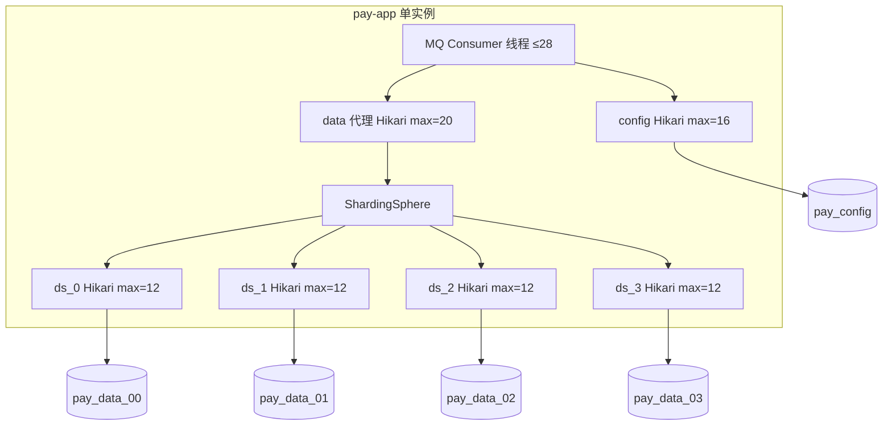

# 数据库连接池优化方案

> 日期：2026-07-16  
> 背景：压测 003（30 TPS × 30 分钟，1000 商户分片）出现 `Connection is not available, request timed out after 30005ms`，MySQL 侧 `Max_used_connections=152` 超过 `max_connections=151`。

---

## 1. 问题根因

### 1.1 连接数「双层池」叠加

分片模式（`mysql,sharding,mq`）存在 **三层** 数据源：

```
应用线程
  → dynamic-datasource 外层 Hikari（config 池 + data 池）
    → data 池：ShardingSphereDriver（外层代理池）
      → shardingsphere.yaml 内层 Hikari（ds_0 ~ ds_3，各一个池）
        → MySQL 物理连接
```

**优化前配置：**

| 层级 | 池 | maximumPoolSize |
|------|-----|-----------------|
| 外层 | pay_config | 40 |
| 外层 | ShardingSphere 代理 | 40 |
| 内层 | pay_data_00 ~ 03 | 40 × 4 = **160** |
| **MySQL 物理连接峰值（单实例）** | | **40 + 160 = 200** |

内层 4 个 `ds_*` 池各自独立向 MySQL 建连，**外层 40 并不限制内层 160**；config 池再占 40，理论峰值约 **200**，已超过 MySQL 默认 `max_connections=151`。

### 1.2 MySQL 容器资源不足

| 项 | 优化前 | 影响 |
|----|--------|------|
| `max_connections` | 151（默认） | 连接被拒绝/排队 |
| `innodb_buffer_pool_size` | 128MB | 缓冲小，随机 IO 多 |
| 容器 memory limit | 无限制但未调优 | 依赖宿主机，参数仍按默认 |

### 1.3 其他放大因素

- MQ 消费线程（优化前注解 min=20）与 DB 连接竞争
- 分片广播查询（无 `merchant_id`）同时占用多库连接
- `application-mq.yml` 全局 `connection-timeout: 3000` 与 sharding 的 30000 混用，易误判超时
- 补偿 Job 与压测热路径抢连接

---

## 2. 优化目标

| 指标 | 目标 |
|------|------|
| MySQL `max_connections` | ≥ 400 |
| 单应用实例 MySQL 物理连接峰值 | ≤ 80（留足监控/脚本余量） |
| Hikari 获取连接超时 | 30s（统一） |
| 压测 30 TPS 连接超时 | 接近 0 |
| 连接池可观测 | Actuator/Prometheus 可查看池状态 |

---

## 3. 优化方案

### 3.1 MySQL Docker 调优（P0）

**改动文件：**

- `docs/docker/mysql/my.cnf` — 服务端参数
- `docs/docker/mysql/docker-compose.yml` — 内存 limits 2G、健康检查
- `docs/docker/mysql/init-mysql-docker.sh` — 一键部署

**关键参数：**

```ini
max_connections = 400
innodb_buffer_pool_size = 512M
wait_timeout = 600
lock_wait_timeout = 30
```

**部署：**

```bash
chmod +x docs/docker/mysql/init-mysql-docker.sh
./docs/docker/mysql/init-mysql-docker.sh
```

### 3.2 应用连接池预算（P0）

按 **消费线程 × 分库数** 估算内层池，避免「每库 40」。  
2026-07-16 二次对齐（见 [整体优化方案批量写入.md](../mq/整体优化方案批量写入.md) PR-B）：proxy 对齐消费线程合计，内层略抬。

| 池 | 优化后 max | 说明 |
|----|-----------|------|
| pay_config（外层） | **16** | 路由/规则/商户校验 |
| ShardingSphere 代理（外层 data） | **28** | 对齐 access+calc+settle(+payment) 线程 |
| ds_0 ~ ds_3（内层） | **14 × 4 = 56** | 单库池，总物理仍远低于 400 |
| **物理连接峰值** | **16 + 56 = 72** | 单实例预算 |

**内层 Hikari 统一参数：**

- `connectionTimeout`: 30000 ms
- `idleTimeout`: 600000 ms（10 分钟）
- `maxLifetime`: 1800000 ms（30 分钟）
- `connectionTestQuery`: SELECT 1
- JDBC：`cachePrepStmts` / `prepStmtCacheSize` / `rewriteBatchedStatements`

**改动文件：**

- `pay-app/src/main/resources/shardingsphere.yaml`
- `pay-app/src/main/resources/application-sharding.yml`
- `pay-app/src/main/resources/application-mysql.yml`
- `pay-app/src/main/resources/application-mq.yml`

### 3.3 其他综合优化（P1）

| 项 | 说明 | 状态 |
|----|------|------|
| MQ 消费线程读 YAML | `prepareStart` 设置 min=max | 已落地（压测报告 003） |
| 压测暂停补偿 Job | `pay.loadtest.pause-jobs=true` | 已落地 |
| 清算事务缩短 | `activateWaitingRefunds` 事务提交后执行 | 已落地 |
| 幂等先查 bill_route | 避免 16 分片广播 | 已落地 |
| Prometheus 连接池指标 | `hikaricp.connections.*` | Spring Boot 默认暴露 |
| 慢 SQL | MySQL `long_query_time=1` | my.cnf 已开 |

### 3.4 验收方法

```bash
# 1) MySQL 参数
docker exec mysql8 mysql -uroot -p123456 -e "
  SHOW VARIABLES LIKE 'max_connections';
  SHOW VARIABLES LIKE 'innodb_buffer_pool_size';
  SHOW STATUS LIKE 'Max_used_connections';
"

# 2) 启动应用后看池日志（Hikari pool name）
grep -i 'HikariPool\|Pool-' /tmp/pay-app.log | head -20

# 3) 压测后检查
grep -c 'Connection is not available' /tmp/pay-app-loadtest003.log
```

**通过标准：** `Max_used_connections` < 300，应用日志连接超时 ≈ 0。

---

## 4. 连接池架构图（优化后）



---

## 5. 已执行改动清单

| 文件 | 改动 |
|------|------|
| `docs/docker/mysql/my.cnf` | max_connections=400、buffer pool 512M |
| `docs/docker/mysql/docker-compose.yml` | 内存 2G、挂载配置 |
| `docs/docker/mysql/init-mysql-docker.sh` | 部署脚本 |
| `shardingsphere.yaml` | 内层池 12、JDBC 缓存、Hikari 生命周期 |
| `application-sharding.yml` | 外层池 config=16/data=20、统一超时 |
| `application-mysql.yml` | 单库模式补齐 dynamic Hikari |
| `application-mq.yml` | 与 sharding 对齐 timeout，避免 3s 覆盖 |

---

## 6. 后续建议（P2）

1. **多实例部署**：每实例内层池再减半，或按实例数等比缩减 `maximumPoolSize`
2. **读写分离**：config 库只读副本，减轻主库连接
3. **连接池集中配置**：抽取 `pay.datasource.pool.*` 到单处，避免 yaml 漂移
4. **压测看板**：Grafana 增加 `hikaricp_connections_active` 与 `Max_used_connections` 同屏

---

## 7. 一句话结论

压测连接打满的主因是 **MySQL 默认 151 连接 + 分片内层 4×40 池未做预算**。通过 **抬高 MySQL max_connections/内存** 与 **将应用物理连接峰值压到 ~64**，可在 30 TPS 分片压测下消除连接池超时。
