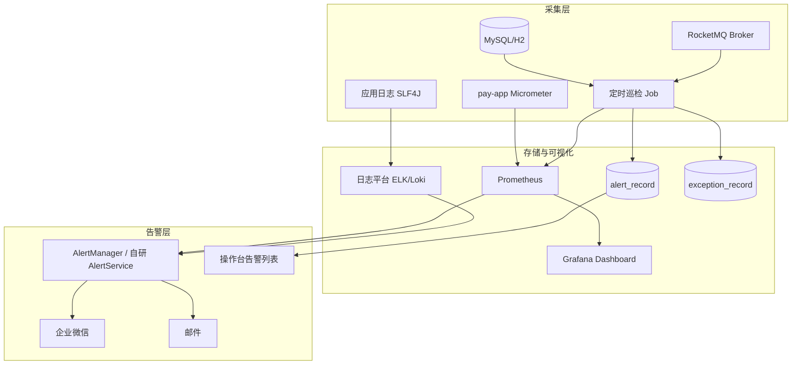
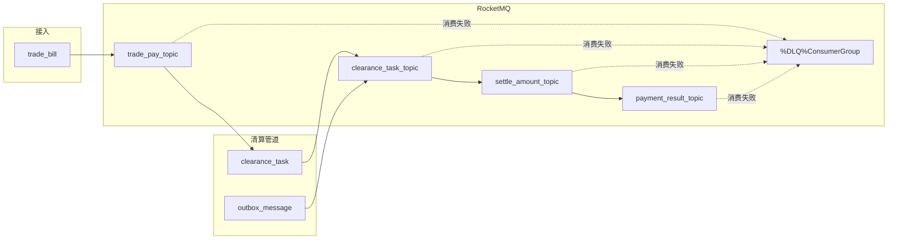
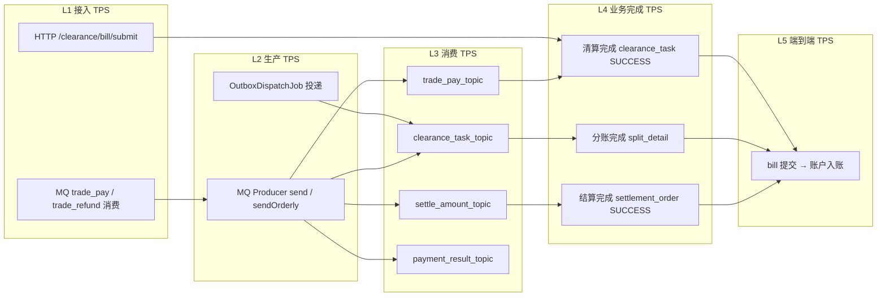
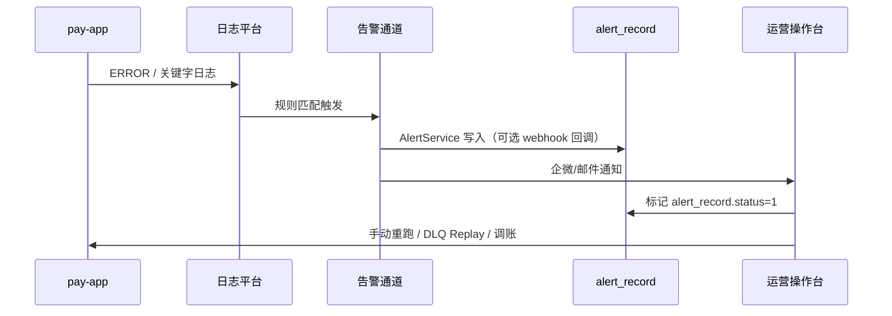

# 支付清算结算平台 — 系统监控方案

> 版本：V1.1 | 日期：2026-07-13 | 适用范围：ai-pay-settle 全链路监控与告警

**关联文档：** [01-架构设计](../01-架构设计.md) · [09-异常与容错设计](../09-异常与容错设计.md) · [MQ 性能优化实施方案](../mq/mq性能优化实施方案.md)

---

## 1. 目标与范围

### 1.1 监控目标

| 维度 | 目标 | 业务影响 |
|------|------|----------|
| **数据库表容量** | 核心表行数、增长率、最老 Pending 年龄可控 | 防止单表膨胀拖慢清算/出款 |
| **MQ 积压** | Topic Lag、Outbox Pending、DLQ 非空可感知 | 防止消息堆积导致资金延迟入账 |
| **异常日志** | ERROR / 业务异常关键字实时告警 | 缩短故障发现时间（MTTD） |
| **TPS 吞吐** | 接入/生产/消费/业务完成各层 TPS 可观测、可对照 | 容量规划、积压预判、性能回归基线 |
| **系统健康** | JVM、连接池、消费耗时、接口可用性 | 保障 SLA 与熔断决策依据 |

### 1.2 监控分层



### 1.3 现状与差距

| 能力 | 现状 | 差距 |
|------|------|------|
| Prometheus 指标 | `mq` Profile 已暴露 `/actuator/prometheus` | 默认 `mysql` Profile 未开启；部分设计指标未落地 |
| Outbox / 清算 Pending | `MqBacklogMonitorJob` 已实现 | 无告警去重；无最老 Pending 年龄指标 |
| MQ Topic Lag | 配置项 `lag-warn/lag-critical` 已存在 | **未接入** Admin API 查询 |
| DLQ 巡检 | `DlqInspectJob` 框架已有 | `queryDlqCount()` 为占位，恒返回 0 |
| 告警落库 | `AlertService` → `alert_record` | 无企微/邮件/短信外发通道 |
| 日志告警 | 默认 Logback 控制台输出 | 无集中采集与规则匹配 |
| 表容量监控 | 无专用 Job | 需新增 `DbCapacityMonitorJob` |
| TPS 吞吐监控 | 仅 `pay_mq_consume_total` 可推导消费 TPS | 无 HTTP/生产/业务完成 TPS；无生产-消费对照 Job |

---

## 2. 数据库表容量监控

### 2.1 监控表分级

#### P0 — 直接影响资金与消息投递

| 表名 | 容量信号 | 关键状态字段 | 已有索引 |
|------|----------|--------------|----------|
| `outbox_message` | 待发送消息积压 | `status` 0=待发送 | `idx_outbox_status_time (status, create_time)` |
| `clearance_task` | 清算任务积压 / 僵死 | `status` 0=PENDING 1=RUNNING 3=FAILED 4=DEAD | `idx_clearance_status_shard`, `idx_clearance_next_retry` |
| `settlement_order` | 出款管道深度 | `status` 0~4 | — |
| `account_flow` | 流水增长速度 | — | `uk_biz (bill_no, op_type)` |

#### P1 — 业务积压与异常闭环

| 表名 | 容量信号 | 说明 |
|------|----------|------|
| `trade_bill` | 接入量 / 未清分单据 | `status` pending/cleared/failed |
| `exception_record` | 未关闭工单数 | `status` 0=待处理 |
| `alert_record` | 未处理告警数 | `status` 0=未处理 |
| `merchant_payable_suspend` | 退款挂账积压 | `status` 0=挂账中 |
| `account_voucher` | ERP 同步失败堆积 | `sync_status` 2=失败 |

#### P2 — 配置与历史数据

| 表名 | 监控目的 |
|------|----------|
| `fee_calc_result` / `split_detail` | 日增量、归档策略 |
| `reconcile_bill` | 按日落库，关注单日写入失败 |
| `fee_share_rule` / `merchant_contract` | 低频变更，仅审计 |

### 2.2 监控指标设计

| 指标名 | 类型 | 采集方式 | 说明 |
|--------|------|----------|------|
| `pay_table_row_count` | Gauge | `SELECT COUNT(*)` / 近似行数 | 标签：`table` |
| `pay_table_pending_count` | Gauge | 按 `status` 分组计数 | 标签：`table`, `status` |
| `pay_table_oldest_pending_age_seconds` | Gauge | `MIN(create_time)` 与当前时间差 | 标签：`table` |
| `pay_table_daily_growth` | Gauge | 当日 `INSERT` 行数 | 标签：`table` |
| `pay_exception_open_total` | Gauge | `exception_record WHERE status=0` | 按 `severity` 分标签 |
| `pay_alert_open_total` | Gauge | `alert_record WHERE status=0` | 按 `level` 分标签 |

### 2.3 阈值与告警级别

| 表 / 场景 | WARN（P3） | ERROR（P2） | CRITICAL（P1） | 对应 EX 码 |
|-----------|------------|-------------|----------------|------------|
| `outbox_message` pending | ≥ 1,000 | ≥ 5,000 | ≥ 10,000 或最老 > 30min | EX-0302 |
| `clearance_task` PENDING | ≥ 500 | ≥ 2,000 | ≥ 5,000 | — |
| `clearance_task` RUNNING > 30min | — | 任意 > 0 | — | EX-0206 |
| `clearance_task` DEAD | — | 日增 > 10 | 日增 > 50 | EX-0201 |
| `exception_record` open P0 | — | — | 任意 > 0 | — |
| `exception_record` open P1 | — | > 10 | > 50 | — |
| `settlement_order` PAYING > 5min | > 20 | > 100 | > 500 | EX-0502 |
| `account_voucher` sync 失败 | > 50 | > 200 | > 1,000 | EX-0305 |
| 单表总行数（生产预估） | 达 80% 容量规划 | 达 90% | 达 95% | — |

> 注：`outbox_message` / `clearance_task` 的 WARN/CRITICAL 阈值与 `application-mq.yml` 中 `pay.mq.backlog.*` 保持一致，避免配置漂移。

### 2.4 实现方案：`DbCapacityMonitorJob`（待开发）

```text
模块：pay-control 或 pay-mq
调度：每 5 分钟（pay.monitor.db.check-interval-ms: 300000）
依赖：各 Repository count 方法 + MeterRegistry
```

**核心逻辑：**

1. 遍历 P0/P1 表，写入 `pay_table_row_count` / `pay_table_pending_count` Gauge。
2. 对 `outbox_message`、`clearance_task` 计算 `oldest_pending_age_seconds`。
3. 超阈值调用 `AlertService.send()`，告警类型 `DB_CAPACITY`。
4. 对 `clearance_task` RUNNING 超时复用 `ClearanceRetryJob` 逻辑，监控侧只负责计数告警。
5. 告警去重：同 `alert_type + table + level` 在 15 分钟内不重复写入（可用 Redis 或内存 TTL Map）。

**SQL 示例：**

```sql
-- Outbox 最老待发送年龄
SELECT TIMESTAMPDIFF(SECOND, MIN(create_time), NOW())
FROM outbox_message WHERE status = 0;

-- 清算 RUNNING 超时
SELECT COUNT(*) FROM clearance_task
WHERE status = 1 AND update_time < DATE_SUB(NOW(), INTERVAL 30 MINUTE);

-- 未关闭工单
SELECT severity, COUNT(*) FROM exception_record
WHERE status IN (0, 1) GROUP BY severity;
```

### 2.5 容量治理（非监控，联动动作）

| 表 | 治理策略 |
|----|----------|
| `outbox_message` | `status=1` 且超过 7 天 → 归档/删除 |
| `clearance_task` | DEAD/终态超过 90 天 → 冷存储 |
| `account_flow` | 按月分表或分区 |
| `trade_bill` | 按 `bill_date` 分区，保留 13 个月在线 |

---

## 3. MQ 积压监控

### 3.1 监控对象



### 3.2 已实现能力

| 组件 | 路径 | 职责 |
|------|------|------|
| `MqBacklogMonitorJob` | `pay-mq/.../MqBacklogMonitorJob.java` | Outbox / 清算 Pending 巡检、Gauge、熔断 |
| `MqBacklogState` | `pay-mq/.../MqBacklogState.java` | 积压严重时打开接入层 HTTP 503 |
| `DlqInspectJob` | `pay-mq/.../DlqInspectJob.java` | DLQ 非空巡检（待接入 Admin API） |
| `MqConsumeMetrics` | `pay-mq/.../MqConsumeMetrics.java` | 消费成功/失败计数、耗时 |
| `OutboxDispatchJob` | `pay-split/.../OutboxDispatchJob.java` | 1s 批量投递，失败发 `MQ_BACKLOG` 告警 |

### 3.3 指标清单

| 指标名 | 类型 | 标签 | 状态 |
|--------|------|------|------|
| `pay_outbox_pending` | Gauge | — | ✅ 已实现 |
| `pay_clearance_pending` | Gauge | — | ✅ 已实现 |
| `pay_mq_consume_total` | Counter | `topic`, `status` | ✅ 已实现 |
| `pay_mq_consume_duration` | Timer | `topic` | ✅ 已实现 |
| `pay_mq_topic_lag` | Gauge | `topic`, `consumer_group` | ⏳ 待实现 |
| `pay_mq_dlq_count` | Gauge | `consumer_group` | ⏳ 待实现 |
| `pay_mq_circuit_open` | Gauge | — | ⏳ 待实现（熔断状态） |
| `pay_outbox_pending_age_seconds` | Gauge | — | ⏳ 待实现 |

### 3.4 阈值配置（`application-mq.yml`）

```yaml
pay:
  mq:
    backlog:
      check-interval-ms: 60000        # 积压巡检间隔
      lag-warn: 1000                  # Topic Lag 预警（待接入）
      lag-critical: 10000             # Topic Lag 严重（待接入）
      outbox-pending-warn: 1000
      outbox-pending-critical: 5000
      clearance-pending-warn: 500
      circuit-enabled: true           # 严重积压时 503 熔断
    dlq:
      inspect-cron: "0 */10 * * * ?"  # DLQ 巡检，每 10 分钟
```

### 3.5 Topic Lag 监控（待补齐）

**采集方式：** RocketMQ `DefaultMQAdminExt.examineConsumeStats(consumerGroup)`

| Topic | Consumer Group | 有序消费 |
|-------|----------------|----------|
| `trade_pay_topic` | `pay-access-consumer` | 否 |
| `trade_refund_topic` | `pay-access-consumer` | 否 |
| `clearance_task_topic` | `pay-calc-consumer` | **是**（按 merchantId） |
| `settle_amount_topic` | `pay-settlement-consumer` | **是** |
| `payment_result_topic` | `pay-settlement-consumer-payment` | 否 |

**告警规则：**

| 条件 | 级别 | 动作 |
|------|------|------|
| 单 Topic Lag ≥ `lag-warn` 持续 3 个周期 | WARN | `AlertService` → `MQ_BACKLOG` |
| 单 Topic Lag ≥ `lag-critical` | ERROR | 告警 + 评估扩容 Consumer 线程 |
| 消费 TPS < 生产 TPS 持续 10min | ERROR | 触发 playbook §3.7、§4.9 |
| `pay_mq_consume_total{status=fail}` 5min 增长率 > 10% | WARN | 检查下游 DB / 业务异常 |

### 3.6 DLQ 监控（待补齐）

**DLQ Topic 命名：** `%DLQ%<consumerGroup>`

| Consumer Group | DLQ Topic |
|----------------|-----------|
| `pay-access-consumer` | `%DLQ%pay-access-consumer` |
| `pay-calc-consumer` | `%DLQ%pay-calc-consumer` |
| `pay-settlement-consumer` | `%DLQ%pay-settlement-consumer` |
| `pay-settlement-consumer-payment` | `%DLQ%pay-settlement-consumer-payment` |

**告警规则：**

| 条件 | 级别 | 系统行为 |
|------|------|----------|
| DLQ count > 0 | ERROR (P1) | `AlertService` → `MQ_DLQ`；`ExceptionRecordService` → EX-0109 |
| DLQ count > 100 | CRITICAL | 暂停自动 Replay，人工介入 |
| 同一 `biz_key` 进 DLQ ≥ 3 次 | ERROR | 标记 NonRetryable，禁止自动重放 |

**运维入口：** `POST /api/v1/console/dlq/replay`（`DlqController`）

### 3.7 MQ 积压应急 Playbook

| 步骤 | 判断 | 动作 |
|------|------|------|
| 1 | Outbox pending 上升 | 检查 `OutboxDispatchJob` 日志；确认 Broker 可达 |
| 2 | clearance_task PENDING 上升 | 检查 `pay-calc-consumer` 线程与 DB 连接池 |
| 3 | Topic Lag 上升但 DB Pending 正常 | Consumer 慢或下游阻塞，查 `pay_mq_consume_duration` P99 |
| 4 | 熔断已打开（503） | 上游暂停灌量；优先消化 Outbox |
| 5 | DLQ 非空 | Dashboard 查看消息体 → 修代码/数据 → 小批量 Replay |

---

## 4. TPS 吞吐监控

### 4.1 监控分层

TPS（Transactions Per Second）在本系统中指**单位时间内完成的业务操作数**，按链路拆为五层，便于定位瓶颈：



| 层级 | 含义 | 典型场景 |
|------|------|----------|
| **接入 TPS** | 外部请求进入系统的速率 | HTTP 灌单、上游 MQ 推送 |
| **生产 TPS** | 应用向 RocketMQ 发消息速率 | `PayMqProducer.sendOrderly`、Outbox 投递 |
| **消费 TPS** | Consumer 处理消息速率 | 各 Topic Listener（**已部分实现**） |
| **业务完成 TPS** | 业务终态达成速率 | 清算 SUCCESS、结算 SUCCESS |
| **端到端 TPS** | 单笔 bill 全链路完成速率 | 压测验收核心指标 |

### 4.2 指标清单

| 指标名 | 类型 | 标签 | 埋点位置 | 状态 |
|--------|------|------|----------|------|
| `pay_http_request_total` | Counter | `uri`, `method`, `status` | HTTP Filter / Observation | ⏳ 待实现 |
| `pay_http_request_duration` | Timer | `uri`, `method` | HTTP Filter | ⏳ 待实现 |
| `pay_mq_produce_total` | Counter | `topic`, `status` | `RocketPayMqProducer` / `LocalPayMqProducer` | ⏳ 待实现 |
| `pay_mq_produce_duration` | Timer | `topic` | Producer 发送耗时 | ⏳ 待实现 |
| `pay_mq_consume_total` | Counter | `topic`, `status` | `MqConsumeMetrics` | ✅ 已实现 |
| `pay_mq_consume_duration` | Timer | `topic` | `MqConsumeMetrics` | ✅ 已实现 |
| `pay_outbox_dispatch_total` | Counter | `topic`, `status` | `OutboxDispatchJob` | ⏳ 待实现 |
| `pay_business_throughput_total` | Counter | `stage`, `status` | 各 Service 终态埋点 | ⏳ 待实现 |
| `pay_e2e_duration` | Timer | `bill_type` | bill 提交 → 入账完成 | ⏳ 待实现 |
| `pay_tps_produce_consume_gap` | Gauge | `topic` | `TpsBalanceMonitorJob` 计算 | ⏳ 待实现 |

**`stage` 标签枚举（`pay_business_throughput_total`）：**

| stage | 埋点类 | 触发时机 |
|-------|--------|----------|
| `bill_accept` | `BillAccessServiceImpl` | 账单落库成功 |
| `clearance_done` | `ClearanceTaskServiceImpl` | 清算 task → SUCCESS |
| `split_done` | `SplitServiceImpl` | 分账明细写入完成 |
| `settle_done` | `SettleAccountServiceImpl` | 结算单 → SUCCESS |
| `payment_done` | `SettleAccountServiceImpl` | 打款回调 SUCCESS |

### 4.3 TPS 计算公式（PromQL）

```promql
# ---- 接入层 ----
# HTTP 账单提交 TPS（1 分钟滑动窗口）
sum(rate(pay_http_request_total{uri="/api/v1/clearance/bill/submit",status="200"}[1m]))

# HTTP 整体 TPS（含 4xx/5xx）
sum(rate(pay_http_request_total[1m])) by (uri, status)

# ---- MQ 生产 / 消费 ----
# 分 Topic 生产 TPS
sum(rate(pay_mq_produce_total{status="success"}[1m])) by (topic)

# 分 Topic 消费 TPS（已有指标推导）
sum(rate(pay_mq_consume_total{status="success"}[1m])) by (topic)

# 生产-消费 TPS 差值（正数 = 积压加剧）
sum(rate(pay_mq_produce_total{status="success"}[1m])) by (topic)
-
sum(rate(pay_mq_consume_total{status="success"}[1m])) by (topic)

# Outbox 投递 TPS
sum(rate(pay_outbox_dispatch_total{status="success"}[1m])) by (topic)

# ---- 业务完成层 ----
# 清算完成 TPS
sum(rate(pay_business_throughput_total{stage="clearance_done",status="success"}[1m]))

# 结算完成 TPS
sum(rate(pay_business_throughput_total{stage="settle_done",status="success"}[1m]))

# ---- 端到端 ----
# 端到端完成 TPS（bill 提交到入账）
sum(rate(pay_business_throughput_total{stage="split_done",status="success"}[1m]))

# 端到端 P99 耗时（秒）
histogram_quantile(0.99, sum(rate(pay_e2e_duration_bucket[5m])) by (le, bill_type))

# ---- 吞吐健康度 ----
# 消费成功率
sum(rate(pay_mq_consume_total{status="success"}[5m])) by (topic)
/
sum(rate(pay_mq_consume_total[5m])) by (topic)

# 理论最大消费 TPS（参考）= 线程数 / P99 耗时
# 例：32 线程 × (1 / 0.2s) ≈ 160 TPS（clearance_task）
```

### 4.4 关键链路 TPS 对照

同一 Topic 在稳态下应满足：**生产 TPS ≈ 消费 TPS**，且各层 TPS 满足漏斗关系：

```text
接入 TPS ≥ 生产 TPS ≥ 消费 TPS ≥ 业务完成 TPS
```

| 链路节点 | 上游 | 下游 | 稳态关系 | 异常含义 |
|----------|------|------|----------|----------|
| 接入 → 清算 | `bill_accept` | `clearance_done` | 比值 ≈ 1（延迟 ≤ 分钟级） | 清算 Consumer 慢或规则阻塞 |
| trade_pay 生产/消费 | `pay_mq_produce{trade_pay}` | `pay_mq_consume{trade_pay}` | 差值 < 50/s | 接入 Consumer 积压 |
| clearance 生产/消费 | Outbox + Publisher | `pay_mq_consume{clearance_task}` | 差值 < 20/s | 算账层瓶颈 |
| 清算 → 分账 | `clearance_done` | `split_done` | 比值 ≈ 1 | Outbox 投递或结算 Consumer 慢 |
| 端到端 | `bill_accept` | `split_done` | 完成率 ≥ 99.9% | 全链路丢单或僵死 |

### 4.5 阈值与告警

#### 4.5.1 容量基线（压测目标对照）

引用 [MQ 性能优化实施方案](../mq/mq性能优化实施方案.md) 阶段目标：

| 指标 | 阶段 1 | 阶段 2 | 阶段 3 | 压测工具 |
|------|--------|--------|--------|----------|
| 端到端清算 TPS | ≥ 200 | ≥ 500 | ≥ 1000 | `MqLoadTestRunner` |
| trade_pay 消费 TPS | ≥ 200 | ≥ 500 | ≥ 1000 | Prometheus |
| clearance_task 消费 TPS | ≥ 150 | ≥ 400 | ≥ 800 | Prometheus |
| 生产-消费 TPS 差值 | < 50/s | < 30/s | < 10/s | `TpsBalanceMonitorJob` |

#### 4.5.2 运行时告警规则

| 规则名 | 条件 | 级别 | alert_type |
|--------|------|------|------------|
| `tps-produce-consume-gap` | 单 Topic 生产 TPS - 消费 TPS > 阈值，持续 10min | P2 | `TPS_IMBALANCE` |
| `tps-consume-drop` | 消费 TPS 较 1h 前同期下降 > 50%，持续 5min | P1 | `TPS_DROP` |
| `tps-consume-zero` | 业务时段（08:00–23:00）消费 TPS = 0 持续 3min | P1 | `TPS_ZERO` |
| `tps-http-503-rate` | HTTP 503 TPS > 10/s（熔断） | P1 | `MQ_BACKLOG` |
| `tps-e2e-latency-high` | 端到端 P99 > 30s，持续 10min | P2 | `TPS_SLOW` |
| `tps-below-baseline` | 峰值时段端到端 TPS < 基线 70% | P3 | `TPS_BELOW_BASELINE` |

**建议配置（`pay.monitor.tps`）：**

```yaml
pay:
  monitor:
    tps:
      enabled: true
      check-interval-ms: 60000           # TpsBalanceMonitorJob 巡检间隔
      gap-warn: 30                       # 生产-消费差值 WARN（条/秒）
      gap-critical: 100                  # 生产-消费差值 ERROR
      drop-ratio-warn: 0.3               # 同比下降 30% 预警
      drop-ratio-critical: 0.5           # 同比下降 50% 告警
      zero-duration-seconds: 180         # 业务时段零流量持续秒数
      e2e-p99-warn-seconds: 10           # 端到端 P99 预警
      e2e-p99-critical-seconds: 30       # 端到端 P99 严重
      baseline-e2e-tps: 200              # 基线端到端 TPS（按环境覆盖）
```

### 4.6 实现方案

#### 4.6.1 `PayHttpMetrics` — HTTP 接入 TPS

```text
模块：pay-access
类：PayHttpMetricsFilter（或 Spring Boot 3 ObservationRegistry）
拦截：/api/v1/**
```

```java
// 伪代码：Filter 末尾埋点
registry.counter("pay_http_request_total",
    "uri", normalizedUri, "method", method, "status", String.valueOf(status))
    .increment();
registry.timer("pay_http_request_duration", "uri", normalizedUri, "method", method)
    .record(duration);
```

**uri 归一化：** 将路径参数替换为模板（如 `/settlement/account/balance`），避免高基数标签。

#### 4.6.2 `PayMqProduceMetrics` — MQ 生产 TPS

```text
模块：pay-mq
类：PayMqProduceMetrics
埋点：RocketPayMqProducer.send() / sendOrderly() 成功或失败后
```

与 `MqConsumeMetrics` 对称设计，便于按 Topic 做生产/消费叠图。

#### 4.6.3 `PayBusinessMetrics` — 业务完成 TPS

```text
模块：pay-common（或 pay-control）
类：PayBusinessMetrics
```

在以下方法**事务提交后**调用：

| 方法 | stage |
|------|-------|
| `BillAccessServiceImpl.submitBill()` | `bill_accept` |
| `ClearanceTaskServiceImpl` 终态 SUCCESS | `clearance_done` |
| `SplitServiceImpl.generateSplitDetail()` | `split_done` |
| `SettleAccountServiceImpl` 结算 SUCCESS | `settle_done` |

端到端耗时：在 `submitBill` 时记录 `billNo + startTime`（Caffeine 缓存，TTL 1h），`split_done` 时计算差值写入 `pay_e2e_duration`。

#### 4.6.4 `TpsBalanceMonitorJob` — 生产消费对照

```text
模块：pay-mq
调度：pay.monitor.tps.check-interval-ms（默认 60s）
条件：pay.mq.enabled=true && pay.monitor.tps.enabled=true
```

**核心逻辑：**

1. 从 Prometheus 查询（或本地 MeterRegistry 快照）各 Topic 近 1min 生产/消费 TPS。
2. 计算 `gap = produceTps - consumeTps`，写入 Gauge `pay_tps_produce_consume_gap`。
3. `gap > gap-critical` → `AlertService.send("TPS_IMBALANCE", ERROR, ...)`。
4. 消费 TPS 同比下降超阈值 → `TPS_DROP`。
5. 业务时段消费 TPS = 0 → `TPS_ZERO`。

#### 4.6.5 与现有 `MqConsumeMetrics` 的关系

```
MqConsumeMetrics（已有）  →  消费 TPS + 消费耗时
PayMqProduceMetrics（新增）→  生产 TPS + 发送耗时
TpsBalanceMonitorJob（新增）→  对照告警 + Gap Gauge
PayBusinessMetrics（新增）  →  业务完成 TPS + 端到端耗时
PayHttpMetrics（新增）      →  HTTP 接入 TPS
```

### 4.7 Grafana TPS 看板

新增 **TPS 吞吐页（Pay-Settle TPS）**：

| 面板 | 类型 | PromQL / 说明 |
|------|------|---------------|
| 全链路 TPS 叠图 | Time series | `bill_accept` / `clearance_done` / `split_done` / `settle_done` 四条曲线 |
| 分 Topic 生产 vs 消费 | Time series | 双 Y 轴叠图，标注 gap 区域 |
| 端到端 TPS | Stat + Graph | `rate(pay_business_throughput_total{stage="split_done"})` |
| 端到端 P50/P99 | Heatmap | `pay_e2e_duration` |
| HTTP 接入 TPS | Time series | `/clearance/bill/submit` 分 status |
| Outbox 投递 TPS | Time series | `pay_outbox_dispatch_total` |
| 生产-消费 Gap | Gauge | `pay_tps_produce_consume_gap`，> 阈值标红 |
| 压测基线参考线 | Annotation | 200 / 500 / 1000 TPS 水平线 |

### 4.8 压测与监控联动

压测脚本 `pay-test/MqLoadTestRunner` 输出实际 TPS，应与 Prometheus 指标交叉验证：

| 压测输出 | 对应 Prometheus 指标 | 验收偏差 |
|----------|---------------------|----------|
| 实际发送 TPS | `rate(pay_mq_produce_total{topic="trade_pay_topic"})` | ± 5% |
| 端到端完成 TPS | `rate(pay_business_throughput_total{stage="split_done"})` | ± 10% |
| P99 延迟 | `histogram_quantile(0.99, pay_e2e_duration)` | ± 15% |

压测后保留 Grafana 截图与 `LoadTestMetrics.Report` 归档，作为 TPS 基线变更依据。

### 4.9 TPS 异常 Playbook

| 现象 | 排查顺序 | 动作 |
|------|----------|------|
| 消费 TPS 骤降 | ① DB 连接池 pending ② Consumer 线程 ③ GC ③ 下游死锁 | 查 `hikaricp_*`、`pay_mq_consume_duration` P99 |
| 生产 TPS >> 消费 TPS | ① Lag ② Consumer 数 ③ 有序队列热点 | 扩容 Consumer / 查 hashKey 倾斜 |
| 端到端 TPS 低但消费 TPS 正常 | ① Outbox 投递 ② 结算层阻塞 | 查 `pay_outbox_dispatch_total`、settlement Pending |
| HTTP TPS 高但业务完成 TPS 低 | ① 503 熔断 ② 重复提交幂等 | 查 `pay_http_request_total{status="503"}` |
| 零流量告警 | ① 上游停推 ② Broker 不可达 ③ 应用宕机 | 查 health + Broker 连接 |

---

## 5. 系统异常日志报警

### 5.1 日志架构

```text
应用 (SLF4J/Logback)
    ├── 控制台（开发）
    ├── 滚动文件 logs/pay-settle.log（生产，待配置）
    └── JSON 格式输出（生产，待配置）
            ↓
    日志采集（Filebeat / Promtail）
            ↓
    存储（Elasticsearch / Loki）
            ↓
    告警规则（ElastAlert / Grafana Alerting / 云监控）
            ↓
    通知（企微 / 邮件）
```

### 5.2 建议 Logback 配置（`logback-spring.xml`，待新增）

```xml
<!-- 生产 Profile：JSON + 滚动文件 -->
<springProfile name="mysql,mq">
  <appender name="FILE" class="ch.qos.logback.core.rolling.RollingFileAppender">
    <file>logs/pay-settle.log</file>
    <rollingPolicy class="ch.qos.logback.core.rolling.TimeBasedRollingPolicy">
      <fileNamePattern>logs/pay-settle.%d{yyyy-MM-dd}.log.gz</fileNamePattern>
      <maxHistory>30</maxHistory>
    </rollingPolicy>
  </appender>
</springProfile>
```

**日志级别规范：**

| 包 / 场景 | 级别 | 说明 |
|-----------|------|------|
| `com.payment` | INFO | 业务主路径 |
| `com.payment.mq` | INFO | MQ 发送/消费摘要 |
| `com.payment.control.service.AlertService` | WARN | 每条告警必打 |
| SQL（MyBatis） | WARN | 生产关闭 DEBUG SQL |
| 根日志 | WARN | 第三方框架降噪 |

### 5.3 日志告警规则

#### A. 通用 ERROR 规则

| 规则名 | 匹配条件 | 级别 | 抑制 |
|--------|----------|------|------|
| `app-error-burst` | `level=ERROR` 且 `logger` 以 `com.payment` 开头，5min 内 ≥ 20 条 | P1 | 15min 内同规则只告警一次 |
| `uncaught-exception` | 日志含 `Exception` / `Error` 且非业务 `BizException` | P2 | 按 `stack_trace.hash` 去重 |
| `oom-gc` | 含 `OutOfMemoryError` / `GC overhead` | P0 | 立即 |

#### B. 业务关键字规则

| 规则名 | 关键字 / 模式 | 级别 | 关联 EX |
|--------|---------------|------|---------|
| `clearance-dead` | `CLEARANCE_DEAD` / `task DEAD` | P1 | EX-0201 |
| `payment-fail` | `PAYMENT_FAIL` / `打款失败` | P1 | EX-0501 |
| `mq-circuit-open` | `mq backlog circuit OPEN` | P1 | EX-0302 |
| `outbox-dispatch-fail` | `Outbox dispatch failed` | P2 | EX-0302 |
| `dlq-message` | `DLQ` + `non-retryable` | P1 | EX-0109 |
| `account-penetrate` | `账户穿透` / `wait+frozen` | P0 | EX-0406 |
| `biz-reject` | `BizException` + `code=10002` | P3 | EX-0106 |

#### C. 接入层 HTTP 日志（若接入 Nginx / Gateway）

| 规则名 | 条件 | 级别 |
|--------|------|------|
| `http-5xx-rate` | 5xx 占比 5min > 5% | P1 |
| `http-503-burst` | 503 连续 ≥ 10 次（熔断） | P1 |
| `http-latency-p99` | P99 > 3s 持续 5min | P2 |

### 5.4 日志 → 告警 → 工单闭环



### 5.5 与 `AlertService` 的协同

当前 `AlertService` 在代码路径内同步写库 + `log.warn`：

```java
// pay-control/.../AlertService.java
log.warn("alert type={} content={}", alertType, content);
```

**建议：**

1. 日志平台对 `alert type=` 模式做二次采集，与 DB `alert_record` 交叉验证。
2. 新增 `AlertNotifier` 接口（企微 Webhook / 邮件），由 `AlertService` 异步调用。
3. 日志告警与 DB 告警共用去重键：`alert_type + fingerprint`。

---

## 6. 系统健康监控

### 6.1 Spring Boot Actuator

| 端点 | 用途 | Profile |
|------|------|---------|
| `/actuator/health` | 存活探针 | 建议全 Profile 开启 |
| `/actuator/prometheus` | 指标抓取 | `mq` Profile 已开启 |
| `/actuator/info` | 版本信息 | `mq` Profile 已开启 |

**建议：** 在 `application.yml` 基础配置中统一暴露 `health,prometheus`，不仅限于 `mq` Profile。

### 6.2 JVM / 连接池指标（Micrometer 内置）

| 指标 | 告警建议 |
|------|----------|
| `jvm_memory_used_bytes` | 堆使用 > 85% 持续 5min → P2 |
| `hikaricp_connections_active` | active / max > 90% 持续 3min → P1 |
| `hikaricp_connections_pending` | pending > 0 持续 1min → P1 |
| `process_cpu_usage` | > 80% 持续 10min → P2 |

### 6.3 消费性能 SLO

消费耗时 SLO 与 TPS 容量目标见 §4.5.1，二者联动：P99 升高会压低理论最大消费 TPS。

| Topic | P99 耗时目标 | 错误率目标 |
|-------|-------------|------------|
| `trade_pay_topic` | < 500ms | < 0.1% |
| `clearance_task_topic` | < 2s | < 0.1% |
| `settle_amount_topic` | < 1s | < 0.01% |
| `payment_result_topic` | < 300ms | < 0.01% |

PromQL 示例：

```promql
# 消费错误率（5 分钟）
sum(rate(pay_mq_consume_total{status="fail"}[5m])) by (topic)
/
sum(rate(pay_mq_consume_total[5m])) by (topic)

# 消费 P99 耗时
histogram_quantile(0.99, sum(rate(pay_mq_consume_duration_bucket[5m])) by (le, topic))
```

---

## 7. 告警分级与通知策略

沿用 [09-异常与容错设计](../09-异常与容错设计.md) 分级：

| 级别 | 定义 | 响应 SLA | 通知渠道 | 示例 |
|------|------|----------|----------|------|
| **P0** | 资金安全风险 | 15 分钟 | 电话 + 企微 + 邮件 | 账户穿透、短款 |
| **P1** | 大面积业务受阻 | 30 分钟 | 企微 + 邮件 | Outbox 严重积压、DLQ 堆积、熔断打开 |
| **P2** | 单笔/局部异常 | 4 小时 | 企微 | 规则未匹配、ERP 同步失败 |
| **P3** | 可自愈 / 观察 | 下一工作日 | 站内信 / 邮件摘要 | Lag 预警、Outbox WARN |

### 7.1 告警类型字典（`alert_record.alert_type`）

| alert_type | 来源 | 默认级别 |
|------------|------|----------|
| `OUTBOX_BACKLOG` | MqBacklogMonitorJob | WARN / ERROR |
| `MQ_BACKLOG` | MqBacklogMonitorJob / OutboxDispatchJob | WARN |
| `MQ_DLQ` | DlqInspectJob | ERROR |
| `MQ_LAG` | MqLagMonitorJob（待开发） | WARN / ERROR |
| `DB_CAPACITY` | DbCapacityMonitorJob（待开发） | WARN / ERROR |
| `CLEARANCE_DEAD` | ClearanceTaskServiceImpl | ERROR |
| `PAYMENT_FAIL` | SettleAccountServiceImpl | ERROR |
| `TPS_IMBALANCE` | TpsBalanceMonitorJob（待开发） | ERROR |
| `TPS_DROP` | TpsBalanceMonitorJob（待开发） | ERROR |
| `TPS_ZERO` | TpsBalanceMonitorJob（待开发） | ERROR |
| `TPS_SLOW` | TpsBalanceMonitorJob / Grafana（待开发） | WARN |
| `TPS_BELOW_BASELINE` | TpsBalanceMonitorJob（待开发） | WARN |
| `LOG_ALERT` | 日志平台 Webhook | 按规则 |

### 7.2 告警去重与升级

```text
去重键 = alert_type + fingerprint（表名/Topic/ConsumerGroup/日志 hash）
静默窗口 = 15 分钟（同键不重复通知）
升级条件 = 同键 1 小时内触发 ≥ 3 次 → 自动升一级
恢复通知 = 指标回落到 WARN 阈值以下 → 发送恢复消息，关闭熔断
```

---

## 8. Grafana 看板设计

### 8.1 总览页（Pay-Settle Overview）

| 面板 | 数据源 |
|------|--------|
| 今日入账 TPS / 清算 TPS | §4.3 `pay_business_throughput_total` |
| 生产 vs 消费 TPS Gap | `pay_tps_produce_consume_gap` |
| Outbox Pending / 最老年龄 | `pay_outbox_pending`, `pay_outbox_pending_age_seconds` |
| 清算 Pending / DEAD 日增 | `pay_clearance_pending`, DB Job |
| Topic Lag 热力图 | `pay_mq_topic_lag` |
| DLQ 总量 | `pay_mq_dlq_count` |
| 未处理告警 / 工单 | `pay_alert_open_total`, `pay_exception_open_total` |
| 熔断状态 | `pay_mq_circuit_open` |

### 8.2 数据库容量页

| 面板 | 说明 |
|------|------|
| 核心表行数趋势（7d/30d） | `pay_table_row_count` |
| 各表 Pending 分布 | 堆叠柱状图 |
| 最老 Pending 年龄 | 超 30min 标红 |
| HikariCP 连接池 | active / idle / pending |

### 8.3 MQ 消费页

| 面板 | 说明 |
|------|------|
| 分 Topic 消费 TPS | Counter rate |
| 分 Topic P50/P99 耗时 | Timer histogram |
| 消费失败率 | fail / total |
| Consumer 线程配置参考线 | 注解面板 |

### 8.4 TPS 吞吐页

详见 §4.7。核心面板：全链路 TPS 叠图、分 Topic 生产/消费对照、端到端 P99、压测基线参考线。

---

## 9. 实施路线图

### Phase 1 — 补齐基础指标（1~2 周）

| 任务 | 模块 | 优先级 |
|------|------|--------|
| 全 Profile 暴露 Prometheus | pay-app | P0 |
| 实现 `pay_mq_topic_lag` / `pay_mq_dlq_count` | pay-mq | P0 |
| 替换 `DlqInspectJob.queryDlqCount` 为 Admin API | pay-mq | P0 |
| 新增 `PayMqProduceMetrics`（生产 TPS） | pay-mq | P0 |
| 新增 `PayHttpMetricsFilter`（HTTP 接入 TPS） | pay-access | P0 |
| 新增 `pay_mq_circuit_open` Gauge | pay-mq | P1 |
| 新增 `logback-spring.xml` 文件滚动 | pay-app | P1 |

### Phase 1.5 — TPS 吞吐监控（1 周）

| 任务 | 模块 | 优先级 |
|------|------|--------|
| 新增 `PayBusinessMetrics`（业务完成 TPS + 端到端耗时） | pay-common | P0 |
| OutboxDispatchJob 埋点 `pay_outbox_dispatch_total` | pay-split | P0 |
| 新增 `TpsBalanceMonitorJob`（生产-消费对照告警） | pay-mq | P0 |
| 新增 `TpsMonitorProperties` 配置类 | pay-mq | P1 |
| Grafana TPS 看板 JSON | 运维 | P1 |

### Phase 2 — 数据库容量监控（1 周）

| 任务 | 模块 | 优先级 |
|------|------|--------|
| 新增 `DbCapacityMonitorJob` | pay-control | P0 |
| Repository 补充 `countByStatus` / `oldestPendingAge` | pay-domain | P0 |
| 告警去重（`AlertDeduplicator`） | pay-control | P1 |
| `pay_exception_open_total` / `pay_alert_open_total` | pay-control | P1 |

### Phase 3 — 日志与外部告警（2 周）

| 任务 | 说明 | 优先级 |
|------|------|--------|
| 部署日志采集（Filebeat → ES/Loki） | 运维 | P0 |
| 配置 §5.3 日志告警规则 | 运维 | P0 |
| 实现 `AlertNotifier`（企微 Webhook） | pay-control | P1 |
| 实现 `GET /api/v1/console/alert/list` | pay-access | P2 |

### Phase 4 — 可视化与演练（1 周）

| 任务 | 说明 |
|------|------|
| 导入 Grafana Dashboard JSON | 运维 |
| 编写 Prometheus AlertManager 规则 | 运维 |
| 季度监控演练（积压 / DLQ / 熔断） | 研发 + 运维 |

---

## 10. 配置参考（汇总）

```yaml
# application.yml / application-mq.yml 建议新增
pay:
  monitor:
    db:
      enabled: true
      check-interval-ms: 300000
      tables: outbox_message,clearance_task,settlement_order,exception_record,alert_record
    tps:
      enabled: true
      check-interval-ms: 60000
      gap-warn: 30
      gap-critical: 100
      drop-ratio-warn: 0.3
      drop-ratio-critical: 0.5
      zero-duration-seconds: 180
      e2e-p99-warn-seconds: 10
      e2e-p99-critical-seconds: 30
      baseline-e2e-tps: 200
    alert:
      dedupe-window-ms: 900000          # 15 分钟去重
      wechat-webhook-url: ${WX_WEBHOOK:}
      email-enabled: false
  mq:
    backlog:
      check-interval-ms: 60000
      lag-warn: 1000
      lag-critical: 10000
      outbox-pending-warn: 1000
      outbox-pending-critical: 5000
      clearance-pending-warn: 500
      circuit-enabled: true
    dlq:
      inspect-cron: "0 */10 * * * ?"

management:
  endpoints:
    web:
      exposure:
        include: health,info,prometheus
  metrics:
    tags:
      application: pay-settle

logging:
  level:
    com.payment: INFO
    com.payment.mq.job: INFO
```

---

## 11. 日常巡检清单

| 频率 | 检查项 | 入口 |
|------|--------|------|
| 实时 | Grafana 总览页红黄灯 | Grafana |
| 实时 | 分 Topic 生产/消费 TPS 对照 | Grafana TPS 页 §8.4 |
| 每 10min | DLQ 是否非空 | RocketMQ Dashboard `http://127.0.0.1:8081` |
| 每小时 | 生产-消费 TPS Gap 趋势 | `pay_tps_produce_consume_gap` |
| 每小时 | `alert_record` 未处理数 | SQL / 操作台 |
| 每小时 | Outbox Pending 趋势 | Prometheus `pay_outbox_pending` |
| 每日 | 核心表日增量 | `pay_table_daily_growth` |
| 每周 | 告警噪音率（重复告警占比） | `alert_record` 统计 |
| 每月 | 表容量规划复盘 | DBA 报表 |

---

## 12. 附录

### 12.1 关键代码索引

| 组件 | 路径 |
|------|------|
| 积压监控 Job | `pay-mq/src/main/java/com/payment/mq/job/MqBacklogMonitorJob.java` |
| DLQ 巡检 Job | `pay-mq/src/main/java/com/payment/mq/job/DlqInspectJob.java` |
| 消费指标 | `pay-mq/src/main/java/com/payment/mq/support/MqConsumeMetrics.java` |
| 生产指标（待开发） | `pay-mq/.../PayMqProduceMetrics.java` |
| TPS 对照 Job（待开发） | `pay-mq/.../TpsBalanceMonitorJob.java` |
| HTTP 指标（待开发） | `pay-access/.../PayHttpMetricsFilter.java` |
| 业务吞吐指标（待开发） | `pay-common/.../PayBusinessMetrics.java` |
| 告警服务 | `pay-control/src/main/java/com/payment/control/service/AlertService.java` |
| 异常工单 | `pay-control/src/main/java/com/payment/control/service/ExceptionRecordService.java` |
| 积压配置 | `pay-mq/src/main/java/com/payment/mq/config/MqBacklogProperties.java` |
| MQ Profile | `pay-app/src/main/resources/application-mq.yml` |
| 表结构 | `pay-app/src/main/resources/db/schema.sql` |

### 12.2 Docker 监控栈（Grafana + Prometheus）

```bash
# 启动独立监控栈（数据存 Prometheus/Grafana 卷，与业务 MySQL 隔离）
chmod +x docs/docker/monitoring/init-monitoring.sh
./docs/docker/monitoring/init-monitoring.sh

# 启动应用（暴露 /actuator/prometheus）
mvn -pl pay-app spring-boot:run -Dspring-boot.run.profiles=mysql,mq

# 验证指标
curl -s http://127.0.0.1:18089/actuator/prometheus | grep pay_

# 访问
# Grafana    http://127.0.0.1:3000  admin/admin
# Prometheus http://127.0.0.1:9090
```

### 12.3 RocketMQ 本地环境

```bash
# 启动（脚本已迁移至 docs/docker/mq/）
chmod +x docs/docker/mq/init-rocketmq.sh
./docs/docker/mq/init-rocketmq.sh

# 指标端点
curl -s http://localhost:18089/actuator/prometheus | grep pay_
```

### 12.4 参考 PromQL 告警规则

```yaml
groups:
  - name: pay-settle
    rules:
      - alert: OutboxPendingCritical
        expr: pay_outbox_pending >= 5000
        for: 2m
        labels:
          severity: critical
        annotations:
          summary: "Outbox pending {{ $value }}"

      - alert: MqConsumeErrorRateHigh
        expr: |
          sum(rate(pay_mq_consume_total{status="fail"}[5m])) by (topic)
          / sum(rate(pay_mq_consume_total[5m])) by (topic) > 0.01
        for: 5m
        labels:
          severity: warning

      - alert: DlqNotEmpty
        expr: pay_mq_dlq_count > 0
        for: 1m
        labels:
          severity: critical

      - alert: TpsProduceConsumeGap
        expr: pay_tps_produce_consume_gap > 100
        for: 10m
        labels:
          severity: warning
        annotations:
          summary: "Topic {{ $labels.topic }} produce-consume gap {{ $value }}/s"

      - alert: TpsConsumeDrop
        expr: |
          sum(rate(pay_mq_consume_total{status="success"}[5m])) by (topic)
          < 0.5 * sum(rate(pay_mq_consume_total{status="success"}[5m] offset 1h)) by (topic)
        for: 5m
        labels:
          severity: critical
        annotations:
          summary: "Consume TPS dropped >50% on {{ $labels.topic }}"

      - alert: E2eTpsBelowBaseline
        expr: |
          sum(rate(pay_business_throughput_total{stage="split_done",status="success"}[5m])) < 140
        for: 15m
        labels:
          severity: warning
        annotations:
          summary: "E2E TPS below 70% of 200 baseline"
```

---

*本文档描述的是目标监控体系与现有实现的差距分析。Phase 1~2 / Phase 1.5 中的「待开发」项为下一步研发任务，实施时请同步更新本文档状态列。*
