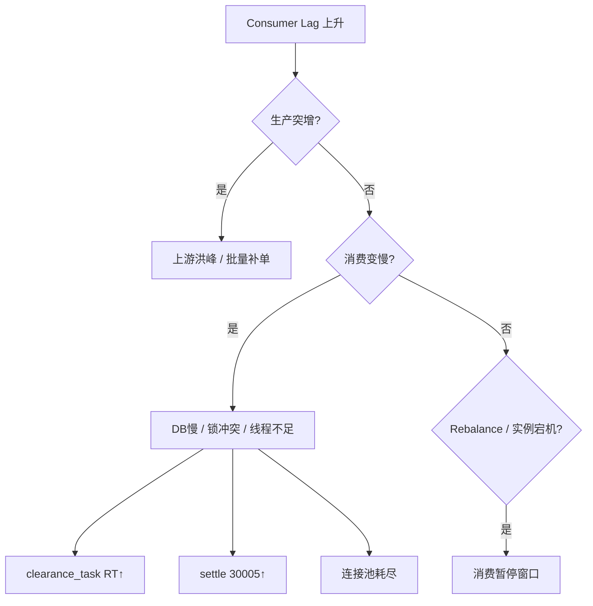

# ai-pay-settle 最终性能优化实施方案

> 版本：V1.1 | 日期：2026-07-12  
> 前置阅读：[mq多线程.md](./mq多线程.md)（原理与约束）、[docs/09-异常与容错设计.md](./docs/09-异常与容错设计.md)（异常分级）  
> 用途：**下一阶段代码改造的执行清单**，按 PR 拆分、可验收、可回滚

---

## 1. 优化目标

### 1.1 性能指标（压测验收标准）

| 指标 | 当前基线（估） | 阶段 1 目标 | 阶段 2 目标 | 阶段 3 目标 |
|------|----------------|-------------|-------------|-------------|
| 端到端清算 TPS | ~50（单实例、MQ 未开） | ≥ 200 | ≥ 500 | ≥ 1000 |
| trade_pay 消费 P99 | — | ≤ 50ms | ≤ 30ms | ≤ 20ms |
| clearance_task 消费 P99 | — | ≤ 300ms | ≤ 200ms | ≤ 150ms |
| settle_amount 消费 P99 | — | ≤ 100ms | ≤ 80ms | ≤ 50ms |
| Consumer Lag（稳态） | — | < 1000 | < 500 | < 200 |
| 30005 乐观锁冲突率 | — | < 0.5% | < 0.3% | < 0.1% |
| DLQ 消息数 | — | 0 | 0 | 0 |

压测工具：`pay-test/MqLoadTestRunner`（MQ 入口）+ RocketMQ Dashboard。

### 1.2 架构目标（最终态）

```
                         ┌─────────────────────────────────────┐
                         │           RocketMQ Cluster           │
                         │  Queue×16（与 shardId % 16 对齐）     │
                         └─────────────────────────────────────┘
                trade_pay          clearance_task      settle_amount
                     │                    │                    │
          ┌──────────▼──────────┐  ┌──────▼──────┐  ┌─────────▼─────────┐
          │ 接入 Consumer 集群   │  │ 算账 Consumer│  │ 结算 Consumer 集群 │
          │ CONCURRENTLY ×32    │  │ CONCURRENTLY │  │ ORDERLY ×16       │
          │ 仅落库 + 发下游 MQ   │  │ ×32          │  │ 按 merchantId 路由 │
          └──────────┬──────────┘  └──────┬──────┘  └─────────┬─────────┘
                     │                    │                    │
                     └────────────────────┼────────────────────┘
                                          ▼
                                    MySQL（连接池 50+）
```

**核心原则：**

1. **接入快、算账慢、结算稳** — 各层独立扩缩容  
2. **RocketMQ 自带线程池并行**，不在 Listener 内 fire-and-forget  
3. **同 merchant 入账有序**，跨 merchant 并行  
4. **每次只改一个变量**，压测对比后再进下一步  

---

## 2. 现状差距分析（代码级）

| 项 | 现状 | 差距 |
|----|------|------|
| MQ 开关 | `application.yml` 默认 `pay.mq.enabled=false` | 生产需 `mysql,mq` profile |
| Consumer 线程 | 5 个 Listener 均未显式配置 `consumeThreadMax` | 无法按 Topic 调优 |
| 消费模式 | 全部默认 `CONCURRENTLY` | `settle_amount` 需改 `ORDERLY` |
| 消息路由 Key | `RocketPayMqProducer` 仅 setHeader KEYS，**未按 merchantId 选 Queue** | 有序消费无效 |
| Topic Queue 数 | `init-rocketmq.sh` 创建 Topic **未指定读写队列数**（默认 4） | 并行度上限低 |
| 连接池 | `application-mysql.yml` **无 HikariCP 配置** | 线程↑后连接耗尽 |
| Outbox | `OutboxDispatchJob` 每 3s 轮询 100 条 | 高 TPS 下成为瓶颈，依赖 MQ 投递 |
| 清算激活退款 | `activateWaitingRefunds` 在 `executeTask` 内**同步 executeTask** | 热点原单会阻塞消费线程 |
| 监控 | 无 Consumer Lag / RT / 30005 指标暴露 | 无法线上调优 |
| 配置集中 | Consumer 参数散落各 `@RocketMQMessageListener` | 需统一配置类 |
| **积压处置** | 无 Lag 监控 Job、无自动扩容策略、无上游限流 | 堆积只能人工看 Dashboard |
| **失败处置** | MQ 抛异常依赖 Client 默认重试；**无 DLQ Listener**；`DEAD` 任务无工单 | 多次失败后缺乏闭环 |
| **Outbox 积压** | `OutboxDispatchJob` 失败仅 warn 日志 | pending 无限增长无告警 |
| **消费重试可观测** | 无 `reconsumeTimes` 埋点 | 无法区分首次失败与末次入 DLQ |

---

## 3. 分阶段实施方案

---

### 阶段 1：配置与 Consumer 调优（PR-1，预计 1 天）

> 目标：打开 MQ 全链路，显式线程/连接池，Topic Queue=16，**不改业务逻辑**。

#### Step 1.1 新增 Consumer 统一配置

**新建文件** `pay-mq/src/main/java/com/payment/mq/config/MqConsumerProperties.java`

```java
@ConfigurationProperties(prefix = "pay.mq.consumer")
public class MqConsumerProperties {
    private int accessThreadMax = 32;
    private int calcThreadMax = 32;
    private int settlementThreadMax = 16;
    private int settlementPaymentThreadMax = 16;
    private int consumeTimeoutMinutes = 15;
    private int pullBatchSize = 32;
    // getter/setter
}
```

**修改** `PayMqAutoConfiguration.java`：`@EnableConfigurationProperties(MqConsumerProperties.class)`

**修改** `application-mq.yml`（追加）：

```yaml
pay:
  mq:
    enabled: true
    clearance-via-mq: true
    outbox-via-mq: true
    payment-callback-via-mq: true
    consumer:
      access-thread-max: 32
      calc-thread-max: 32
      settlement-thread-max: 16
      settlement-payment-thread-max: 16
      consume-timeout-minutes: 15
      pull-batch-size: 32

spring:
  datasource:
    hikari:
      maximum-pool-size: 50
      minimum-idle: 10
      connection-timeout: 3000
      max-lifetime: 1800000

rocketmq:
  name-server: 127.0.0.1:9877
  consumer:
    pull-batch-size: 32
```

**修改** `application.yml`：生产 profile 建议改为 `active: mysql,mq`（或通过环境变量 `SPRING_PROFILES_ACTIVE` 注入，避免本地默认强开 MQ）。

#### Step 1.2 五个 Consumer 显式线程配置

| 文件 | 改动 |
|------|------|
| `pay-access/.../TradePayConsumer.java` | 注入 `MqConsumerProperties`，`consumeThreadMax = props.getAccessThreadMax()`，`consumeMode = CONCURRENTLY` |
| `pay-access/.../TradeRefundConsumer.java` | 同上 |
| `pay-calc/.../ClearanceTaskConsumer.java` | `consumeThreadMax = props.getCalcThreadMax()`，`consumeTimeout = props.getConsumeTimeoutMinutes()` |
| `pay-settlement/.../SettleAmountConsumer.java` | 暂保持 CONCURRENTLY（阶段 2 改 ORDERLY） |
| `pay-settlement/.../PaymentResultConsumer.java` | `consumeThreadMax = props.getSettlementPaymentThreadMax()` |

**注意：** `@RocketMQMessageListener` 注解属性必须是编译期常量，**不能**直接引用 `@ConfigurationProperties` 字段。

**解决方案（二选一，推荐 A）：**

- **方案 A**：在注解中写死初始值，与 yml 保持一致，并加注释「与 pay.mq.consumer.* 同步」  
- **方案 B（推荐最终态）**：废弃各 `RocketListener` 内部类，改用 `DefaultRocketMQListenerContainer` 编程式注册，从 `MqConsumerProperties` 动态注入 — **阶段 3 再做**

**阶段 1 采用方案 A**，示例：

```java
@RocketMQMessageListener(
    topic = MqTopics.CLEARANCE_TASK,
    consumerGroup = MqConsumerGroups.CALC,
    consumeMode = ConsumeMode.CONCURRENTLY,
    consumeThreadMax = 32,
    consumeTimeout = 15L
)
```

#### Step 1.3 Topic Queue 数调整为 16

**修改** `pay-mq/init-rocketmq.sh`：

```bash
# 原：updateTopic -t $topic -c $CLUSTER
# 改：
docker exec rmq-broker sh -c \
  "$MQADMIN updateTopic -n $NAMESRV_ADDR -t $topic -c $CLUSTER -r 16 -w 16"
```

**新增** `pay-mq/init-rocketmq.sh` 注释说明：Queue 数 = `shardId` 分片数（16）。

#### Step 1.4 验证清单（阶段 1）

```bash
# 1. 启动基础设施
cd pay-mq && ./init-rocketmq.sh

# 2. 启动应用（MQ + MySQL）
cd .. && mvn -pl pay-app spring-boot:run -Dspring-boot.run.profiles=mysql,mq

# 3. 跑 MQ 压测（100 TPS 基线）
mvn -pl pay-test exec:java -Dexec.mainClass=com.payment.test.mq.MqLoadTestMain

# 4. Dashboard 确认
#    - 5 个 Topic 各有 16 Queue
#    - 各 Consumer Group Lag 稳态趋近 0
```

**验收标准：** 100 TPS × 60s 无 DLQ、Lag < 1000、无连接池超时日志。

---

### 阶段 2：消息路由 + 有序结算 + 流水线解耦（PR-2，预计 3 天）

> 目标：settle_amount 同商户有序；Producer 按 Key 路由；Outbox 提速；消除接入层同步清算。

#### Step 2.1 Producer 按 businessKey 选 Queue

**修改** `pay-mq/src/main/java/com/payment/mq/PayMqProducer.java` 接口：

```java
void send(String topic, String tag, String keys, String payload);
void sendOrderly(String topic, String tag, String hashKey, String payload);  // 新增
```

**修改** `RocketPayMqProducer.java`：

```java
@Override
public void sendOrderly(String topic, String tag, String hashKey, String payload) {
    String destination = topic + (tag != null ? ":" + tag : "");
    SendResult result = rocketMQTemplate.syncSendOrderly(
        destination,
        MessageBuilder.withPayload(payload).setHeader("KEYS", hashKey).build(),
        hashKey
    );
    // 校验 SEND_OK
}
```

**修改** `LocalPayMqProducer.java`：Local 模式按 `hashKey.hashCode()` 串行化模拟（单 JVM 内 `ConcurrentHashMap` + 每 key 队列）。

#### Step 2.2 各发送点指定 hashKey

| 发送点 | 文件 | hashKey | 说明 |
|--------|------|---------|------|
| clearance_task | `BillAccessServiceImpl.triggerClearance` | `String.valueOf(merchantId)` | 同商户进同 Queue |
| settle_amount | `OutboxDispatchJob.dispatch` | payload 中 `merchantId` | 有序入账 |
| settle_amount | `SplitServiceImpl` 若直发 MQ | `merchantId` | 与 Outbox 一致 |
| trade_pay | 外部 Producer | `billNo` | 单据级分散 |
| payment_result | `MockPaymentChannel` | `settleNo` | 结算单唯一 |

**修改** `BillAccessServiceImpl.java`：

```java
// 原：payMqProducer.send(topic, tag, billNo, payload)
// 改：
payMqProducer.sendOrderly(MqTopics.CLEARANCE_TASK, MqTags.TASK,
    String.valueOf(merchantId), json);
```

**修改** `OutboxDispatchJob.java`：解析 payload 取 `merchantId`，调用 `sendOrderly`。

#### Step 2.3 SettleAmountConsumer 改有序消费

**修改** `SettleAmountConsumer.java`：

```java
import org.apache.rocketmq.spring.annotation.ConsumeMode;

@RocketMQMessageListener(
    topic = MqTopics.SETTLE_AMOUNT,
    consumerGroup = MqConsumerGroups.SETTLEMENT,
    consumeMode = ConsumeMode.ORDERLY,
    consumeThreadMax = 16
)
```

**效果：** 同一 Queue 内串行（同 merchantId 路由后同 Queue），跨 Queue 并行。

#### Step 2.4 Outbox 批量派发优化

**修改** `OutboxDispatchJob.java`：

```java
// 1. 批量大小可配置：pay.outbox.dispatch-batch-size=200
// 2. 缩短轮询间隔：pay.outbox.dispatch-interval-ms=1000（MQ 模式下）
// 3. 并行 send 时保持 per-merchant orderly（sendOrderly 已保证）
List<OutboxMessageEntity> pending = outboxMessageRepository
    .findTopNByStatusOrderByCreateTimeAsc(0, batchSize);
```

**新增** `OutboxMessageRepository` 方法：`findTop100ByStatusOrderByCreateTimeAsc` 改为参数化 batch size。

**可选优化：** Outbox 写入后**同事务发 MQ**（去掉 Job 轮询）— 需评估事务与 MQ 一致性，建议阶段 3 做「事务消息」或保持 Outbox + 短间隔 Job。

#### Step 2.5 退款激活异步化

**问题：** `activateWaitingRefunds` 在原单 `executeTask` 内同步调用多次 `executeTask`，阻塞消费线程。

**修改** `ClearanceTaskServiceImpl.java`：

```java
private void activateWaitingRefunds(String clearedBillNo) {
    List<TradeBillEntity> waiting = tradeBillRepository.findByStatusAndOriginBillNo(...);
    for (TradeBillEntity refund : waiting) {
        refund.status = BillStatus.PENDING.getCode();
        tradeBillRepository.save(refund);
        createTask(refund.billNo, refund.merchantId);
        // 改：发 MQ，不 sync executeTask
        if (payMqProperties.isClearanceViaMq()) {
            publishClearanceTask(refund.billNo, refund.merchantId);
        } else {
            executeTask(refund.billNo);
        }
    }
}
```

需注入 `PayMqProducer` + `PayMqProperties` 到 `ClearanceTaskServiceImpl`，或抽取 `ClearanceTaskPublisher` 组件。

#### Step 2.6 验证清单（阶段 2）

```bash
# 1. 同 merchant 并发 100 条 settle_amount，账户余额正确、无 30005 风暴
# 2. 不同 merchant 并行 500 TPS，Lag 稳态 < 500
# 3. 原单清算后退款单自动激活（WAIT_ORIGIN → CLEARED）
# 4. Dashboard 观察 settle_amount 各 Queue 消费均匀
```

**验收标准：** 500 TPS 压测 5 分钟，30005 率 < 0.5%，端到端无丢单。

---

### 阶段 3：可观测 + 编程式 Consumer + 可选拆分部署（PR-3，预计 1～2 周）

> 目标：指标可量化；Consumer 参数配置化；为独立部署做准备。

#### Step 3.1 Micrometer 指标埋点

**新建** `pay-mq/src/main/java/com/payment/mq/support/MqConsumeMetrics.java`

```java
@Component
public class MqConsumeMetrics {
    private final MeterRegistry registry;

    public <T> T record(String topic, Supplier<T> action) { ... }
    public void record(String topic, Runnable action) { ... }
}
```

**修改** 各 `MqMessageHandler.handle()` 或在 Listener 代理层统一 wrap：

| 指标名 | 类型 | 标签 |
|--------|------|------|
| `pay_mq_consume_total` | Counter | topic, status=success/fail |
| `pay_mq_consume_duration` | Timer | topic |
| `pay_account_conflict_total` | Counter | merchantId（30005） |
| `pay_clearance_task_duration` | Timer | billType |

**暴露：** Spring Boot Actuator `/actuator/prometheus`（`pay-app/pom.xml` 加 `micrometer-registry-prometheus`）。

#### Step 3.2 编程式注册 RocketMQ Consumer（可选）

**新建** `pay-mq/src/main/java/com/payment/mq/config/RocketMqListenerRegistrar.java`

- 读取 `MqConsumerProperties`
- 为每个 `MqMessageHandler` 创建 `DefaultRocketMQListenerContainer`
- 支持 yml 热调线程数（需重启生效）

**删除** 各 Consumer 内部 `RocketListener` 静态类，统一由 Registrar 注册。

#### Step 3.3 部署 Profile 拆分（可选，中长期）

| Profile | 启用 Consumer | 禁用 |
|---------|---------------|------|
| `access` | TradePay, TradeRefund | Clearance, Settlement |
| `calc` | ClearanceTask | Access, Settlement |
| `settlement` | SettleAmount, PaymentResult | Access, Calc |

**实现：** 各 `RocketListener` 加 `@ConditionalOnProperty(name="pay.mq.consumer.roles", havingValue="access")` 等。

**启动示例：**

```bash
# 接入层 ×2
java -jar pay-app.jar --spring.profiles.active=mysql,mq --pay.mq.consumer.roles=access
# 算账层 ×4
java -jar pay-app.jar --spring.profiles.active=mysql,mq --pay.mq.consumer.roles=calc
# 结算层 ×2
java -jar pay-app.jar --spring.profiles.active=mysql,mq --pay.mq.consumer.roles=settlement
```

#### Step 3.4 数据库索引与慢 SQL（并行任务）

**检查并补充索引（`scripts/init-mysql.sql`）：**

```sql
-- clearance_task：消费与重试
ALTER TABLE clearance_task ADD INDEX idx_status_shard (status, shard_id);
-- outbox：派发 Job
ALTER TABLE outbox_message ADD INDEX idx_status_time (status, create_time);
-- account_flow：对账
ALTER TABLE account_flow ADD INDEX idx_merchant_time (merchant_id, create_time);
```

**MyBatis 慢 SQL：** `application-mysql.yml` 开启 `logging.level.com.payment.domain.mapper=DEBUG`（仅压测环境）。

#### Step 3.5 验证清单（阶段 3）

- Prometheus 抓取指标正常  
- 2+2+2 实例部署，500～1000 TPS 线性扩展  
- Grafana 面板：Lag、P99、30005、DLQ  

---

## 4. 完整改造文件清单（汇总）

### 4.1 新增文件

| 路径 | 说明 |
|------|------|
| `pay-mq/.../MqConsumerProperties.java` | Consumer 线程/超时配置 |
| `pay-mq/.../MqConsumeMetrics.java` | 消费指标（阶段 3） |
| `pay-mq/.../RocketMqListenerRegistrar.java` | 编程式注册（阶段 3，可选） |
| `pay-calc/.../ClearanceTaskPublisher.java` | 统一发 clearance_task MQ（阶段 2） |
| `docs/压测报告模板.md` | 可选，记录每阶段 TPS |

### 4.2 修改文件

| 路径 | 阶段 | 改动摘要 |
|------|------|----------|
| `pay-app/src/main/resources/application-mq.yml` | 1 | 线程、连接池、MQ 开关 |
| `pay-app/src/main/resources/application-mysql.yml` | 1 | HikariCP |
| `pay-mq/init-rocketmq.sh` | 1 | Queue=16 |
| `pay-access/.../TradePayConsumer.java` | 1 | consumeThreadMax |
| `pay-access/.../TradeRefundConsumer.java` | 1 | consumeThreadMax |
| `pay-calc/.../ClearanceTaskConsumer.java` | 1 | consumeThreadMax, consumeTimeout |
| `pay-settlement/.../SettleAmountConsumer.java` | 2 | ORDERLY |
| `pay-settlement/.../PaymentResultConsumer.java` | 1 | consumeThreadMax |
| `pay-mq/.../PayMqProducer.java` | 2 | sendOrderly |
| `pay-mq/.../RocketPayMqProducer.java` | 2 | syncSendOrderly |
| `pay-mq/.../LocalPayMqProducer.java` | 2 | 本地有序模拟 |
| `pay-access/.../BillAccessServiceImpl.java` | 2 | sendOrderly(clearance) |
| `pay-split/.../OutboxDispatchJob.java` | 2 | sendOrderly + 批量 |
| `pay-calc/.../ClearanceTaskServiceImpl.java` | 2 | 退款激活改发 MQ |
| `pay-domain/.../OutboxMessageRepository.java` | 2 | 参数化 batch |
| `scripts/init-mysql.sql` | 3 | 索引 |
| `pay-app/pom.xml` | 3 | actuator + prometheus |

### 4.3 不改 / 禁止改

| 项 | 原因 |
|----|------|
| Listener 内自建线程池异步 ACK | 丢单风险，见 mq多线程.md §5.4 |
| 去掉 bill_no / account_flow 幂等 | 重复消费会重复入账 |
| 全 Topic ORDERLY | 并行度骤降 |
| 无压测直接上 consumeThreadMax=64 | DB 连接池/锁冲突 |

---

## 5. PR 拆分与合并顺序

```
PR-1（阶段 1）配置 + Consumer 线程 + Queue16 + 连接池
  ↓ 压测基线报告
PR-2（阶段 2）sendOrderly + ORDERLY 结算 + Outbox 优化 + 退款异步
  ↓ 压测 500 TPS 报告
PR-3（阶段 3）Metrics + 索引 + 可选部署拆分
  ↓ 压测 1000 TPS 报告
PR-4（阶段 4）积压监控 + DLQ + 失败闭环 + 补偿增强
  ↓ 故障演练报告（积压/多次失败场景）
```

**每个 PR 必须包含：**

1. 单元/集成测试通过（`mvn test`）  
2. `MqLocalModeIntegrationTest` / `ClearanceFlowIntegrationTest` 通过  
3. 压测对比数据（TPS、P99、Lag、30005）  
4. 回滚说明（见 §6）  

---

## 6. 回滚方案

| 阶段 | 回滚操作 | 影响 |
|------|----------|------|
| PR-1 | `pay.mq.enabled=false`，恢复默认线程 | 回到 HTTP/Job 模式 |
| PR-2 | `settle_amount` 改回 CONCURRENTLY；Producer 改 syncSend | 可能 30005 升高 |
| PR-3 | 关闭 Actuator；合并部署单实例 | 仅失去观测/拆分能力 |

**紧急开关（建议写入 `application-mq.yml`）：**

```yaml
pay:
  mq:
    enabled: ${PAY_MQ_ENABLED:true}
    clearance-via-mq: ${PAY_MQ_CLEARANCE:true}
    outbox-via-mq: ${PAY_MQ_OUTBOX:true}
```

---

## 7. 压测操作手册（固定流程）

### 7.1 环境准备

```bash
# MySQL
scripts/init-db.sh

# RocketMQ（16 Queue）
cd pay-mq && ./init-rocketmq.sh

# 应用（可开 2 实例，端口 18089 / 18090）
mvn -pl pay-app spring-boot:run -Dspring-boot.run.profiles=mysql,mq \
  -Dspring-boot.run.jvmArguments="-Dserver.port=18089"
```

### 7.2 压测命令

```bash
# MQ 入口压测（trade_pay_topic）
mvn -pl pay-test exec:java \
  -Dexec.mainClass=com.payment.test.mq.MqLoadTestMain \
  -Dexec.args="--tps=500 --duration-seconds=300"

# HTTP 入口对比（可选）
mvn -pl pay-test exec:java \
  -Dexec.mainClass=com.payment.test.ClearanceLoadTestMain
```

### 7.3 每次压测记录模板

| 变量 | 值 |
|------|-----|
| 阶段 | PR-1 / PR-2 / PR-3 |
| 实例数 | 1 / 2 / 4 |
| TPS 设定 | 100 / 500 / 1000 |
| 实际发送 TPS | |
| 端到端完成 TPS | |
| trade_pay P99 | |
| clearance_task P99 | |
| settle_amount P99 | |
| Max Lag | |
| 30005 次数 | |
| DLQ 数 | |
| DB CPU | |
| Hikari 活跃连接 | |

---

## 8. 线程与连接池配比表（最终推荐值）

| 部署模式 | 实例数 | accessThread | calcThread | settleThread | Hikari max | Queue |
|----------|--------|--------------|------------|--------------|------------|-------|
| 开发单机 | 1 | 16 | 16 | 8 | 30 | 16 |
| 压测单机 | 1 | 32 | 32 | 16 | 50 | 16 |
| 生产合并部署 | 2 | 32 | 32 | 16 | 50 | 16 |
| 生产拆分部署 | 2+4+2 | 32 / 32 / 16 | — | — | 各 50 | 16 |

**公式校验：**

```
单实例最大并发 DB 连接需求 ≈ calcThreadMax + settleThreadMax + HTTP预留(10)
50 ≥ 32 + 16 + 10  →  58（略紧，生产建议 calc=24 或 pool=60）
```

---

## 9. 消息积压处理方案

> 对应异常码：EX-0302（Outbox 积压）、P1「DLQ/ Lag 堆积」  
> 原则：**先止血（扩容/限流）→ 再消堆积 → 最后根因修复**，资金链路宁可延迟不可错账。

### 9.1 积压的定义与观测

本项目存在 **两类「积压」**，不可混为一谈：

| 类型 | 观测对象 | 指标来源 | 含义 |
|------|----------|----------|------|
| **MQ Lag** | Broker 中未消费消息数 | RocketMQ Dashboard / `consumer_offset` | Consumer 处理速度 < 生产速度 |
| **Outbox Pending** | `outbox_message.status=0` 行数 | DB 查询 / 自定义 Gauge | 清分已完成但尚未投递 settle MQ |
| **业务 Pending** | `clearance_task.status=PENDING` | DB | 任务已创建但尚未执行（MQ 丢失时兜底） |

**端到端延迟** = MQ Lag 等待时间 + 消费 RT + Outbox 轮询间隔 + 下游 Lag。

#### 9.1.1 告警分级（建议写入 `pay.mq.backlog.*` 配置）

| 级别 | 条件（任一满足） | 响应 SLA | 动作 |
|------|------------------|----------|------|
| **P3 预警** | 单 Topic Lag > 1,000 持续 5min | 30min | 值班关注，准备扩容 |
| **P2 告警** | 单 Topic Lag > 10,000 或 Outbox pending > 1,000 | 15min | 自动告警 + 启动 playbook S1 |
| **P1 严重** | Lag > 100,000 或 Lag 持续上升 30min | 5min | playbook S2 + 上游限流 |
| **P0 紧急** | settle_amount Lag > 50,000 且涉及大促 | 立即 | 暂停非核心入口 + 高管通知 |

### 9.2 积压根因分类



| 根因 | 典型信号 | 本项目高发 Topic |
|------|----------|------------------|
| 生产突增 | Producer TPS 陡升，Consumer TPS 不变 | trade_pay |
| 消费线程不足 | CPU 低、Lag 升、consume RT 正常 | clearance_task |
| DB 瓶颈 | RT P99↑、慢 SQL、Hikari 等待 | clearance_task |
| 乐观锁风暴 | 30005 日志刷屏 | settle_amount |
| 下游反压 | clearance Lag 低、settle Lag 高 | settle_amount |
| Outbox 投递慢 | Outbox pending↑、MQ Lag 正常 | settle_amount |
| 实例故障 | 某 Queue 无消费进度 | 全部 |

### 9.3 分 Topic 积压处置 Playbook

#### trade_pay_topic / trade_refund_topic（接入层）

| 步骤 | 操作 | 说明 |
|------|------|------|
| S1 | 水平扩容 pay-app（access 角色） | 同 Group 自动 Rebalance |
| S2 | `accessThreadMax` 32→48（临时） | 配合连接池上调 |
| S3 | **上游渠道限流** | 协商降 TPS 或 HTTP 429 |
| S4 | 检查 DB `trade_bill` 写入延迟 | 索引、连接池 |

**禁止：** 为提速跳过校验或直接 `executeTask` 同步清算（破坏流水线解耦）。

#### clearance_task_topic（算账层，核心热点）

| 步骤 | 操作 | 说明 |
|------|------|------|
| S1 | 扩容 calc 实例（优先于加线程） | 2→4→8 实例 |
| S2 | `calcThreadMax` 临时上调 | 不超过 Hikari max×0.7 |
| S3 | 观察 `clearance_task` RUNNING 僵死 | `ClearanceRetryJob.watchdog` 应释放 |
| S4 | DB 侧：慢 SQL、锁等待 | `idx_status_shard` 索引 |
| S5 | 若规则热加载失败导致大面积 FAILED | 先修规则，再批量 `retryFailedTasks` |

**堆积消减估算：**

```
所需并行度 ≈ 积压条数 / 目标消化时间（秒） × 平均 RT（秒）
例：100,000 条积压，4 小时内消完，RT=200ms → 需 ~14 并行（单条 0.2s → 5 TPS/线程 → 3 线程即可？）
实际：100000 / (4×3600) ≈ 7 TPS；RT=0.2s → 需 2 线程 — 说明瓶颈不在线程而在实例数/DB
```

#### settle_amount_topic（结算层）

| 步骤 | 操作 | 说明 |
|------|------|------|
| S1 | **不要** 盲目加线程（加剧 30005） | ORDERLY + merchant 路由 |
| S2 | 扩容 settlement 实例 | 增加 Queue 并行 |
| S3 | 检查 30005 率 | >1% 则减线程或加 Redis 锁 |
| S4 | Outbox pending 高但 MQ Lag 低 | 加大 `OutboxDispatchJob` batch/频率 |

#### Outbox 积压（DB 内，非 MQ Lag）

触发：EX-0302，`outbox_message` pending > 1,000。

```java
// 处置优先级
1. OutboxDispatchJob 批量 100→500，间隔 3s→1s
2. 检查 payMqProducer.send 失败率（Broker 可用性）
3. 临时加 Outbox Job 实例（仅跑 Job 的轻量 Pod）
4. 人工 SQL 审计：SELECT COUNT(*) FROM outbox_message WHERE status=0
5. 极端情况：暂停 clearance 生产（上游限流），先清空 Outbox
```

### 9.4 自动与半自动处置（代码改造，PR-4）

#### Step 9.4.1 积压监控 Job

**新建** `pay-mq/src/main/java/com/payment/mq/job/MqBacklogMonitorJob.java`

```java
@Scheduled(fixedDelayString = "${pay.mq.backlog.check-interval-ms:60000}")
public void checkBacklog() {
    // 1. 通过 DefaultMQAdminExt 查询各 Group Lag（或 REST API）
    // 2. outboxMessageRepository.countByStatus(0)
    // 3. clearanceTaskRepository.countByStatus(PENDING)
    // 4. 超阈值 → alertService.send(P1/P2, content)
    // 5. 写入 Micrometer Gauge: pay_mq_lag{topic}, pay_outbox_pending
}
```

**配置** `application-mq.yml`：

```yaml
pay:
  mq:
    backlog:
      check-interval-ms: 60000
      lag-warn: 1000
      lag-critical: 10000
      outbox-pending-warn: 1000
      outbox-pending-critical: 5000
      auto-scale-enabled: false   # K8s HPA 联动，可选
```

#### Step 9.4.2 动态消费限速（可选）

洪峰时保护 DB，避免 Lag 消减过程中打垮 MySQL：

**新建** `pay-mq/.../MqConsumeRateLimiter.java`

- 基于 Guava RateLimiter 或 Semaphore
- 在 Listener 入口 `acquire()`，配置 `pay.mq.consumer.max-tps`
- Lag > critical 时 **不降速**（应扩容）；Lag 消减期 DB CPU > 80% 时 **临时降速**

#### Step 9.4.3 上游生产限流

**修改** `BillAccessServiceImpl` / 渠道回调入口：

- 当 `MqBacklogMonitor` 标记 `circuit=OPEN` 时，HTTP 返回 `503` + `Retry-After`
- MQ 生产侧：渠道独立，需网关层限流（文档化，非本服务代码）

### 9.5 积压处置检查清单（值班 SOP）

```
□ 1. 确认积压 Topic 与 Consumer Group
□ 2. 记录当前 Lag、Consumer TPS、RT P99、DB CPU
□ 3. 判断根因（§9.2 决策树）
□ 4. 执行对应 Topic playbook（§9.3）
□ 5. 每 15min 记录 Lag 曲线，确认下降趋势
□ 6. Lag 归零后，恢复临时参数（线程数/限流）
□ 7. 输出故障复盘：根因、处置时间线、后续改进项
```

---

## 10. 消息多次失败处理方案

> 原则：**MQ 重试负责瞬态故障，业务状态机负责可补偿失败，DLQ+工单负责不可自愈失败**  
> 铁律：任何重试必须 **幂等**；超过上限必须 **停止自动重试** 并 **告警 + 留痕**。

### 10.1 三层重试模型

```
┌─────────────────────────────────────────────────────────────┐
│  L1 RocketMQ Client 重试（瞬态：网络、DB 连接瞬断）          │
│      最多 16 次，退避 1s→2m，失败 → DLQ                       │
├─────────────────────────────────────────────────────────────┤
│  L2 业务状态机重试（可补偿：规则暂缺、split 部分失败）         │
│      clearance_task FAILED，retry_count 1~5 → DEAD           │
│      + ClearanceRetryJob / SplitCompensateJob                │
├─────────────────────────────────────────────────────────────┤
│  L3 人工/工单重放（不可自愈：脏数据、科目错误、金额异常）      │
│      DEAD / DLQ → exception_record → 运营台 manualRetry       │
└─────────────────────────────────────────────────────────────┘
```

**关键区别：**

| 层级 | 触发方 | 重试次数 | 成功后状态 | 失败后 |
|------|--------|----------|------------|--------|
| L1 MQ | `throw Exception` from Listener | 16 | CONSUME_SUCCESS | 进 DLQ |
| L2 业务 | `executeTask` catch | 5（task 表） | task SUCCESS | task DEAD |
| L3 人工 | 运营台 API | 不限（审计） | 同 L2 | 关单/冲正 |

**本项目现状问题：** L1 与 L2 **可能双重重试**同一 billNo（MQ 重试 + task FAILED 重试），需确保 **幂等**（已实现 bill_no UK、claimTask、account_flow UK）。

### 10.2 L1：RocketMQ 消费失败与 DLQ

#### 10.2.1 重试策略（对齐 docs/08 §8）

| 参数 | 值 | 说明 |
|------|-----|------|
| `maxReconsumeTimes` | 16 | 超过进 DLQ |
| 退避 | 1s, 5s, 10s, 30s, 1m, 2m, ... | Broker 默认阶梯 |
| DLQ Topic | `{原Topic}_DLQ` | 如 `trade_pay_topic_DLQ` |

#### 10.2.2 哪些异常应抛出（触发 MQ 重试）vs 吞掉（直接 SUCCESS）

| 异常类型 | 处理 | 示例 |
|----------|------|------|
| 瞬态 | **抛出**，走 MQ 重试 | DB 连接超时、Lock wait timeout |
| 幂等重复 | **吞掉**，返回 SUCCESS | bill_no 已存在 |
| 参数非法 | **吞掉**，记 DLQ 日志 + 告警，不进 MQ 无限重试 | 金额负数、字段缺失 |
| 业务拒单 | **吞掉**，写 FAILED 状态，不进 MQ 重试 | 商户冻结 10003 |
| 不可重试 | **吞掉**，进 DLQ 人工 | bill_type 未知 |

**改造：新建** `pay-mq/.../MqConsumeExceptionClassifier.java`

```java
public enum MqConsumeAction { RETRY, ACK, DLQ }

public MqConsumeAction classify(Throwable e) {
    if (e instanceof BizException be) {
        return switch (be.getCode()) {
            case 10001, 10004 -> MqConsumeAction.ACK;  // 幂等/等待原单
            case 10002, 10003, 20001 -> MqConsumeAction.DLQ; // 不可自动重试
            case 30005 -> MqConsumeAction.RETRY;       // 乐观锁，瞬态
            default -> MqConsumeAction.RETRY;
        };
    }
    if (isTransient(e)) return MqConsumeAction.RETRY;
    return MqConsumeAction.DLQ;
}
```

**修改** 各 Consumer Listener：

```java
@Override
public void onMessage(String message) {
    try {
        delegate.handle(message);
    } catch (Exception e) {
        switch (classifier.classify(e)) {
            case RETRY -> throw e;                    // MQ 重试
            case ACK -> log.warn("ack despite error"); // 不重试
            case DLQ -> { log.error(...); throw e; }  // 快速进 DLQ
        }
    }
}
```

#### 10.2.3 DLQ Topic 初始化

**修改** `pay-mq/init-rocketmq.sh`：

```bash
DLQ_TOPICS=(
  "%DLQ%pay-access-consumer"
  "%DLQ%pay-calc-consumer"
  "%DLQ%pay-settlement-consumer"
  "%DLQ%pay-settlement-consumer-payment"
)
# RocketMQ 4.x DLQ 通常自动创建；脚本中显式创建并订阅监控
```

#### 10.2.4 DLQ 消费与重放（PR-4 必做）

**新建** `pay-mq/.../DlqInspectJob.java`（只读巡检，不自动消费）

```java
@Scheduled(cron = "0 */10 * * * ?")  // 每 10 分钟
public void inspectDlq() {
    // 查询各 DLQ 消息数
    // > 0 → alertService.send(P1, "DLQ non-empty: trade_pay DLQ count=N")
    // 写入 alert_record + exception_record 草稿
}
```

**新建** `pay-control/.../DlqReplayService.java`（人工触发）

```java
/**
 * 人工审核后重放 DLQ 消息到原 Topic。
 * 必须：双人复核 + 记录 replay_log + 幂等校验
 */
public void replay(String dlqTopic, String msgId, Long operatorId) {
    // 1. 从 DLQ 拉取消息体
    // 2. 校验 bill_no 当前状态（避免重复入账）
    // 3. 发回原 Topic（带 REPLAY 标记）
    // 4. 写 compensate_log / exception_record 关单
}
```

**HTTP API（运营台）：**

```
POST /api/v1/console/dlq/replay
{ "dlqTopic": "trade_pay_topic_DLQ", "msgId": "...", "operatorId": 123, "remark": "..." }
```

### 10.3 L2：业务层失败与补偿 Job

#### 10.3.1 clearance_task 状态机（已有，需增强）

```
PENDING → RUNNING → SUCCESS
                 ↘ FAILED (retry_count++) → 达 5 次 → DEAD
RUNNING > 30min → watchdog → FAILED
```

| 状态 | 含义 | 自动动作 | 人工动作 |
|------|------|----------|----------|
| FAILED | 可重试 | `ClearanceRetryJob` 每小时 100 条 | 运营台「重试」 |
| DEAD | 停止自动重试 | **P2 告警** + 建 `exception_record` | 修数据后 manualRetry |

**改造 Step：DEAD 时自动建工单**

**修改** `ClearanceTaskServiceImpl.java`：

```java
if (task.retryCount >= MAX_RETRY) {
    task.status = TaskStatus.DEAD.getCode();
    exceptionRecordService.open(EX_0201, billNo, task.errorMsg); // 新增
    alertService.send("CLEARANCE_DEAD", billNo + ": " + task.errorMsg);
}
```

#### 10.3.2 部分成功补偿（EX-0207，已有 SplitCompensateJob）

| 场景 | 检测条件 | 补偿 Job | 现状 |
|------|----------|----------|------|
| 有 fee_result 无 split | fee 存在 && split 不存在 && task FAILED | `SplitCompensateJob` | ✅ 已有 |
| 有 split 无 outbox | split 存在 && outbox 不存在 | 需新增 `OutboxCompensateJob` | ❌ 缺失 |
| outbox 已发未入账 | outbox=1 && 无 account_flow | `SettleCreditCompensateJob` | ❌ 缺失 |

**新建** `pay-split/.../OutboxCompensateJob.java`：

```java
@Scheduled(fixedDelayString = "${pay.compensate.outbox-interval-ms:600000}")
public void compensateMissingOutbox() {
    // SELECT bill_no FROM fee_calc_result f
    // WHERE EXISTS split_detail AND NOT EXISTS outbox_message
    // 补写 outbox 或直发 settle_amount_topic（幂等）
}
```

#### 10.3.3 业务重试与 MQ 重试的协调

**问题：** MQ 第 8 次重试时，task 可能已是 FAILED（retry_count=3），重复执行浪费资源。

**策略（推荐）：**

```java
public void executeTask(String billNo) {
    if (claimed == 0) {
        ClearanceTaskEntity task = repo.findByBillNo(billNo).orElseThrow();
        if (task.status == SUCCESS) return;           // 幂等：已成功，MQ 可 ACK
        if (task.status == DEAD) throw new NonRetryableException(...); // 进 DLQ，不再 MQ 重试
        if (task.status == RUNNING && !stale(task)) return; // 其他线程在处理
    }
    // ... 正常执行
}
```

**新建** `NonRetryableException` → `MqConsumeExceptionClassifier` 映射为 ACK 或 DLQ。

#### 10.3.4 重试退避（业务 Job）

docs/08 规定：1m / 5m / 15m / 30m / 60m。当前 `ClearanceRetryJob` 为固定每小时，**建议增强**：

**修改** `clearance_task` 表（或复用 `update_time`）：

```sql
ALTER TABLE clearance_task ADD COLUMN next_retry_time DATETIME DEFAULT NULL;
ALTER TABLE clearance_task ADD INDEX idx_next_retry (status, next_retry_time);
```

**修改** `ClearanceRetryJob`：

```java
// 只重试 next_retry_time <= now() 的 FAILED 任务
// retry_count=1 → +1min, =2 → +5min, =3 → +15min ...
```

### 10.4 L3：人工介入与工单

对齐 `docs/09` exception_record 模型：

| 触发 | exception_code | severity | 自动/人工 |
|------|----------------|----------|-----------|
| task DEAD | EX-0201 | P2 | 自动建单 |
| DLQ 非空 | EX-0109 | P1 | 自动告警 |
| Outbox pending > 5000 | EX-0302 | P1 | 自动告警 |
| 重复 16 次 MQ 失败 | EX-0110 | P2 | DLQ 巡检 |

**运营台能力清单（PR-4）：**

- 查询 FAILED / DEAD 任务列表  
- 单条 `manualRetry(billNo)` → PENDING + 发 clearance_task MQ  
- DLQ 消息预览 + 重放（双人复核）  
- 关单 + 备注（不可修复的脏数据）  

### 10.5 分 Topic 多次失败处置摘要

| Topic | L1 MQ 重试 | L2 业务 | L3 人工 | 特别注意 |
|-------|------------|---------|---------|----------|
| trade_pay | 16 次 | trade_bill FAILED | DLQ 重放 | 脏数据勿无限重试 |
| clearance_task | 16 次 | task FAILED/DEAD | 运营台重跑 | DEAD 必须工单 |
| settle_amount | 16 次 | account_flow 幂等 | 补账 Job | 30005 可 MQ 重试 |
| payment_result | 16 次 | settlement_order 状态 | 查单 Job | 掉单禁止自动重出 |
| outbox | 无 MQ | Job 无限重试 | 人工补发 | pending 告警 |

### 10.6 失败闭环验收标准

- [ ] 模拟 DB 断连：消息 MQ 重试，恢复后自动消费，无丢单  
- [ ] 模拟规则缺失：task → FAILED → DEAD，告警触达，manualRetry 成功  
- [ ] 模拟 split 失败：SplitCompensateJob 补全，task → SUCCESS  
- [ ] 模拟 17 次失败：消息进入 DLQ，DlqInspectJob 告警  
- [ ] DLQ 人工重放：幂等，不重复入账  
- [ ] Outbox pending 超阈值：P1 告警  

---

## 11. PR-4：积压与失败闭环（阶段 4，预计 3～5 天）

> 依赖 PR-1～3 的 Metrics 与 MQ 全链路开启。

### 11.1 新增文件

| 路径 | 说明 |
|------|------|
| `pay-mq/.../MqConsumeExceptionClassifier.java` | 异常 → RETRY/ACK/DLQ |
| `pay-mq/.../NonRetryableException.java` | 不可 MQ 重试标记 |
| `pay-mq/.../job/MqBacklogMonitorJob.java` | Lag + Outbox 监控 |
| `pay-mq/.../job/DlqInspectJob.java` | DLQ 巡检告警 |
| `pay-control/.../DlqReplayService.java` | 人工重放 |
| `pay-control/.../ExceptionRecordService.java` | 工单创建 |
| `pay-access/.../controller/DlqController.java` | 运营台 API |
| `pay-split/.../OutboxCompensateJob.java` | 补 outbox |
| `pay-settlement/.../SettleCreditCompensateJob.java` | 补入账（可选） |

### 11.2 修改文件

| 路径 | 改动 |
|------|------|
| 五个 Consumer Listener | 接入 ExceptionClassifier |
| `ClearanceTaskServiceImpl` | DEAD 建工单；SUCCESS/DEAD 短路 MQ 重试 |
| `ClearanceRetryJob` | 指数退避 next_retry_time |
| `OutboxDispatchJob` | 失败计数 + 告警 |
| `AlertService` | 新增 CLEARANCE_DEAD / DLQ / BACKLOG 类型 |
| `init-rocketmq.sh` | DLQ 说明注释 |
| `application-mq.yml` | backlog 阈值配置 |
| `db/schema.sql` | clearance_task.next_retry_time |

### 11.3 实施步骤

```
Step 1  MqConsumeExceptionClassifier + Listener 改造（1 天）
Step 2  MqBacklogMonitorJob + 告警阈值（0.5 天）
Step 3  ClearanceTask DEAD 工单 + next_retry_time 退避（1 天）
Step 4  DlqInspectJob + DlqReplayService + 运营 API（1 天）
Step 5  OutboxCompensateJob + 故障演练（1 天）
```

### 11.4 故障演练脚本

```bash
# 演练 1：算账层慢 SQL（模拟积压）
# - 注入 sleep 或限流 Hikari max=5
# - 压测 500 TPS 5min → 观察 Lag 上升 → 扩容实例 → Lag 下降

# 演练 2：故意 throw 规则未匹配（模拟多次失败）
# - 删除 fee_share_rule 后发送 10 条消息
# - 验证 FAILED → DEAD → 告警 → manualRetry

# 演练 3：DLQ
# - 发送非法 JSON 到 trade_pay
# - 验证 16 次后进 DLQ，DlqInspectJob 告警
```

---

## 12. 下一步行动（立即开始 PR-1）

按以下顺序改代码：

- [ ] **1.** `MqConsumerProperties` + `application-mq.yml` 扩展  
- [ ] **2.** 五个 Consumer 加 `consumeThreadMax` / `consumeTimeout`  
- [ ] **3.** `init-rocketmq.sh` Topic Queue=16  
- [ ] **4.** `application-mysql.yml` 加 HikariCP  
- [ ] **5.** 跑 100 TPS 压测，输出基线报告  
- [ ] **6.** 提交 PR-1，合并后进入 PR-2  
- [ ] **7.** PR-4 积压/失败方案评审（可与 PR-2 并行设计）

---

## 13. 与 mq多线程.md 的关系

| mq多线程.md | 本文档 |
|-------------|--------|
| 原理、约束、反模式 | **可执行的改造步骤** |
| 方案 A～F 对比 | 落实到具体文件与 PR |
| 估算公式 | 压测验收指标 |
| 路线图概要 | 分 Step + 验证清单 + 回滚 |
| §12 积压/失败概要 | **§9～§11 完整 Playbook + 代码清单** |

**建议：** 开发时两文档对照阅读；Review 时以本文档文件清单为准；异常分级细节见 `docs/09-异常与容错设计.md`。
