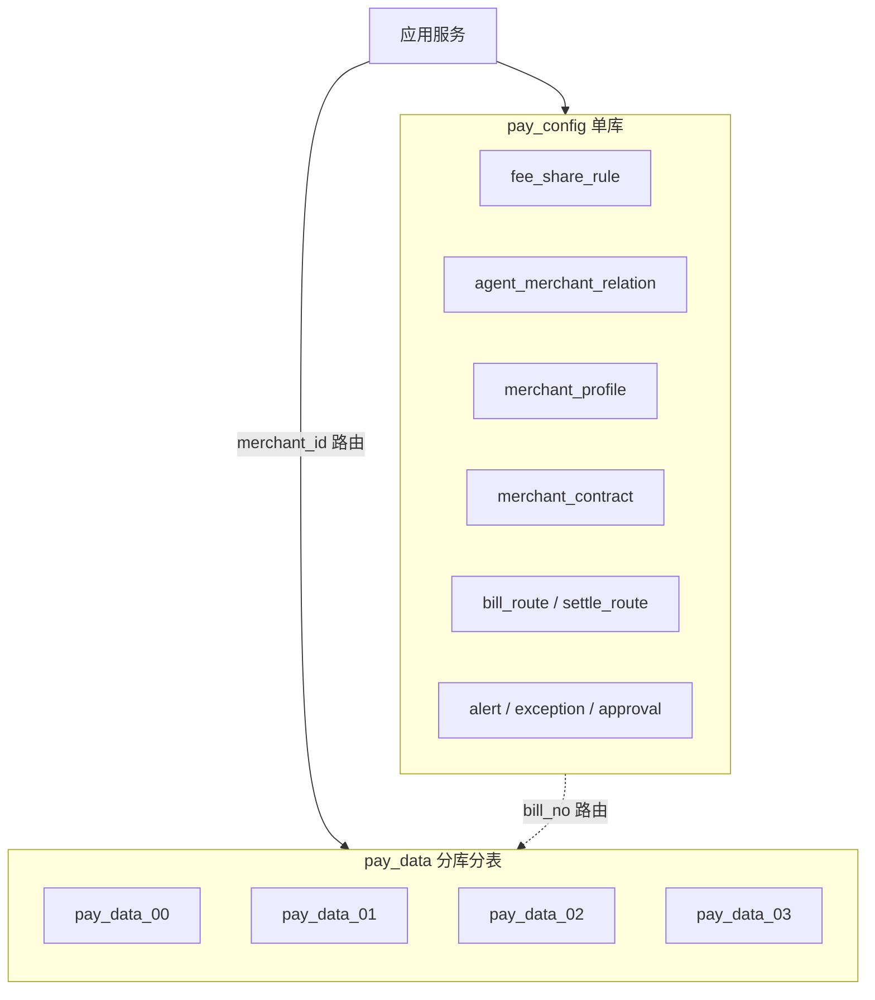
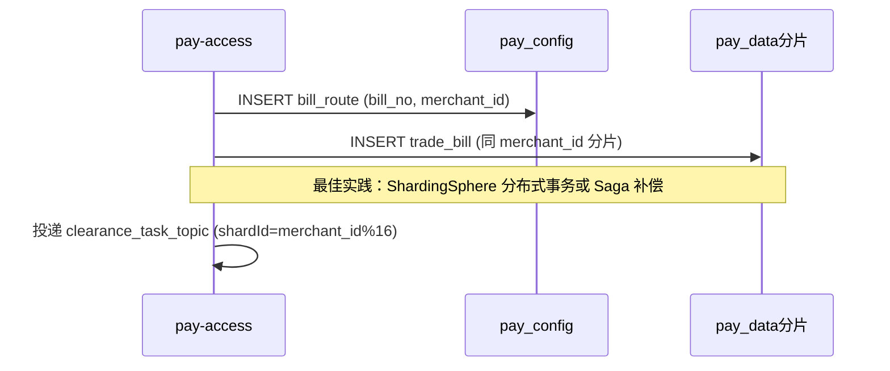

# MySQL 分库分表设计（config 库 + data 库）

> 版本：V2.0 | 日期：2026-07-14 | 类型：数据库架构 / DBA 交付  
> 依据：[01-架构设计](01-架构设计.md) · [02-开发手册](02-开发手册.md) · [03-领域模型](03-领域模型与枚举字典.md) · 代码 `pay-app/src/main/resources/db/schema.sql`  
> 关联：[db拆分.md](../db拆分.md)（7 库垂直拆分备选方案）

---

## 1. 设计目标

### 1.1 现状

当前 **单体 Spring Boot**（`pay-app`），18 张表全部落在单库 `pay_settle`：

- 数据源：`application-mysql.yml` → 单 Hikari 连接池
- 分片字段：`clearance_task.shard_id = merchant_id % 16`（见 `ClearanceTaskServiceImpl`）
- MQ 对齐：`clearance_task_topic` Queue 数 = 16，与 `shardId` 一致

### 1.2 目标架构

将数据库划分为两层：

| 层级 | 库名 | 策略 | 说明 |
|------|------|------|------|
| **配置层** | `pay_config` | 单库，**不分表** | 主数据、规则、管控、路由索引 |
| **数据层** | `pay_data_{00..03}` | **4 分库 × 4 分表 = 16 分片** | 交易、清算、结算全链路业务数据 |



**核心原则：**

1. **配置与数据分离** — 低频变更、全局读的配置进 `pay_config`；高频写入、按商户隔离的数据进 `pay_data`
2. **分片键统一** — 数据层一律以 `merchant_id` 为分片键，与代码 `shard_id % 16` 对齐
3. **同分片绑表** — 同一 `bill_no` 链路涉及的表（trade_bill → clearance_task → fee_calc_result → split_detail → account_flow）落在同一物理分片，支持单分片本地事务
4. **禁止跨分片 JOIN** — 运营全量查询走 ES / 数仓 / 分片并行聚合
5. **开发环境** — 保留单库 `pay_settle`，生产启用 ShardingSphere

---

## 2. 分片算法

### 2.1 分片键

**主分片键：`merchant_id`**

选取依据：

| 维度 | 说明 |
|------|------|
| 代码一致性 | `ClearanceTaskServiceImpl` 已用 `merchant_id % 16` |
| MQ 对齐 | RocketMQ 16 Queue，按 `shardId` 投递 |
| 资金局部性 | `merchant_settle_account` 与 `account_flow` 必须同商户同分片 |
| 热点分散 | 商户维度天然离散，避免单一超级商户压垮单片 |

**辅助路由键：`bill_no` / `settle_no`**

当请求仅携带 `bill_no` 时，先查 `pay_config.bill_route` 获取 `merchant_id`，再路由到数据分片。

### 2.2 路由公式

```
shard_id   = merchant_id % 16          -- 与代码/MQ 一致
db_index   = shard_id / 4              -- 0~3 → pay_data_00 ~ pay_data_03
tbl_suffix = shard_id % 4              -- 0~3 → 表后缀 _0 ~ _3
```

**示例：**

| merchant_id | shard_id | 目标库 | 表后缀 |
|-------------|----------|--------|--------|
| 10001 | 1 | pay_data_00 | _1 |
| 10016 | 0 | pay_data_00 | _0 |
| 10017 | 1 | pay_data_00 | _1 |
| 10064 | 0 | pay_data_00 | _0 |
| 10065 | 1 | pay_data_00 | _1 |

### 2.3 物理拓扑

```
pay_data_00                          pay_data_01
├── trade_bill_0 ~ trade_bill_3      ├── trade_bill_0 ~ trade_bill_3
├── clearance_task_0 ~ _3            ├── clearance_task_0 ~ _3
├── fee_calc_result_0 ~ _3           ├── ...
├── split_detail_0 ~ _3              ...
├── ...                              pay_data_02 / pay_data_03 同理
```

**分片总数：** 4 库 × 4 表 = **16 物理分片**，与 `shard_id ∈ [0,15]` 一一对应。

### 2.4 扩容规划

| 阶段 | 分片数 | 触发条件 | 方案 |
|------|--------|----------|------|
| 起步 | 16 | 日订单 < 500 万 | 4 库 4 表 |
| 扩容 | 32 | 单片 > 2000 万行或 CPU > 70% | 翻倍：8 库 4 表，迁移工具重哈希 |
| 归档 | — | 单分片表 > 3000 万行 | 热数据保留 13 个月，冷数据归档 OSS |

扩容时需暂停 `merchant_id` 取模基数变更，采用 **双写 + 数据迁移** 方案（见 §8）。

---

## 3. pay_config — 配置库

### 3.1 职责

- 全局主数据与计费规则（Redis 缓存的数据源）
- 运营管控、审批、告警、异常工单
- **路由索引表**（`bill_no` / `settle_no` → `merchant_id`）
- 数据量小、变更频率低，**单库单表，不做分片**

### 3.2 表清单

| 表名 | 说明 | 代码状态 | 读写特征 |
|------|------|----------|----------|
| merchant_profile | 商户档案 | ✅ | 接入校验，极低变更 |
| merchant_contract | 签约合同（结算模式、阶梯月数） | ✅ | 结算前读取 |
| fee_share_rule | 计费分润规则 | ✅ | 极低写、极高读（走 Redis） |
| agent_merchant_relation | 代理-商户-合伙人关系 | ✅ | 变更事件 + 每小时全量刷缓存 |
| bill_route | 单据路由索引 `bill_no → merchant_id` | 🔲 新增 | 接入时写入，全链路路由 |
| settle_route | 结算单路由 `settle_no → merchant_id` | 🔲 新增 | 结算单创建时写入 |
| alert_record | 告警记录 | ✅ | 低写、运营查询 |
| exception_record | 异常工单 | ✅ | 低写、全商户 |
| approval_record | 审批记录 | 🔲 预留 | 规则/出款审批 |
| compensate_log | 补偿 Job 幂等日志 | 🔲 预留 | 低写 |
| adjustment_order | 差错调整单 | 🔲 预留 | 需审批 |
| fee_rule_audit_log | 规则变更审计 | 🔲 预留 | 审批后追加 |

### 3.3 路由表 DDL（新增）

```sql
CREATE DATABASE IF NOT EXISTS pay_config
  DEFAULT CHARACTER SET utf8mb4 COLLATE utf8mb4_unicode_ci;

USE pay_config;

-- 单据路由：解决仅持 bill_no 时的分片定位
CREATE TABLE bill_route (
  bill_no      VARCHAR(64)  NOT NULL COMMENT '清算单据号',
  merchant_id  BIGINT       NOT NULL COMMENT '商户ID，分片键',
  bill_type    TINYINT      NOT NULL COMMENT '单据类型',
  create_time  DATETIME     NOT NULL DEFAULT CURRENT_TIMESTAMP,
  PRIMARY KEY (bill_no),
  KEY idx_merchant (merchant_id),
  KEY idx_create_time (create_time)
) ENGINE=InnoDB COMMENT='单据分片路由索引';

-- 结算单路由
CREATE TABLE settle_route (
  settle_no    VARCHAR(64)  NOT NULL COMMENT '结算单号',
  merchant_id  BIGINT       NOT NULL COMMENT '商户ID',
  create_time  DATETIME     NOT NULL DEFAULT CURRENT_TIMESTAMP,
  PRIMARY KEY (settle_no),
  KEY idx_merchant (merchant_id)
) ENGINE=InnoDB COMMENT='结算单分片路由索引';
```

**写入时机：**

| 路由表 | 写入点 | 一致性 |
|--------|--------|--------|
| bill_route | pay-access 接入 trade_bill 时 | 与 data 分片写入同一业务事务（见 §5.2 两阶段） |
| settle_route | pay-settlement 创建 settlement_order 时 | 与 data 分片同事务 |

### 3.4 配置库其余表

配置库其余表 DDL 与 `schema.sql` / [02-开发手册](02-开发手册.md) §2.4、§2.7（contract）、§2.8 一致，直接建在 `pay_config`，**不做后缀分表**。

---

## 4. pay_data — 数据层分库分表

### 4.1 职责

承载全链路 **高频写入、按商户隔离** 的业务数据：

```
接入落单 → 清算任务 → 计费结果 → 清分明细/凭证/Outbox → 中间户/流水 → 结算出款
```

### 4.2 分片表清单

以下 **12 张表** 全部按 `merchant_id` 分库分表，逻辑表名不变，物理表带后缀 `_0` ~ `_3`：

| # | 逻辑表名 | 说明 | 绑定分组 |
|---|----------|------|----------|
| 1 | trade_bill | 原始清算单据 | bill_group |
| 2 | clearance_task | 清算任务 | bill_group |
| 3 | fee_calc_result | 计费结果 | bill_group |
| 4 | split_detail | 清分明细 | bill_group |
| 5 | account_voucher | 会计凭证 | bill_group |
| 6 | outbox_message | 可靠消息 Outbox | bill_group |
| 7 | merchant_settle_account | 中间户账户 | settle_group |
| 8 | account_flow | 账户流水 | settle_group |
| 9 | settlement_order | 结算单 | settle_group |
| 10 | withdraw_apply | 提现申请 | settle_group |
| 11 | merchant_payable_suspend | 退款挂账 | settle_group |
| 12 | reconcile_bill | 商户日对账单 | settle_group |

**绑定表组（ShardingSphere binding-tables）：**

```yaml
# 同一 bill_no 链路的多表必须在同一分片
binding-tables:
  - bill_group: trade_bill, clearance_task, fee_calc_result, split_detail, account_voucher, outbox_message
  - settle_group: merchant_settle_account, account_flow, settlement_order, withdraw_apply, merchant_payable_suspend, reconcile_bill
```

> `bill_group` 与 `settle_group` 在同一 `merchant_id` 分片上共存，清算入账（creditBalance）为跨组同分片操作，仍在单库内可事务化。

### 4.3 物理表命名

以 `trade_bill` 在 `pay_data_01` 库为例：

```
pay_data_01.trade_bill_0
pay_data_01.trade_bill_1
pay_data_01.trade_bill_2
pay_data_01.trade_bill_3
```

### 4.4 分片表 DDL 模板

```sql
-- 在每个 pay_data_XX 库执行，以 trade_bill 为例
CREATE TABLE trade_bill_0 (
  id              BIGINT        NOT NULL AUTO_INCREMENT,
  bill_no         VARCHAR(64)   NOT NULL COMMENT '清算单据唯一号',
  bill_type       TINYINT       NOT NULL,
  business_line   VARCHAR(32)   NOT NULL,
  category        VARCHAR(32)   NOT NULL,
  service_item    VARCHAR(32)   NOT NULL,
  merchant_id     BIGINT        NOT NULL COMMENT '分片键',
  agent_id        BIGINT        DEFAULT NULL,
  second_agent_id BIGINT        DEFAULT NULL,
  order_no        VARCHAR(64)   NOT NULL,
  origin_bill_no  VARCHAR(64)   DEFAULT NULL,
  trade_amount    DECIMAL(18,2) NOT NULL,
  city_code       VARCHAR(16)   NOT NULL,
  pay_channel     VARCHAR(32)   DEFAULT NULL,
  status          TINYINT       NOT NULL DEFAULT 0,
  create_time     DATETIME      NOT NULL DEFAULT CURRENT_TIMESTAMP,
  update_time     DATETIME      NOT NULL DEFAULT CURRENT_TIMESTAMP ON UPDATE CURRENT_TIMESTAMP,
  PRIMARY KEY (id),
  UNIQUE KEY uk_bill_no (bill_no),
  KEY idx_merchant_date (merchant_id, create_time),
  KEY idx_order_no (order_no)
) ENGINE=InnoDB DEFAULT CHARSET=utf8mb4 COMMENT='原始交易清算单据_分片0';

-- trade_bill_1 ~ trade_bill_3 结构相同
-- clearance_task_0 ~ _3、fee_calc_result_0 ~ _3 ... 同理，字段与 schema.sql 一致
```

### 4.5 热点表二级分片（按需）

当单分片内 `trade_bill` 或 `account_flow` 超过 **3000 万行**，在分片内启用 **MySQL 按月 RANGE 分区**（不再增加 ShardingSphere 分片维度）：

```sql
ALTER TABLE trade_bill_2
PARTITION BY RANGE (TO_DAYS(create_time)) (
  PARTITION p202601 VALUES LESS THAN (TO_DAYS('2026-02-01')),
  PARTITION p202602 VALUES LESS THAN (TO_DAYS('2026-03-01')),
  ...
  PARTITION p_future VALUES LESS THAN MAXVALUE
);
```

| 表 | 二级策略 | 触发条件 |
|----|----------|----------|
| trade_bill | 按月 RANGE 分区 | 单物理分片表 > 3000 万行 |
| account_flow | 按月 RANGE 分区 | 同上 |
| split_detail | 冷归档 | 超过 24 个月归档至 OSS |
| clearance_task | SUCCESS 行定期清理 | 完成 > 90 天迁至 hist 表 |

---

## 5. 路由与事务

### 5.1 查询路由场景

| 场景 | 入参 | 路由方式 |
|------|------|----------|
| 接入幂等 | bill_no | config.bill_route → merchant_id → 数据分片 |
| 清算执行 | bill_no + merchant_id | 直接 sharding |
| 商户余额 | merchant_id | 直接 sharding |
| 结算单查询 | settle_no | config.settle_route → merchant_id → 数据分片 |
| 规则匹配 | 维度字段 | config.fee_share_rule（单库） |
| 代理关系 | merchant_id | config 单库查 + Redis |
| T1 批处理 | 全商户 | **并行扫描 16 分片** |
| 运营台按商户查 | merchant_id | 单分片 |
| 运营台全量查 | 无分片键 | 禁止 OLTP；走 ES / 数仓 |

### 5.2 接入写路径（config + data 协作）



**一致性方案（推荐顺序）：**

1. **Saga 补偿（推荐）** — 先写 data 分片 trade_bill，成功后写 config.bill_route；失败则反向删除，接入幂等靠 `bill_no`
2. **ShardingSphere XA** — 强一致，性能损耗大，仅灰度期使用
3. **异步补偿 Job** — 扫描 data 有单但 config 无路由的记录，补写 bill_route

### 5.3 单分片本地事务边界

以下操作必须在 **同一 merchant_id 分片** 内完成本地事务：

| 流程 | 涉及表（均在同一分片） |
|------|------------------------|
| 清算主链路 | trade_bill + clearance_task + fee_calc_result |
| 清分事务 | split_detail + account_voucher + outbox_message |
| 结算入账 | merchant_settle_account + account_flow + merchant_payable_suspend |
| 出款 | settlement_order + account_flow + merchant_settle_account |

**跨 config ↔ data：** 只读 RPC/缓存，不做跨库事务；写操作通过路由表 + Saga 保证最终一致。

### 5.4 仅持 bill_no 的代码改造点

当前代码多处 `findByBillNo(billNo)`，拆分后需补充 `merchant_id` 或路由：

| 类 / 方法 | 改造 |
|-----------|------|
| `ClearanceTaskServiceImpl.executeTask(billNo)` | 从 bill_route 取 merchant_id，Hint 分片 |
| `SplitCompensateJob` | 扫描各分片或从 bill_route 反查 |
| `TradeBillRepository.findByBillNo` | 增加 `findByBillNo(billNo, merchantId)` |
| `OutboxDispatchJob` | 按分片并行扫描 outbox_message |

---

## 6. ShardingSphere 配置

### 6.1 生产配置草案

```yaml
# application-prod-sharding.yml
spring:
  shardingsphere:
    datasource:
      names: config, ds0, ds1, ds2, ds3
      config:
        type: com.zaxxer.hikari.HikariDataSource
        jdbc-url: jdbc:mysql://mysql-config:3306/pay_config
        username: pay
        password: ${CONFIG_DB_PASSWORD}
      ds0:
        jdbc-url: jdbc:mysql://mysql-data-00:3306/pay_data_00
      ds1:
        jdbc-url: jdbc:mysql://mysql-data-01:3306/pay_data_01
      ds2:
        jdbc-url: jdbc:mysql://mysql-data-02:3306/pay_data_02
      ds3:
        jdbc-url: jdbc:mysql://mysql-data-03:3306/pay_data_03

    rules:
      sharding:
        binding-tables:
          - trade_bill, clearance_task, fee_calc_result, split_detail, account_voucher, outbox_message
          - merchant_settle_account, account_flow, settlement_order, withdraw_apply, merchant_payable_suspend, reconcile_bill
        tables:
          trade_bill:
            actual-data-nodes: ds$->{0..3}.trade_bill_$->{0..3}
            table-strategy:
              standard:
                sharding-column: merchant_id
                sharding-algorithm-name: tbl-mod4
            database-strategy:
              standard:
                sharding-column: merchant_id
                sharding-algorithm-name: db-mod16-div4
          # clearance_task、fee_calc_result 等配置同上
        sharding-algorithms:
          db-mod16-div4:
            type: INLINE
            props:
              algorithm-expression: ds$->{(merchant_id % 16).intdiv(4)}
          tbl-mod4:
            type: INLINE
            props:
              algorithm-expression: trade_bill_$->{merchant_id % 16 % 4}
        # 各表 table-strategy 的 algorithm-expression 中表名前缀按逻辑表替换

    props:
      sql-show: false
```

### 6.2 模块数据源绑定

| Maven 模块 | config 库 | data 分片 |
|------------|-----------|-----------|
| pay-access | bill_route 写 | trade_bill 写 |
| pay-calc | 读 relation（缓存） | clearance_task, fee_calc_result |
| pay-fee | 读 fee_share_rule（缓存） | — |
| pay-split | — | split_detail, account_voucher, outbox_message |
| pay-settlement | 读 contract | account, flow, order, withdraw |
| pay-control | alert, exception, approval | — |

### 6.3 开发环境

```yaml
# 本地不分片，保持现状
spring.datasource.url: jdbc:mysql://127.0.0.1:3306/pay_settle
# schema.sql 建 18 表 + 不建 bill_route（可用 merchant_id 直连）
```

---

## 7. 与代码实现对齐

### 7.1 已有分片逻辑

```java
// ClearanceTaskServiceImpl.java
task.shardId = (int) (merchantId % 16);

// ClearanceTaskPublisher.java
payload.put("shardId", (int) (merchantId % 16));
```

生产分库分表后，`shard_id` 字段保留，含义不变，可直接用于：

- MQ 按 Queue 投递（Queue i ← shard_id = i）
- 运维监控各分片堆积
- Job 按 `shard_id` 过滤：`WHERE status=0 AND shard_id=#{shard}`

### 7.2 实体与 Mapper

当前 18 个 Entity / Mapper 无需改字段，仅需：

1. 生产环境切换 ShardingSphere 数据源
2. 查询方法补充 `merchant_id` 条件（帮助路由，避免广播）
3. 新增 `BillRouteEntity` / `SettleRouteEntity` 及 Mapper（config 库）

### 7.3 定时 Job 分片扫描

| Job | 扫描方式 |
|-----|----------|
| ClearanceRetryJob | 16 分片并行，每片 `WHERE status IN (0,3) AND shard_id=?` |
| OutboxDispatchJob | 16 分片并行扫描 `outbox_message` |
| T1 批处理 | 16 分片并行 `scanT1(lastId, 500)` |
| SplitCompensateJob | 16 分片并行检查 fee_result 有、split 无 |

---

## 8. 迁移方案

### 8.1 阶段规划


| 阶段 | 动作 | 验收 |
|------|------|------|
| S1 | 建 pay_config；建 pay_data_00~03 及 12×4 张分表 | DDL 执行成功 |
| S2 | 历史数据按 merchant_id 路由导入各分片；生成 bill_route / settle_route | 行数一致 |
| S3 | 应用双写 pay_settle + 新分片，夜间对账 | 差异 = 0 |
| S4 | 读流量切 ShardingSphere | 回归通过 |
| S5 | 停写 pay_settle，保留只读 30 天 | 监控无异常 |

### 8.2 历史数据搬迁

```sql
-- 示例：搬迁 merchant_id=10017 的数据（shard_id=1 → pay_data_00.trade_bill_1）
INSERT INTO pay_data_00.trade_bill_1
SELECT * FROM pay_settle.trade_bill
WHERE merchant_id % 16 = 1;

-- 批量生成路由表
INSERT INTO pay_config.bill_route (bill_no, merchant_id, bill_type, create_time)
SELECT bill_no, merchant_id, bill_type, create_time
FROM pay_settle.trade_bill;
```

### 8.3 回滚

- 读切回 `pay_settle` 单库
- 双写期保留旧库写入，可快速回退

---

## 9. 容量与运维

### 9.1 实例规格（起步）

| 库 | 数量 | 规格 | 磁盘 |
|----|------|------|------|
| pay_config | 1 主 1 从 | 4C8G | 100GB |
| pay_data_XX | 4 主 4 从 | 8C16G | 500GB / 库 |

### 9.2 连接池

| 服务 | config 连接 | 每 data 分片连接 |
|------|-------------|-----------------|
| pay-access | 10 | 20（ShardingSphere 聚合） |
| pay-calc | 5 | 30 |
| pay-settlement | 5 | 40 |

### 9.3 监控指标

| 指标 | 说明 | 告警 |
|------|------|------|
| `shard_pending_tasks{shard}` | 各分片 PENDING 清算任务 | > 625/片（总量 10000） |
| `shard_outbox_age{shard}` | 各分片 outbox 最老 pending | > 600s |
| `bill_route_miss_total` | 路由表未命中 | > 0 |
| `cross_shard_query_total` | 广播查询次数 | > 0（应禁止） |
| `shard_data_size_mb{db,table}` | 各物理表大小 | > 50GB |

沿用 `DbCapacityMonitorJob`，改为按分片聚合上报。

---

## 10. 完整表归属总览

| 表名 | 库 | 分表 | 状态 |
|------|-----|------|------|
| merchant_profile | pay_config | 否 | ✅ |
| merchant_contract | pay_config | 否 | ✅ |
| fee_share_rule | pay_config | 否 | ✅ |
| agent_merchant_relation | pay_config | 否 | ✅ |
| bill_route | pay_config | 否 | 🔲 新增 |
| settle_route | pay_config | 否 | 🔲 新增 |
| alert_record | pay_config | 否 | ✅ |
| exception_record | pay_config | 否 | ✅ |
| approval_record | pay_config | 否 | 🔲 |
| compensate_log | pay_config | 否 | 🔲 |
| adjustment_order | pay_config | 否 | 🔲 |
| fee_rule_audit_log | pay_config | 否 | 🔲 |
| trade_bill | pay_data | **是** _0~_3 | ✅ |
| clearance_task | pay_data | **是** | ✅ |
| fee_calc_result | pay_data | **是** | ✅ |
| split_detail | pay_data | **是** | ✅ |
| account_voucher | pay_data | **是** | ✅ |
| outbox_message | pay_data | **是** | ✅ |
| merchant_settle_account | pay_data | **是** | ✅ |
| account_flow | pay_data | **是** | ✅ |
| settlement_order | pay_data | **是** | ✅ |
| withdraw_apply | pay_data | **是** | ✅ |
| merchant_payable_suspend | pay_data | **是** | ✅ |
| reconcile_bill | pay_data | **是** | ✅ |

---

## 11. 与 7 库垂直拆分的关系

本项目存在两种演进路径，可组合使用：

| 方案 | 文档 | 适用场景 |
|------|------|----------|
| **config + data 分库分表**（本文） | 分库分表.md | 数据量驱动，保留单体或少量服务 |
| **7 库垂直拆分** | [db拆分.md](../db拆分.md) | 微服务化、团队按域拆分 |

**组合建议（大规模生产）：**

```
pay_config（单库）
    +
pay_data（按域拆为 access/calc/split/settle 4 组 data 集群，每组内仍 16 分片）
```

即：垂直拆服务域 + 水平拆 merchant_id，两者正交。

---

## 附录 A：分片路由速查卡

```
merchant_id = 10017
  shard_id  = 10017 % 16 = 1
  database  = pay_data_00        (1 / 4 = 0)
  table     = trade_bill_1       (1 % 4 = 1)

SQL 路由条件（推荐显式携带）:
  WHERE merchant_id = 10017 AND bill_no = 'CL20260714000001'
```

## 附录 B：禁止事项

- ❌ 不带 `merchant_id` 的数据层广播查询（全表扫描 16 分片）
- ❌ 跨分片 JOIN（如 trade_bill JOIN fee_calc_result 不同商户）
- ❌ 跨 config + data 的强一致分布式事务作为默认方案
- ❌ 修改 `merchant_id % 16` 基数而不做数据迁移

## 附录 C：相关文档

- 建表 DDL：[02-开发手册](02-开发手册.md) §2
- 聚合边界：[03-领域模型](03-领域模型与枚举字典.md) §1.2
- MQ 分片对齐：[mq/mq多线程.md](mq/mq多线程.md)
- Outbox 事务：[06-清分与账务](06-清分与账务详细设计.md)

---

## 12. 代码实现（V2.1）

### 12.1 模块与类

| 组件 | 路径 | 说明 |
|------|------|------|
| 分片路由 | `pay-common/.../ShardRouter` | `merchant_id % 16` 路由计算 |
| 数据源常量 | `pay-domain/.../DataSourceNames` | `config` / `data` |
| 路由服务 | `pay-domain/.../ShardRouteService` | 注册/查询 bill_route、settle_route |
| 查询辅助 | `pay-domain/.../ShardQueryHelper` | 按 bill_no 补全 merchant_id 条件 |
| Mapper 分库 | `pay-domain/mapper/*` | `@DS("config")` 或 `@DS("data")` |
| ShardingSphere | `pay-app/resources/shardingsphere.yaml` | 生产 16 分片规则 |
| 分表初始化 | `pay-app/.../ShardTableInitializer` | sharding profile 自动建物理分表 |

### 12.2 业务改造点

| 服务 | 改造 |
|------|------|
| `BillAccessServiceImpl` | 落单后 `registerBillRoute` |
| `ClearanceTaskServiceImpl` | `ShardRouter.shardId(merchantId)` |
| `SettleAccountServiceImpl` | 创建结算单后 `registerSettleRoute` |
| `SplitServiceImpl` | split/voucher/outbox 写入 `merchant_id` |
| 数据仓储 | `findByBillNo` 经 `ShardQueryHelper` 精准路由 |

### 12.3 运行配置

**开发（默认，单库兼容）：**

```bash
# application-mysql.yml：config/data 均指向 pay_settle
mvn -pl pay-app spring-boot:run
```

**生产分片：**

```bash
# 激活 sharding profile，data 走 ShardingSphere
java -jar pay-app.jar --spring.profiles.active=mysql,sharding
```

### 12.4 新增表字段

分片表补充 `merchant_id` 列（ShardingSphere 分片键）：

- `split_detail.merchant_id`
- `account_voucher.merchant_id`
- `outbox_message.merchant_id`

---

**变更记录**

| 版本 | 日期 | 说明 |
|------|------|------|
| V2.1 | 2026-07-14 | 落地代码：动态数据源 + 路由表 + ShardingSphere 配置 |
| V2.0 | 2026-07-14 | config 库 + data 库 4×4 分片方案，对齐代码 merchant_id%16 |
| V1.x | — | 原 7 库垂直拆分思路，见 [db拆分.md](../db拆分.md) |
