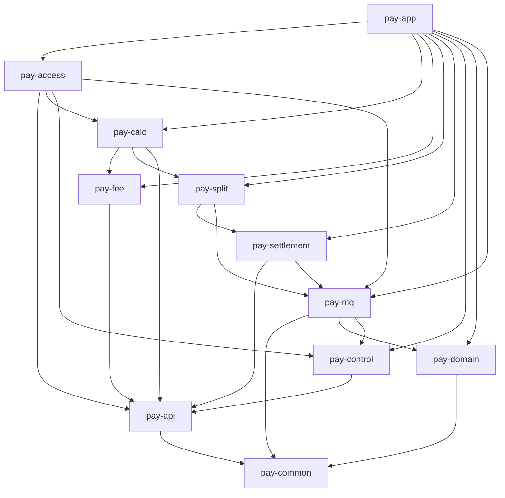
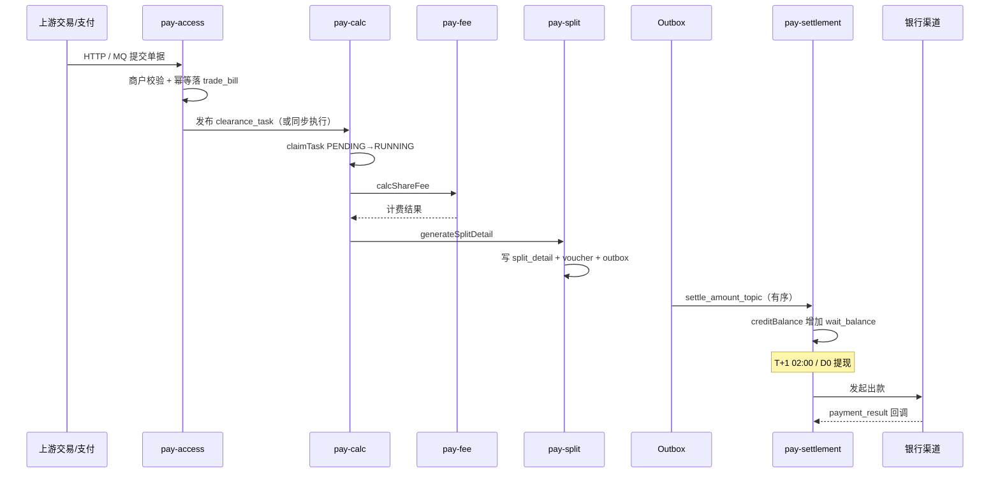

# ai-pay-settle 整体技术文档

> 版本：V1.0 | 日期：2026-07-18 | 类型：项目技术总览  
> 项目：支付清算结算系统（Payment Clearing & Settlement Platform）

---

## 1. 项目概述

### 1.1 系统定位

**ai-pay-settle** 是一套面向多层经营主体（一级代理、二级代理、商户、合伙人）的 **支付清算结算平台**，覆盖从交易单据接入、自动算费分润、清分记账到中间户托管与银行出款的全链路。

```
上游（交易/支付） → 清算（接入 → 算账 → 计费 → 清分 → 账务） → 结算（中间户 → 出款） → 下游（ERP/银行）
```

### 1.2 核心能力

| 能力 | 说明 |
|------|------|
| 全渠道单据接入 | 支持收款、退款、充值、分润、奖惩、鉴权、出款、订单清分等 8 类单据 |
| 可视化计费引擎 | 固定比例 / 固定金额 / 阶梯递减三种分成模式，多维度规则匹配 |
| 多层分润 | 平台 → 一级代理 → 二级代理 → 合伙人 → 商户，自动级联计算 |
| 中间户托管 | 资金隔离，T+1 自动结算 + D0 实时提现 |
| 业财一体化 | 自动生成会计凭证，Outbox 可靠投递对接 ERP |
| 运营控制台 | 清算概览、规则配置、对账下载、DLQ 重放 |
| 监控与容错 | Prometheus 指标、积压熔断、补偿 Job、异常工单 |

### 1.3 实现状态

| 维度 | 当前代码 | 生产目标 |
|------|----------|----------|
| 部署形态 | **单体 Spring Boot**（`pay-app`） | K8s 多服务拆分 |
| 数据库 | 开发单库 `pay_settle`（18 表） | `pay_config` + `pay_data` 分片（4 库 × 4 表 = 16 分片） |
| RPC | 进程内 Spring Bean 调用 | Dubbo 3 远程调用 |
| 消息 | Local MQ（同步派发）/ RocketMQ 5（可选） | RocketMQ Cluster |
| 调度 | Spring `@Scheduled` | XXL-Job |
| 缓存 | Redis 7 + Spring Cache（已接入） | Redis Cluster |

---

## 2. 技术栈

### 2.1 语言与框架

| 组件 | 版本 | 说明 |
|------|------|------|
| Java | 17 | LTS，Maven `release=17` |
| Spring Boot | 3.2.5 | 父 POM 统一管理 |
| Spring Web | 3.2.x | REST API（`pay-access`） |
| Spring Scheduling | 3.2.x | 定时任务（T+1、补偿、监控） |
| Spring Async | 3.2.x | 异步执行 |
| Spring Validation | 3.2.x | 参数校验 |
| Spring Cache | 3.2.x | 注解式缓存 |
| Spring Data Redis | 3.2.x | Lettuce 连接池 |

### 2.2 持久化

| 组件 | 版本 | 说明 |
|------|------|------|
| MyBatis-Plus | 3.5.7 | ORM，乐观锁、分页插件 |
| dynamic-datasource | 4.3.1 | 多数据源（config / data） |
| ShardingSphere-JDBC | 5.5.1 | 分库分表路由（`sharding` Profile） |
| MySQL Connector/J | Boot 管理 | 生产数据库 |
| H2 | Boot 管理 | 单测内存库（`h2` Profile） |
| HikariCP | Boot 管理 | 连接池 |

### 2.3 消息与中间件

| 组件 | 版本 | 说明 |
|------|------|------|
| RocketMQ Spring Boot Starter | 2.3.1 | MQ 集成 |
| RocketMQ Client | 5.3.0 | 客户端 |
| RocketMQ Tools | 5.3.0 | Admin API（积压/Lag 查询） |

### 2.4 监控与可观测性

| 组件 | 说明 |
|------|------|
| Spring Boot Actuator | 健康检查、指标暴露 |
| Micrometer | 业务指标采集 |
| micrometer-registry-prometheus | `/actuator/prometheus` 端点 |
| Grafana + Prometheus | Docker 监控栈（`docs/docker/monitoring/`） |

### 2.5 工具库

| 组件 | 说明 |
|------|------|
| Jackson + JSR310 | JSON 序列化，兼容 MQ 扩展字段 |
| Apache Commons Pool2 | Redis Lettuce 连接池 |
| Lombok | 部分模块使用（视具体类而定） |

### 2.6 规划但未完全落地

| 组件 | 状态 |
|------|------|
| Dubbo 3 | 架构文档规划，代码为进程内调用 |
| XXL-Job | 架构文档规划，当前用 `@Scheduled` |
| ELK / Loki | 监控方案规划，当前 Logback 控制台 |

---

## 3. 工程结构

### 3.1 Maven 多模块

```
pay-settle/                    # 父 POM（1.0.0-SNAPSHOT）
├── pay-common                 # 公共枚举、异常、分片工具、Redis 封装、指标
├── pay-api                    # Service 接口 + DTO 契约（无实现）
├── pay-domain                 # Entity / Mapper / Repository / 分片路由
├── pay-mq                     # MQ Producer/Consumer 基础设施、积压熔断
├── pay-access                 # HTTP/MQ 接入层
├── pay-calc                   # 清算编排（算账层）
├── pay-fee                    # 计费引擎
├── pay-split                  # 清分 + Outbox + 凭证
├── pay-settlement             # 结算、中间户、出款、对账
├── pay-control                # 商户校验、规则管理、告警、异常工单
├── pay-app                    # Spring Boot 启动入口（聚合全部业务模块）
└── pay-test                   # 独立压测工具（不参与运行时装配）
```

### 3.2 模块依赖关系



### 3.3 分层架构

| 层级 | 对应模块 | 职责 |
|------|----------|------|
| L1 服务接入层 | `pay-access` | HTTP/MQ 接收单据，标准化落库，触发清算 |
| L2 操作台 | `pay-access`（Console） | 运营后台：概览、规则、对账、DLQ |
| L3 公共服务管理 | `pay-control` | 商户校验、规则管理、告警、异常工单 |
| L4 算账服务 | `pay-calc` | 清算任务调度、分片执行、失败重试 |
| L5 计费子系统 | `pay-fee` | 规则匹配、三种分成模式计算 |
| L6 计费结果存储 | `pay-domain` | `fee_calc_result` 持久化 |
| L7 清分处理 | `pay-split` | 分账明细、会计凭证、Outbox |
| L8 账务前置 | `pay-split` | 业务金额 → 复式分录 |
| 结算子系统 | `pay-settlement` | 中间户、提现、T+1、出款、对账 |

---

## 4. 核心业务链路

### 4.1 主流程：支付 → 清算 → 结算



### 4.2 计费计算顺序（不可变）

```
平台手续费 → 一级代理 → 二级代理 → 合伙人 → 商户实收
```

约束：各分润方金额之和 + 平台手续费 ≤ 交易本金；任一方为负则标记异常，不写入结算账户。

### 4.3 数据一致性

清算与结算跨模块协作采用 **本地事务 + Outbox 可靠消息**：

1. 清分服务在同一分片本地事务内写入 `split_detail` + `outbox_message`
2. `OutboxDispatchJob` 定时拉取 pending Outbox，按 `merchantId` 有序投递 `settle_amount_topic`
3. 结算服务幂等消费，更新 `merchant_settle_account` + `account_flow`

### 4.4 幂等设计

| 场景 | 幂等键 | 实现 |
|------|--------|------|
| MQ 消费 | `bill_no` | `trade_bill.uk_bill_no` |
| 计费 | `bill_no` | `fee_calc_result` 唯一约束 + Redis 分布式锁 |
| 银行打款 | `settlement_no` | `settlement_order.uk_settle_no` |
| 余额变更 | `bill_no + op_type` | `account_flow.uk_biz` |

---

## 5. 模块详解

### 5.1 pay-common

公共基础库，无业务编排、无持久化。

| 包 | 内容 |
|----|------|
| `enums` | `BillType`、`BillStatus`、`TaskStatus`、`ShareMode`、`SettleMode`、`PartyType` 等 |
| `exception` | `BizException`、`ErrorCode`（1xxxx 接入 / 2xxxx 清算 / 3xxxx 结算 / 4xxxx 出款） |
| `shard` | `ShardRouter`、`ShardConstants`（`merchant_id % 16`） |
| `redis` | `RedisDistributedLock` / `NoOpDistributedLock`（Redis 不可用时降级） |
| `util` | `MoneyUtils`、`RedisSeqGenerator`、`SeqGenerator` |
| `metrics` | `PayBusinessMetrics` 业务阶段吞吐 |
| `cache` | `CacheNames` 缓存名常量 |

### 5.2 pay-api

跨模块服务契约，定义 9 个 Service 接口：

| 接口 | 实现模块 | 职责 |
|------|----------|------|
| `BillAccessService` | pay-access | 单据接入落库 |
| `ClearanceTaskService` | pay-calc | 清算任务执行 |
| `FeeCalcService` | pay-fee | 计费计算 |
| `SplitService` | pay-split | 清分 + Outbox |
| `SettleAccountService` | pay-settlement | 账户入账/提现/T+1 |
| `MerchantValidateService` | pay-control | 商户与单据校验 |
| `FeeRuleService` | pay-control | 规则提交 |
| `ReconcileService` | pay-settlement | 对账 |
| `ConsoleDashboardService` | pay-access | 控制台概览 |

### 5.3 pay-domain

领域持久化层，统一访问 `config` 与 `data` 数据源（`@DS` 注解 + 可选 ShardingSphere）。

| 能力 | 说明 |
|------|------|
| Entity / Mapper | MyBatis-Plus，18 张表映射 |
| Repository | 仓储模式封装，含 Spring Cache 注解 |
| `ShardRouteService` | `bill_route` / `settle_route` 路由注册与查询 |
| `ShardQueryHelper` | 仅持 `bill_no` 时查路由补全 `merchant_id` |

### 5.4 pay-mq

消息基础设施，支持 **Local / RocketMQ 双模式**（`pay.mq.enabled` 切换）。

| Topic | Consumer Group | 方向 | 说明 |
|-------|----------------|------|------|
| `trade_pay_topic` | `pay-access-consumer` | 入 | 支付流水接入 |
| `trade_refund_topic` | `pay-access-refund-consumer` | 入 | 退款流水接入 |
| `clearance_task_topic` | `pay-calc-consumer` | 中 | 清算任务（按 merchant 有序，16 Queue） |
| `settle_amount_topic` | `pay-settlement-consumer` | 中 | 清分后入账 |
| `payment_result_topic` | `pay-gateway-consumer` | 入 | 出款结果回调 |

关键组件：

- `PayMqProducer`：统一发送 / 有序发送
- `MqListenerInvoker`：消费异常分类 + 指标
- `MqBacklogMonitorJob`：Outbox/Pending 积压检测与熔断
- `DlqInspectJob`：DLQ 巡检
- `TpsBalanceMonitorJob`：生产-消费 TPS 对照

### 5.5 pay-access

对外 HTTP API + MQ Consumer。

| 入口 | 路径 / Topic |
|------|--------------|
| 清算提交 | `POST /api/v1/clearance/bill/submit` |
| 余额查询 | `GET /api/v1/settlement/account/balance` |
| 提现申请 | `POST /api/v1/settlement/withdraw/apply` |
| 支付回调 | `POST /api/v1/settlement/channel/payment/callback` |
| 控制台概览 | `GET /api/v1/console/overview` |
| 规则提交 | `POST /api/v1/console/fee-rule/submit` |
| 对账下载 | `GET /api/v1/settlement/reconcile/download` |
| DLQ 重放 | `POST /api/v1/console/dlq/replay` |
| 控制台页面 | `GET /console` → `static/console/index.html` |

补偿：`BillRouteCompensateJob` 补写缺失的 `bill_route`。

### 5.6 pay-calc

清算编排层，串联「校验 → 计费 → 清分」。

- 任务状态：`PENDING → RUNNING → SUCCESS / FAILED / DEAD`
- 分片键：`merchant_id % 16`，与 MQ Queue 数对齐
- 失败重试：指数退避，最多 5 次，超限进入 DEAD
- 退款等待原单：原单成功后激活退款任务

### 5.7 pay-fee

计费引擎：

- `RuleMatcher`：按城市 > 品类 > 业务线 > 默认兜底匹配规则
- `FeeCalcPipeline`：级联分润流水线
- 三种模式：固定比例、固定金额、阶梯递减
- 退款：`calcRefundFee` 按原单比例反向冲销

### 5.8 pay-split

清分与可靠投递：

- `SplitServiceImpl`：写 `split_detail` + `account_voucher` + `outbox_message`
- `VoucherGenerator`：复式凭证生成
- `OutboxDispatchJob`：Outbox → MQ（默认 3~5 秒间隔）
- `SplitCompensateJob` / `OutboxCompensateJob`：补偿缺失分账或 Outbox

### 5.9 pay-settlement

结算与资金账户：

| 流程 | 说明 |
|------|------|
| 入账 | 消费 `settle_amount_topic`，增加 `wait_balance` + 流水 |
| 提现 D0 | 冻结 → 调 `PaymentChannel` → 回调解冻/扣减 |
| T+1 批结 | `T1BatchJob` 每日 02:00 |
| 对账 | `ReconcileBillJob` 每日 04:00 |
| 出款重试 | `PaymentRetryJob` 每小时 30 分 |

并发控制：`merchant_settle_account.version` 乐观锁 + 可选 Redis 分布式锁。

### 5.10 pay-control

管控横切层：

- 接入前校验：商户状态、代理关系、单据合法性
- 规则管理：写入 `fee_share_rule`，缓存失效
- 告警：`AlertService` → `alert_record`
- 异常工单：`ExceptionRecordService` → `exception_record`
- 库容量监控：`DbCapacityMonitorJob`

### 5.11 pay-app

Spring Boot 宿主，聚合全部业务模块。

| 类/资源 | 说明 |
|---------|------|
| `PaySettleApplication` | 启动类，`scanBasePackages = com.payment` |
| `DatabaseSchemaInitializer` | 建表与种子数据 |
| `ShardTableInitializer` | 分片物理表初始化 |
| `application*.yml` | 环境配置 |
| `shardingsphere.yaml` | ShardingSphere 分片规则 |
| `db/*.sql` | Schema 与种子 |

### 5.12 pay-test

独立压测模块，不参与运行时装配。

| 工具 | 入口 | 说明 |
|------|------|------|
| HTTP 压测 | `ClearanceLoadTestMain` / `run-load-test.sh` | 直连清算 API |
| MQ 压测 | `MqLoadTestMain` / `run-mq-load-test.sh` | 多 Producer + TPS 限流 |

---

## 6. 数据库设计

### 6.1 表清单（18 张）

| 表名 | 所属域 | 说明 |
|------|--------|------|
| `trade_bill` | 接入 | 原始交易清算单据 |
| `clearance_task` | 清算 | 清算任务 |
| `fee_share_rule` | 规则 | 分润计费规则 |
| `agent_merchant_relation` | 关系 | 代理-商户-合伙人关系 |
| `merchant_profile` | 主数据 | 商户档案 |
| `merchant_contract` | 主数据 | 商户合约（入驻月数等） |
| `fee_calc_result` | 计费 | 计费结果明细 |
| `split_detail` | 清分 | 分账明细 |
| `account_voucher` | 账务 | 会计凭证 |
| `outbox_message` | 可靠消息 | Outbox 待投递 |
| `merchant_settle_account` | 结算 | 中间户账户 |
| `account_flow` | 结算 | 账户流水 |
| `settlement_order` | 结算 | 结算单 |
| `withdraw_apply` | 结算 | 提现申请 |
| `merchant_payable_suspend` | 结算 | 应付挂账 |
| `reconcile_bill` | 结算 | 对账单 |
| `bill_route` | 路由 | bill_no → merchant_id 路由 |
| `settle_route` | 路由 | settle_no → merchant_id 路由 |
| `alert_record` | 管控 | 告警记录 |
| `exception_record` | 管控 | 异常工单 |

Schema 文件：`pay-app/src/main/resources/db/schema.sql`

### 6.2 分库分表策略

**开发环境**：单库 `pay_settle`，全部 18 表。

**生产目标**（`sharding` Profile）：

| 层级 | 库 | 策略 |
|------|-----|------|
| 配置层 | `pay_config` | 单库不分表（规则、关系、路由、管控） |
| 数据层 | `pay_data_00` ~ `pay_data_03` | 4 库 × 4 表 = **16 分片** |

路由公式：

```
shard_id   = merchant_id % 16
db_index   = shard_id / 4        → pay_data_00 ~ pay_data_03
tbl_suffix = shard_id % 4        → 表后缀 _0 ~ _3
```

仅持 `bill_no` 查询时，先查 `pay_config.bill_route` 获取 `merchant_id` 再路由。

详见：[分库分表.md](分库分表.md)

### 6.3 连接池配置

| Profile | config 池 | data 池 | 说明 |
|---------|-----------|---------|------|
| `mysql` | max 16 | max 24 | 单库模式 |
| `sharding` | max 16 | max 28 | ShardingSphere 代理池 |

---

## 7. Redis 缓存

### 7.1 接入状态

已引入 `spring-boot-starter-data-redis` + Spring Cache，配置见 `application.yml`：

```yaml
spring:
  data:
    redis:
      host: ${REDIS_HOST:127.0.0.1}
      port: ${REDIS_PORT:6379}
  cache:
    type: redis
    redis:
      time-to-live: 3600000  # 1 小时
```

可通过 `payment.redis.enabled=false` 降级为 NoOp 实现。

### 7.2 缓存点

| 数据 | CacheName | 注解位置 |
|------|-----------|----------|
| 分润规则 | `FEE_RULES` | `FeeShareRuleRepositoryImpl` |
| 代理关系 | `AGENT_RELATION` | `AgentMerchantRelationRepositoryImpl` |
| 商户档案 | `MERCHANT_PROFILE` | `MerchantProfileRepositoryImpl` |
| 商户合约 | `MERCHANT_CONTRACT` | `MerchantContractRepositoryImpl` |

### 7.3 非缓存 Redis 用途

| 能力 | 实现 | 说明 |
|------|------|------|
| 分布式锁 | `RedisDistributedLockImpl` | 计费/账户并发控制 |
| 序列号 | `RedisSeqGenerator` | 多实例安全单号生成 |
| 降级 | `NoOpDistributedLock` | Redis 不可用时跳过锁 |

**禁止缓存**：余额、流水、账单状态机（MySQL 为权威源）。

详见：[redis使用.md](redis使用.md)

---

## 8. 配置与 Profile

### 8.1 Spring Profile

| Profile | 用途 | 关键配置 |
|---------|------|----------|
| `mysql`（默认） | 单库开发 | `pay_settle` 单库，dynamic-datasource |
| `h2` | 单元测试 | 内存数据库 |
| `mq` | 启用 RocketMQ | `pay.mq.enabled=true` |
| `sharding` | 分片联调 | ShardingSphere + `pay_config` / `pay_data` |

### 8.2 启动示例

```bash
# 编译
mvn -pl pay-app -am package -DskipTests

# 开发单库
java -jar pay-app/target/pay-app-*.jar --spring.profiles.active=mysql

# 单库 + RocketMQ
java -jar pay-app/target/pay-app-*.jar --spring.profiles.active=mysql,mq

# 分片联调
java -jar pay-app/target/pay-app-*.jar --spring.profiles.active=mysql,sharding
```

默认端口：**18089**

### 8.3 关键配置项

| 配置路径 | 默认值 | 说明 |
|----------|--------|------|
| `pay.mq.enabled` | false | MQ 模式开关 |
| `pay.shard.enabled` | false | 分片模式开关 |
| `pay.db.init.enabled` | true | 自动建表/种子 |
| `pay.outbox.dispatch-interval-ms` | 3000~5000 | Outbox 投递间隔 |
| `pay.settle.t1-cron` | `0 0 2 * * ?` | T+1 结算 |
| `pay.settle.reconcile-cron` | `0 0 4 * * ?` | 对账生成 |
| `pay.compensate.*-interval-ms` | 600000 | 补偿 Job 间隔 |
| `pay.clearance.retry-interval-ms` | 3600000 | 清算重试 |
| `pay.monitor.tps.gap-warn` | 30 | TPS 落差告警阈值 |

---

## 9. 定时任务

| Job | 模块 | 触发 | 职责 |
|-----|------|------|------|
| `T1BatchJob` | settlement | cron 02:00 | T+1 自动结算 |
| `ReconcileBillJob` | settlement | cron 04:00 | 对账单生成 |
| `PaymentRetryJob` | settlement | cron 每小时 30 分 | 失败出款重试 |
| `ClearanceRetryJob` | calc | fixedDelay 1h | 清算失败重试 |
| `ClearanceRetryJob`（watchdog） | calc | fixedDelay 5min | RUNNING 超时看门狗 |
| `OutboxDispatchJob` | split | fixedDelay 3~5s | Outbox → MQ |
| `SplitCompensateJob` | split | fixedDelay 10min | 补清分 |
| `OutboxCompensateJob` | split | fixedDelay 10min | 补 Outbox |
| `BillRouteCompensateJob` | access | fixedDelay 10min | 补路由 |
| `MqBacklogMonitorJob` | mq | fixedDelay 60s | 积压检测与熔断 |
| `TpsBalanceMonitorJob` | mq | fixedDelay 60s | TPS 对照 |
| `DlqInspectJob` | mq | cron 每 10min | DLQ 巡检 |
| `DbCapacityMonitorJob` | control | fixedDelay 5min | 库表容量 |
| `ClearanceMetricsCollector` | calc | fixedDelay 30s | 清算指标 |
| `MqAdminMetricsCollector` | mq | fixedDelay 30s | MQ 基础设施指标 |

---

## 10. 监控体系

### 10.1 指标暴露

- 端点：`/actuator/health`、`/actuator/info`、`/actuator/prometheus`
- 标签：`application=pay-settle`
- HikariCP 指标：`sharding` Profile 下启用

### 10.2 内置监控 Job

| Job | 监控对象 | 告警动作 |
|-----|----------|----------|
| `MqBacklogMonitorJob` | Outbox Pending、清算 Pending | 熔断接入 / 写 alert_record |
| `TpsBalanceMonitorJob` | 生产 vs 消费 TPS 落差 | gap/drop-ratio 阈值告警 |
| `DbCapacityMonitorJob` | 核心表行数 | 容量预警 |
| `DlqInspectJob` | DLQ 消息数 | 非空告警 |

### 10.3 Docker 监控栈

```bash
# 启动 MySQL
docs/docker/mysql/init-mysql-docker.sh

# 启动 RocketMQ
docs/docker/mq/init-rocketmq.sh

# 启动 Prometheus + Grafana
docs/docker/monitoring/init-monitoring.sh
```

Grafana Dashboard：

- `pay-settle-overview.json` — 业务概览
- `pay-app-runtime.json` — 应用运行时
- `pay-infra-fullstack.json` — 全栈基础设施

详见：[monitor/系统监控方案.md](monitor/系统监控方案.md)

---

## 11. 领域枚举速查

### 11.1 单据类型（BillType）

| 编码 | 枚举 | 说明 |
|------|------|------|
| 1 | PAY | 收款 |
| 2 | REFUND | 退款 |
| 3 | RECHARGE | 充值 |
| 4 | PROFIT_SHARE | 分润 |
| 5 | REWARD_PUNISH | 奖惩 |
| 6 | AUTH | 鉴权 |
| 7 | PAYOUT | 出款 |
| 8 | ORDER_CLEAR | 订单清分 |

### 11.2 分成模式（ShareMode）

| 编码 | 模式 | 公式 |
|------|------|------|
| 1 | 固定比例 | 实收 × 比例 |
| 2 | 固定金额 | 每笔固定扣减 |
| 3 | 阶梯递减 | max(min_share, first - (n-1) × step) |

### 11.3 结算模式（SettleMode）

| 模式 | 触发 | 说明 |
|------|------|------|
| T1 | 每日 02:00 | 前日订单批量打款 |
| D0 | 商户实时申请 | 冻结 → 出款 → 回调 |
| D1 | 每日 02:00 | 隔日结算 |
| H0 | 每小时 | 高频商户小时汇总 |
| S0 | 商户手动 | 任意时间发起 |

### 11.4 错误码段

| 码段 | 含义 | 示例 |
|------|------|------|
| 0 | 成功 | — |
| 1xxxx | 接入层 | 10001 重复单据 |
| 2xxxx | 清算/计费 | 20001 规则未匹配 |
| 3xxxx | 结算 | 30001 余额不足 |
| 4xxxx | 出款 | 40001 渠道超时 |

统一响应格式：

```json
{
  "code": 0,
  "message": "success",
  "data": {},
  "traceId": "abc123"
}
```

---

## 12. 异常与容错

### 12.1 四条铁律

**资金不错 · 状态可追溯 · 幂等可重放 · 人机协同**

### 12.2 关键场景

| 场景 | 策略 |
|------|------|
| 退款乱序 | WAIT_ORIGIN 挂起，原单完成后自动激活 |
| 清分半成功 | `SplitCompensateJob` 续跑，不删 fee_result |
| 退款余额不足 | `merchant_payable_suspend` 挂账，后续入账优先抵扣 |
| 打款掉单 | 标记 DISPUTE，禁止自动重出，双人核实 |
| 冻结泄漏 | FrozenLeakJob 自动 unfreeze |
| MQ 积压 | `MqBacklogMonitorJob` 熔断接入 |

### 12.3 补偿 Job 汇总

`SplitCompensate` · `OutboxCompensate` · `BillRouteCompensate` · `ClearanceRetry` · `PaymentRetry` · `DlqInspect`

详见：[09-异常与容错设计.md](09-异常与容错设计.md)

---

## 13. 性能目标

| 场景 | 目标 |
|------|------|
| 清算吞吐 | 5000 TPS（分片并行） |
| 计费 P99 | < 50ms |
| D0 提现端到端 | < 3s |
| T1 批量结算 | 100 万商户 < 2h |

压测工具：`pay-test` 模块，参见 `run-mq-load-test.sh` / `run-load-test.sh`。

---

## 14. 文档索引

| 文档 | 说明 |
|------|------|
| [01-架构设计.md](01-架构设计.md) | 业务架构、分层、主流程、非功能需求 |
| [02-开发手册.md](02-开发手册.md) | 建表 SQL、接口骨架、伪代码、MQ、Redis |
| [03-领域模型与枚举字典.md](03-领域模型与枚举字典.md) | ER 图、聚合边界、全量枚举 |
| [04-计费引擎详细设计.md](04-计费引擎详细设计.md) | 规则匹配、Pipeline、算例、退款冲销 |
| [05-结算引擎详细设计.md](05-结算引擎详细设计.md) | T1/D0/H0 批处理、账户操作、银行适配 |
| [06-清分与账务详细设计.md](06-清分与账务详细设计.md) | 清分规则、科目映射、Outbox、ERP |
| [07-接口契约全量规范.md](07-接口契约全量规范.md) | HTTP/RPC/MQ 全量 Schema、错误码 |
| [08-单据接入与状态机规范.md](08-单据接入与状态机规范.md) | 8 类单据、状态机、重试策略 |
| [09-异常与容错设计.md](09-异常与容错设计.md) | 异常分类、补偿引擎、挂账 SOP |
| [分库分表.md](分库分表.md) | config + data 分片策略、迁移方案 |
| [redis使用.md](redis使用.md) | 缓存点、注解规范、序列/锁方案 |
| [monitor/系统监控方案.md](monitor/系统监控方案.md) | Prometheus/Grafana 监控与告警 |
| [mq/整体优化方案批量写入.md](mq/整体优化方案批量写入.md) | MQ 消费吞吐优化 |
| [db/数据库连接池优化.md](db/数据库连接池优化.md) | HikariCP 连接池预算 |

### 阅读路径

```
评审/产品  → 本文档 + 01 架构设计 + 09 异常容错
后端开工   → 03 领域字典 → 02 开发手册 → 分库分表 → 按模块读 04~08
上线前必审 → 09 异常与容错设计（全文）
联调       → 07 接口契约
压测       → pay-test/README + mq 优化文档
```

---

## 15. 版本历史

| 版本 | 日期 | 说明 |
|------|------|------|
| V1.0 | 2026-07-18 | 整体技术文档初版，梳理项目技术栈与模块架构 |
| V1.3 | 2026-07-14 | 对照代码更新设计 + 分库分表 |
| V1.2 | 2026-07-05 | 细化设计 + 异常与容错 |
| V1.1 | 2026-07-05 | 完善架构、补全附录 |
