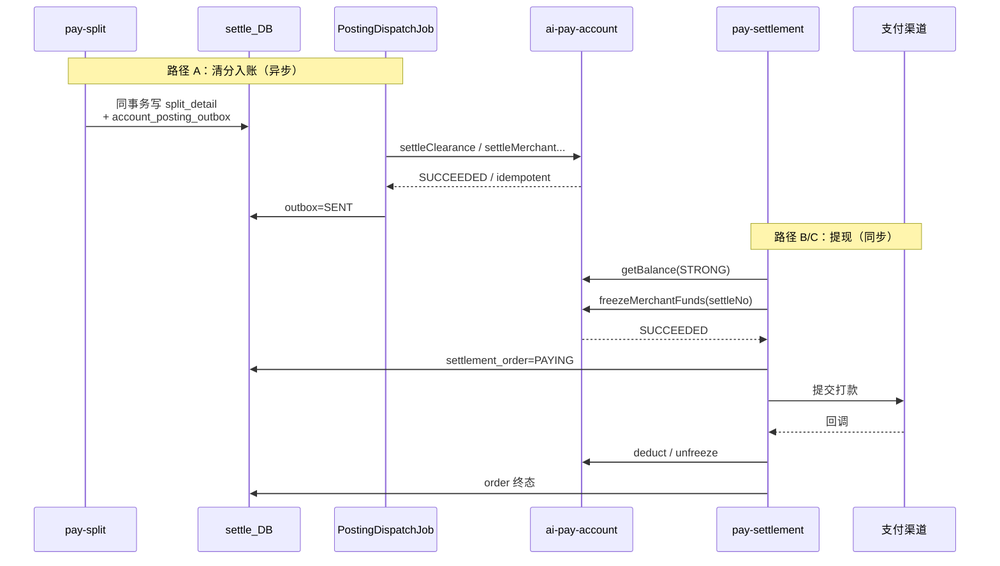

# 清算系统接入账务系统

> 版本：V1.2（残留问题补丁）  
> 日期：2026-07-24  
> 范围：`ai-pay-settle`（清算/结算）以 **Apache Dubbo 3** 消费 `ai-pay-account`（账务）  
> 状态：设计文档（先于编码落地）  
> 变更：V1.1 定方向后，补齐仍未闭合的正确性/运营缺口（见 §18）

---

## 0. 方案评审：V1.0 哪里不够优

| V1.0 做法 | 问题 | V1.1 决策 |
|-----------|------|-----------|
| 过渡期「本地中间户 + 账务」双写余额 | 两套资金真相，对账永久化；一边成功一边失败难补偿；最终仍要切源，双写是浪费 | **不做余额双写**。账务为唯一资金账；清算只保留单据/状态机 |
| 所有切点一刀切同步 Dubbo | 清分入账本就可延迟，强耦合放大账务故障面；提现冻结又必须强确认 | **按路径分级**：入账/退款走 Posting Outbox（异步）；冻结/扣减/解冻同步 + 失败关闭 |
| `creditBalance` 冲抵挂账后用「原 billNo + 剩余金额」调账务 | 首次全额失败重试、或冲抵金额变化时，易触发 `ACC-4003` 幂等冲突 | **入账金额与幂等载荷必须稳定**：挂账冲抵交给账务规则，或拆成独立 bizNo |
| `settleMerchant(amount, platformFee)` 映射含糊 | MQ 入账消息目前只有商户实收；手续费/分润未入账，总账不完整 | **清分结果整单过账**：以 `split_detail` / 计费结果驱动多主体入账（契约需扩展） |
| `MERCHANT_PAYABLE` 与 `MERCHANT_SETTLE` 混用表述 | 与账务已实现的 `pay→PAYABLE` 易重复计负债 | **明确资金生命周期**：清算入账进 `MERCHANT_SETTLE`，不复用 `pay` |
| 长期保留本地 `account_voucher` 作审计并行 | 两套凭证口径，业财核对成本高 | **账务启用后停止生成/推送本地凭证**；历史表只读归档 |
| 挂账仍主要在清算本地 | 资金 SoT 在账务时，本地挂账会再次分裂真相 | **挂账/暂挂归账务**（`220303`）；清算只记业务原因与对账线索 |

**优化后的一句话：**

> 清算只编排「业务事件与结算状态」；资金余额与复式分录只存在于账务。可延迟的入账用 Outbox 异步过账；占款/出款用同步过账且失败即停。

---

## 1. 目标

1. **编排在清算，资金在账务**：账单/计费/清分/结算单/渠道打款仍在 `ai-pay-settle`；余额与总账只在 `ai-pay-account`。  
2. **单资金真相源**：禁止两套 `wait_balance` 并行维护。  
3. **可用性分级**：清分入账可积压重试；提现冻结不可在账务未确认时出款。  
4. **幂等可追账**：`(tenantId, bizNo, bizType)` + 超时查结果；写接口 `retries=0`。

---

## 2. 系统边界（优化后）

```
┌─────────────────────────────────────────────────────────────┐
│                    ai-pay-settle（清算）                       │
│  接入 / 计费 / 清分 / 结算单 / 提现 / 渠道回调 / 对账任务      │
│                                                             │
│  ┌──────────────┐   ┌────────────────────┐                  │
│  │ 业务状态库    │   │ account_posting_   │──异步──┐         │
│  │ bill/task/   │   │ outbox（入账意图）  │        │         │
│  │ settle_order │   └────────────────────┘        │         │
│  └──────────────┘                                 │         │
│         │ 同步（冻结/扣减/解冻）                    │         │
│         └────────────────┬────────────────────────┘         │
│                          ▼                                  │
│                 AccountPostingClient（适配层）               │
└──────────────────────────┬──────────────────────────────────┘
                           │ Dubbo
                           ▼
┌─────────────────────────────────────────────────────────────┐
│                   ai-pay-account（账务）                      │
│  开户 / 过账 / 余额 / 冻结登记 / 总账 / 幂等结果查询           │
└─────────────────────────────────────────────────────────────┘
```

| 能力 | 清算 | 账务 |
|------|------|------|
| 单据与清分状态机 | ✅ | ❌ |
| 结算单 / 提现单 / 渠道交互 | ✅ | ❌ |
| 商户待结算 / 冻结余额 | ❌（不再维护） | ✅ `MERCHANT_SETTLE` / `MERCHANT_FROZEN` |
| 退款应付暂挂 | ❌（不再本地挂账为真相） | ✅ 暂挂科目/规则 |
| 复式总账 | ❌ | ✅ |
| 过账幂等 | 提供稳定 bizNo | ✅ 强制唯一键 |

**下线目标：** `merchant_settle_account.wait_balance/frozen_balance` 的资金语义、`account_flow` 资金流水、本地 `account_voucher` ERP 推送、本地 `merchant_payable_suspend` 作为资金账。

过渡期这些表可保留为只读兼容或迁移影子，**禁止继续作为扣款依据**。

---

## 3. 资金生命周期（必须先对齐）

清算平台单据通常**不经过**账务已实现的 `pay`（用户钱包→商户应付）。对接后的标准资金链：

```
通道/备付金资金到位（上游或备付金账户）
    → 清分完成：多主体负债入账（商户待结算 / 代理 / 平台手续费）
    → 提现或 T+1：MERCHANT_SETTLE → MERCHANT_FROZEN
    → 打款成功：扣减 MERCHANT_FROZEN，备付金/银行存款减少
    → 打款失败：MERCHANT_FROZEN → MERCHANT_SETTLE
```

| 阶段 | 子账（示意） | 总账（示意） |
|------|--------------|--------------|
| 清分入账（商户实收 A） | 备付金/清算过渡 DEBIT；`MERCHANT_SETTLE` CREDIT +A | `100202/224101` DR；`220302` CR |
| 清分入账（手续费 F） | `PLATFORM_FEE_INCOME` +F | `600101` CR（对侧来自商户应付拆分） |
| 冻结 W | `SETTLE` −W；`FROZEN` +W | 负债内部重分类（或不改总账总额） |
| 扣减成功 W | `FROZEN` −W | `220302` DR；`100202` CR |
| 退款扣减 R | `SETTLE` −R；不足则暂挂 | `220303` 等 |

**禁止：** 对同一笔清算账单再调 `PostingDubboService.pay`，否则与清分入账重复确认商户负债。

---

## 4. 最优对接模式：路径分级

### 4.1 分级原则

| 路径类型 | 典型动作 | 模式 | 账务不可用时 |
|----------|----------|------|--------------|
| **A. 可延迟入账** | 清分后入账、退款扣减、分润入账 | **Posting Outbox → 异步 Dubbo** | 积压重试，清算任务可先标「待过账」 |
| **B. 占款强一致** | 提现/T+1 冻结 | **同步 Dubbo，成功后再推进结算单** | **失败关闭**：不创建出款、不调渠道 |
| **C. 终态强一致** | 打款成功扣减 / 失败解冻 | **同步 Dubbo，成功后再改结算单终态** | 回调可重试；结算单保持中间态 |
| **D. 查询** | 可提现余额、控制台余额 | **`getBalance(STRONG)`**；展示可短缓存 | 查询失败明确返回，不用陈旧本地余额做冻结决策 |

### 4.2 为何不选另外两种极端

| 备选 | 否决原因 |
|------|----------|
| 长期双写本地中间户 | 一致性税太高；与「账务系统存在价值」矛盾 |
| 全部同步 Dubbo | 清分高峰把账务打成关键路径；账务抖动直接卡住整条清算管线 |
| 全部异步 MQ 到账务 | 冻结后来不及确认就出款，资金风险不可接受 |

### 4.3 目标时序



---

## 5. 过账契约映射（优化）

### 5.1 现有 API 够不够？

| 能力 | 现有契约 | 结论 |
|------|----------|------|
| 商户净额入账 + 平台手续费 | `settleMerchant(settlementAmount, platformFee)` | **可用作首期最小闭环**（仅商户+手续费） |
| 冻结/解冻/扣减 | `freeze` / `unfreeze` / `deduct` | 契约够，待账务实现 |
| 退款扣减 | `debitMerchantSettlement` | 契约够；**暂挂策略必须在账务实现** |
| 代理 L1/L2、合伙人分润 | ❌ 无多主体入参 | **P0.5 必须扩展**，否则总账长期不平 |
| 整单清分原子过账 | ❌ | **推荐新增** `postClearance(ClearancePostingCommand)` |

### 5.2 推荐契约演进（账务侧）

**首选（最优）：一笔清分一次过账**

```text
ClearancePostingCommand
  context: WriteContext          # bizNo = billNo, bizType = SETTLE_CREDIT（或新 CLEARANCE_POST）
  merchantId
  tradeAmount                    # 可选，用于平衡校验
  lines[]:
    { partyType, partyId, amount, direction }  # 与 split_detail 对齐
  platformFee                    # 可从 PLATFORM 行推导
  accountingDate
```

账务在一笔 `PostingEngine` 事务内完成：商户待结算、手续费收入、代理/合伙人应付，并校验 `Σ应付 = Σ应收`。

**次选（兼容现有 API）：按主体多次调用**

| 行 | 调用 | bizNo |
|----|------|-------|
| 商户实收 | `settleMerchant` | `{billNo}` |
| 手续费 | 含在 `settleMerchant.platformFee` **或** 独立 `FEE_INCOME` | 勿与商户净额重复计 |
| 代理/合伙人 | 扩展 API / `UnifiedPostingCommand` | `{billNo}:P{partyType}:{partyId}` |

次选缺点：多 RPC、部分成功难回滚（虽可幂等重试，但对账窗口更脏）。**有条件应推首选。**

### 5.3 与现有清算切点对照

| # | 清算事件 | 模式 | 账务调用 | BizType | bizNo |
|---|----------|------|----------|---------|-------|
| 1 | 清分完成 | A 异步 Outbox | `postClearance`（荐）或 `settleMerchant` | `SETTLE_CREDIT` | `billNo` |
| 2 | 退款清分完成 | A 异步 | `debitMerchantSettlement` / 冲销清分 | `SETTLE_DEBIT` | 退款 `billNo` |
| 3 | 申请提现 / T+1 | B 同步 | `freezeMerchantFunds` | `SETTLE_FREEZE` | `settleNo`（`freezeBizNo=settleNo`） |
| 4 | 打款成功 | C 同步 | `deductMerchantFrozenFunds` | `SETTLE_DEDUCT` | **同一 `settleNo`**（靠 bizType 区分幂等） |
| 5 | 打款失败 | C 同步 | `unfreezeMerchantFunds` | `SETTLE_UNFREEZE` | **同一 `settleNo`** |
| 6 | 商户合约生效 | 同步一次 | `openAccount` ×（SETTLE + FROZEN） | `ACCOUNT_OPEN` | `OPEN:{mid}:201` / `:202` |
| 7 | 查余额 | D | `getBalance` | — | — |
| 8 | 写超时 | — | `getByIdempotencyKey` | 原 Type | 原 bizNo |

> 幂等键含 `bizType`，因此冻结/扣减/解冻可共用 `settleNo` 作为 `bizNo`，**不必**再拼 `:DEDUCT` 后缀（V1.0 多余）。

### 5.4 `settleMerchant` 金额语义（首期必须写死）

在未上 `postClearance` 前：

```text
settlementAmount = fee_calc_result.merchantIncome   # 商户净入账，>0
platformFee      = fee_calc_result.platformFee      # 可为 0
禁止再把 tradeAmount 传给 settlementAmount
```

Outbox 载荷必须带齐字段（改造现有 `settle_amount_topic` 或另建 `account_posting_outbox`）：

```json
{
  "billNo": "CL...",
  "merchantId": 10001,
  "merchantIncome": 905.89,
  "platformFee": 6.00,
  "tradeAmount": 1000.00,
  "bizTime": "2026-07-24T12:00:00Z",
  "lines": [ "...可选，分润扩展..." ]
}
```

### 5.5 挂账：从清算挪到账务

V1.0 在 `creditBalance` 本地冲抵 `merchant_payable_suspend` 后再调账务——**删除该模式**。

优化后：

1. 退款扣减调 `debitMerchantSettlement`；余额不足由账务记暂挂并返回可识别结果（或成功记暂挂）。  
2. 后续清分入账由账务在 `settleMerchant`/`postClearance` 内**优先冲暂挂**，再增加 `MERCHANT_SETTLE`。  
3. 清算侧可保留挂账查询投影（听账务事件或对账任务），但不在本地改资金。

---

## 6. Posting Outbox（路径 A 落地）

复用清算已有 Outbox 思想，但**对象从「中间户加款」改为「账务过账意图」**。

### 6.1 表（示意）

```sql
CREATE TABLE account_posting_outbox (
  id            BIGINT PRIMARY KEY AUTO_INCREMENT,
  tenant_id     VARCHAR(64)  NOT NULL,
  biz_no        VARCHAR(128) NOT NULL,
  biz_type      VARCHAR(32)  NOT NULL,
  payload_json  JSON         NOT NULL,
  status        TINYINT      NOT NULL DEFAULT 0,  -- 0待投递 1成功 2失败
  retry_count   INT          NOT NULL DEFAULT 0,
  last_error    VARCHAR(512) NULL,
  transaction_no VARCHAR(64) NULL,
  create_time   DATETIME     NOT NULL,
  update_time   DATETIME     NOT NULL,
  UNIQUE KEY uk_posting (tenant_id, biz_no, biz_type)
);
```

写入时机：与 `split_detail` **同一本地事务**（替换或并行于原 `settle_amount_topic` outbox）。

### 6.2 投递 Job

1. 拉 `status=0` 批次。  
2. Dubbo 过账，`retries=0`。  
3. 成功 / `idempotent` → `status=1`，记 `transaction_no`。  
4. 超时 → `getByIdempotencyKey`；仍未知则留待下轮。  
5. 不可重试错误 → `status=2` + 告警。  
6. 可重试错误 → `retry_count++`，指数退避。

### 6.3 与旧 `settle_amount_topic` 关系

| 阶段 | 策略 |
|------|------|
| 接入前 | 继续 `SettleAmountConsumer` → 本地 `creditBalance` |
| 切换日 | **停写**本地余额；Outbox 改投账务；Consumer 逻辑改为 no-op 或只打日志 |
| 完成后 | 删除本地加款消费者资金语义 |

不建议「MQ 加本地余额 + 再调账务」的双写过渡。

---

## 7. 同步路径（B/C）详细约定

### 7.1 提现 / T+1

```
1. getBalance(MERCHANT_SETTLE) STRONG，校验 ≥ 提现金额与合约下限
2. 生成本地 settlement_order(status=CREATED) + settleNo   # 尚未占款
3. freezeMerchantFunds(bizNo=settleNo, freezeBizNo=settleNo, amount)
4. 成功 → order=PAYING，提交渠道
5. 失败明确 → order=FAILED，不调渠道
6. 超时 → 查幂等：
     SUCCEEDED → 按成功走 4
     无记录/FAILED → 可失败关闭或有限次同号重试
```

**禁止：** 先改本地冻结再调账务；禁止账务未成功时调用渠道。

### 7.2 渠道回调

```
SUCCESS:
  deductMerchantFrozenFunds(settleNo)
  成功 → order=SUCCESS
FAIL:
  unfreezeMerchantFunds(settleNo)
  成功 → order=FAILED
```

回调消费需幂等：订单已是终态则直接返回；账务侧同号重放返回 `idempotent`。

### 7.3 本地落单失败但账务已冻结

极少见（进程在 freeze 成功后、写库前崩溃）：

1. 定时对账：账务存在 `SETTLE_FREEZE` 成功且本地无单 / 非 PAYING → 告警。  
2. 补偿：补建本地单并继续出款，或 `unfreeze` 释放（需运营策略）。  
3. 因此 `settleNo` 必须在调 freeze **之前**已生成且尽量先落库 CREATED。

---

## 8. 科目与账户

### 8.1 以账务为准

| 含义 | 账务科目 / 账户 |
|------|-----------------|
| 备付金 | `100202` / `PLATFORM_RESERVE` |
| 商户待结算负债 | 子账 `MERCHANT_SETTLE`；总账 `220302` |
| 商户冻结 | 子账 `MERCHANT_FROZEN` |
| 暂挂 | `220303` |
| 手续费收入 | `600101` / `PLATFORM_FEE_INCOME` |
| 代理/合伙人 | 扩展 OwnerType=`AGENT`/`PARTNER` + 对应科目（待账务补齐） |

清算旧码 `1002/2203/6001/2204…` **仅历史数据**；新过账不得再写本地粗码凭证。

### 8.2 开户

商户合约生效时批量：

- `MERCHANT_SETTLE`  
- `MERCHANT_FROZEN`  

代理/合伙人在首笔分润前懒开户或合约同步开户。

---

## 9. Dubbo 工程要点（保留并收紧）

### 9.1 依赖

- `dubbo 3.3.0` + `pay-account-api`  
- 只依赖 API，不依赖 core/domain  
- 序列化 `fastjson2`；协议 `dubbo`（勿用 Gateway 的 `tri`）

### 9.2 Consumer 硬约束

```yaml
dubbo:
  application:
    name: pay-settle-consumer
  consumer:
    timeout: 3000
    retries: 0
    check: false

pay:
  account:
    enabled: true
    tenant-id: TENANT_DEMO
    url: dubbo://127.0.0.1:50051   # 无注册中心时
    posting-mode: ACCOUNT_ONLY     # 禁止 LOCAL_DUAL_WRITE
```

### 9.3 适配层 `AccountPostingClient`

统一封装：

1. `WriteContext`（`callerId=ai-pay-settle`）  
2. 超时 → 查幂等结果  
3. 错误码映射与指标（成功 / 幂等 / 可重试失败 / 未知）  
4. 熔断：路径 A 可熔断积压；路径 B/C 熔断 = 拒绝提现

---

## 10. 幂等与错误处理

### 10.1 规则

```
idempotencyKey = tenantId + bizNo + bizType
```

- 写 Dubbo `retries=0`  
- 应用重试必须同号  
- 载荷变更同号 → `ACC-4003`，人工处理  

### 10.2 错误处理

| 码 | 路径 A | 路径 B/C |
|----|--------|----------|
| ACC-4040 无账户 | 开户后重试 | 拒绝提现 |
| ACC-4091 余额不足 | 退款走暂挂 | 拒绝冻结 |
| ACC-4220 未实现 | 阻断上线 | 阻断上线 |
| ACC-5030/5031 | 退避重试 | 有限重试后失败关闭 |
| 超时 / ACC-5200 | 查幂等 | 查幂等，禁止换号 |

---

## 11. 迁移计划（取代「双写四阶段」）

### 阶段 0 — 账务能力就绪

- 实现 SETTLE_* 过账规则（至少商户入账/冻结/解冻/扣减/退款暂挂）  
- 明确 `settleMerchant` 金额语义；评估 `postClearance`  

### 阶段 1 — 清算骨架

- Dubbo Consumer + `AccountPostingClient`  
- `account_posting_outbox` + Dispatch Job  
- 开户接入  
- **影子对账（可选）**：仍走本地加款，但异步调账务只比对不切流（若要做，时间盒 ≤ 1～2 周，到期必须切）  

### 阶段 2 — 切换（推荐直接 Account-Only）

1. 冻结变更窗口：停 T+1/D0 或只读。  
2. 迁移脚本：按商户 `openAccount` + 一次性余额迁入（`ADJUST` 或批量子账户调账）。  
3. 切换开关 `posting-mode=ACCOUNT_ONLY`：  
   - 清分写 posting outbox，不再写本地余额  
   - 提现走同步冻结  
4. `queryBalance` 改读账务。  

### 阶段 3 — 收敛

- 本地资金字段只读/废弃  
- 停 `VoucherGenerator` 写入  
- 分润多主体过账上线  
- 日终：清分合计 vs 账务发生额；备付金 vs 子账合计  

**不推荐**把「双写」做成默认长期阶段。

---

## 12. 账务侧前置清单

| 优先级 | 项 |
|--------|----|
| P0 | `settleMerchant` / `freeze` / `unfreeze` / `deduct` / `debit` 真正实现 |
| P0 | 退款不足暂挂 + 后续入账冲暂挂 |
| P0 | 与清算确认 `settleMerchant` 金额语义 |
| P0.5 | `postClearance` 或多主体分润过账 |
| P1 | 商户双账户套餐开户 |
| P1 | 代理/合伙人科目与账户 |
| P2 | Nacos 注册发现 |

---

## 13. 清算侧改动清单

| 位置 | 改动 |
|------|------|
| 父 POM / `pay-app` | Dubbo 3.3.0、配置、`@EnableDubbo` |
| `pay-settlement` | `AccountPostingClient`；提现/回调改同步过账；`AccountOperator` 资金写退役 |
| `pay-split` | 同事务写 `account_posting_outbox`；停或门控 `VoucherGenerator` |
| `pay-control` | 合约生效开户 |
| `pay-domain` | outbox / posting_log schema |
| 配置 | `pay.account.posting-mode=ACCOUNT_ONLY` |

---

## 14. 联调检查清单

- [ ] 直连调通 `openAccount` / `getBalance`  
- [ ] 写接口 `retries=0`，同号二次返回 `idempotent`  
- [ ] 改金额同号 → `ACC-4003`  
- [ ] 清分：杀掉 Job 后重启，Outbox 不重账  
- [ ] 提现：账务 down 时无法出款  
- [ ] 冻结成功后杀进程，恢复后可追账/补偿  
- [ ] 回调成功/失败只导致一笔 deduct/unfreeze  
- [ ] 控制台余额与账务一致  
- [ ] 无本地 `wait_balance` 与账务并行递增  

---

## 15. 决策记录（V1.1）

1. **资金真相源**：仅 `ai-pay-account`。  
2. **不做长期余额双写**；短影子对账可选且设截止日期。  
3. **路径分级**：入账异步 Outbox；占款/出款同步失败关闭。  
4. **挂账归账务**；清算不做资金冲抵。  
5. **清分优先整单过账**；首期可用 `settleMerchant` 最小闭环，但分润扩展不延期过久。  
6. **本地凭证/中间户资金语义退役**。  
7. **幂等**：`settleNo` + 不同 `BizType` 覆盖冻结/扣减/解冻。  

---

## 16. 参考

| 资源 | 路径 |
|------|------|
| 清算总览 | `docs/整体技术文档.md` |
| 清分旧设计 | `docs/06-清分与账务详细设计.md` |
| 结算引擎 | `docs/05-结算引擎详细设计.md` |
| 账务记账方式 | `ai-pay-account/doc/记账方式.md` |
| 账务冻结模型 | `ai-pay-account/doc/ai账务系统设计.md` §6 |
| Dubbo 契约 | `ai-pay-account/pay-account-api/.../dubbo/` |

---

## 17. 下一步

1. 与账务对齐：`postClearance`（含分润）+ 备付金注资事件入口。  
2. 账务实现 SETTLE_*，并提供 T+1 候选扫描或接受清算侧候选集 + 余额校验模型。  
3. 清算：CLEARED 与过账解耦（`POSTED`）、Outbox、同步提现；切流前补齐 §18 的 P0 项。

---

## 19. 实现落地说明（2026-07-24）

代码已按本文完成首轮对接骨架，默认仍为 **LOCAL**（行为与接入前一致）。

### 已实现

| 侧 | 内容 |
|----|------|
| 账务 | `settleMerchant` / `freeze` / `unfreeze` / `deduct` / `debit` 过账规则；种子 `MERCHANT_SETTLE/FROZEN`（100001/100002）+ `PLATFORM_FEE_INCOME` |
| 清算 | Dubbo Consumer、`AccountPostingClient`、`account_posting_outbox`、`AccountPostingDispatchJob` |
| 清算 | ACCOUNT_ONLY：清分写账务 Outbox；提现/T+1/回调同步 freeze/deduct/unfreeze；余额读账务 |
| 清算 | T+1 候选改为按 `settle_mode` 扫描 + 账务 `getBalance` |

### 开启方式

```yaml
pay.account.enabled: true
pay.account.posting-mode: ACCOUNT_ONLY
pay.account.url: dubbo://127.0.0.1:50051
```

需同时启动 `ai-pay-account`（Dubbo `50051`），并将 `pay-account-api` install 到本地仓库。

### 仍未闭合（见 §18）

- `postClearance` 多主体分润、退款整单冲销  
- `ACCOUNT_POSTED` 状态、备付金注资契约  
- 代理/合伙人过账  

生产切流前务必完成 §18.5 清单。

---

## 18. 残留问题与补丁（V1.2）

> 结论先说：**V1.1 方向正确，但还不能直接按文档开工上生产。** 下列问题按严重度排列；P0 不闭合则 Account-Only 切流有资金或业务正确性风险。

### 18.1 P0 — 必须先闭合

#### （1）备付金「谁先入账」缺失

文档资金链从「通道/备付金资金到位」开始，但**没有任何上游事件**写入 `PLATFORM_RESERVE`。  
若 `settleMerchant`/`postClearance` 直接借记备付金，则：

- 备付金从未注资 → 余额不足或被透支；  
- 或账务不做备付金校验 → 子账/总账与真实资金脱节。

**补丁：** 单独定义注资/渠道入金过账（可复用/扩展 `recharge` 语义到平台备付金，或新增 `creditReserve`）。清算清分过账的前置条件是：对应资金已在备付金（或清算过渡科目）中。与支付系统的边界要写进接口契约。

#### （2）「最小闭环只记商户+手续费」会做出不平的账

代理/合伙人分润若延期到 P0.5，首期总账 **Σ负债 ≠ 交易事实**。这不是可接受的临时简化，而是**错账**。

**补丁：** `postClearance`（多主体一行过账）升为 **P0**，与 SETTLE_* 实现同批上线。不允许「只上商户入账」的资金切流。

#### （3）退款不是单边 `debitMerchantSettlement`

收款清分拆出了手续费/代理/合伙人；退款应对称冲销。仅扣商户待结算会留下收入/代理负债悬空。

**补丁：** 新增 `postClearanceReversal` / `postRefundClearance`，以原 `billNo` 或退款 `billNo` 为幂等键，按 `split_detail` 反向过账；余额不足部分走暂挂规则。

#### （4）`CLEARED` 早于账务入账（异步窗口）

当前算账在 split 同事务后即将账单标 `CLEARED`，而路径 A 入账是后续 Outbox。结果：

- 业务上「已清算」，账上「尚未到账」；  
- T+1/D0 若按清算完成态理解会误判；  
- 退款激活（原单 CLEARED 后）可能在入账未完成时就发起扣减。

**补丁：** 拆状态或加字段，例如：

```text
清分成功 = CLEARED（业务）
账务入账成功 = ACCOUNT_POSTED（资金）
可参与结算 / 可激活依赖资金的退款  ⊆ ACCOUNT_POSTED
```

Outbox 成功回调（或 Job）推进 `ACCOUNT_POSTED`。控制台与对账区分两个完成态。

#### （5）T+1 候选集断裂

现网 `runT1Batch` 依赖：

```text
merchant_settle_account.wait_balance >= 1 AND settle_mode = T1
```

Account-Only 后本地余额不再维护；账务现有 API **没有**「列出全部 MERCHANT_SETTLE 且 available≥X」的扫描接口（`listAccounts` 仅按 owner 查）。

**补丁（二选一，推荐 A）：**

- **A. 清算维护结算候选投影**：合约为 T1 的 `merchantId` 列表仍在清算；批处理时对每个商户 `getBalance`，≥阈值才 freeze（N 次查询可接受或加缓存/分段）。  
- **B. 账务提供** `listSettleCandidates(tenantId, accountType, minAvailable, cursor)`。

切流前必须选定，否则 T+1 无法跑。

#### （6）提现 `getBalance` → `freeze` 非原子

预检通过后，并发退款扣减/另一笔提现仍可能让 freeze 失败。

**补丁：** 文档写明：`getBalance` 仅 UX/批过滤；**以 `freeze` 原子成功为唯一占款依据**；失败返回明确错误，不制造半成品出款。

#### （7）切流时在途 `PAYING` 单

本地已 freeze、渠道未终态的订单，余额迁到账务时极易重复冻结或漏冻结。

**补丁：** 切流窗口要求：

1. 暂停新提现/T+1；  
2. `PAYING` 全部终态或人工落账；  
3. 再迁历史可用余额；  
4. 打开 Account-Only。  

禁止「带在途冻结单热迁」。

### 18.2 P1 — 强烈建议同期设计

| 问题 | 说明 | 补丁方向 |
|------|------|----------|
| 出款成功但 `deduct` 一直失败 | 钱已出银行，冻结未扣减，负债虚高 | 回调强重试 + 「渠道成功 vs 账务 DEDUCT」对账工单；超时人工 |
| 出款失败但 `unfreeze` 失败 | 资金卡在 FROZEN | 同理补偿 Job |
| 退款 Outbox 与提现并发 | 异步扣减滞后导致多冻/后暂挂 | 同商户入账/扣减有序；或退款改为同步过账（失败可回退账单态） |
| `Amount > 0` 约束 | `merchantIncome=0`（全额手续费）无法调 `settleMerchant` | 必须走 `postClearance`；允许净额为 0 只过手续费/分润行 |
| 会计日 / 日切 | Outbox 跨日投递时 `accountingDate` 未定义 | 清分完成时写入 `accountingDate` 进 Outbox，账务禁止自行改日 |
| 错账冲正 | 清分重算/判责后无对接冲正 API | 账务冲正能力纳入对接；清算禁止物理删分录 |
| 热点备付金 | 每笔清分打同一 `PLATFORM_RESERVE` | 账务侧分片/影子账户；清算侧控制并发与重试风暴 |
| T+1 同步 freeze 扇出 | 万级商户串行易超时 | 分段并行 + 限流；批次幂等键保留 |

### 18.3 P2 — 可知即可，勿假装已解决

- 账务 SETTLE_* / 暂挂 / `postClearance` **均未实现**（现状仍 `ACC-4220`）。  
- 无统一冲正、日切、ERP 同步的跨系统联调方案。  
- 控制台、对账下载、业财公式仍按本地中间户假设，需随 Account-Only 重做。  
- 多租户、分片键（清算 Long merchantId vs 账务 String ownerId）仅约定转换，未做冲突测试。

### 18.4 对 V1.1 决策的修正

| V1.1 原决策 | V1.2 修正 |
|-------------|-----------|
| 分润扩展 P0.5 | **升为 P0**，与切流绑定 |
| 退款 ≈ `debitMerchantSettlement` | **改为整单冲销清分** |
| CLEARED 后即可依赖资金 | **增加 ACCOUNT_POSTED** |
| T+1 自然可读账务余额 | **必须先解决候选扫描** |
| 资金链默认备付金已有钱 | **必须有注资过账契约** |

### 18.5 更新后的「可开工」定义

同时满足才允许 Account-Only 切流：

1. 备付金注资事件可测；  
2. `postClearance` + 退款冲销已实现且借贷平衡；  
3. freeze/unfreeze/deduct 已实现；  
4. 清算具备 `ACCOUNT_POSTED` 与 T+1 候选方案；  
5. 切流窗口无在途 `PAYING`；  
6. 渠道成功 vs 账务扣减对账 Job 上线。
