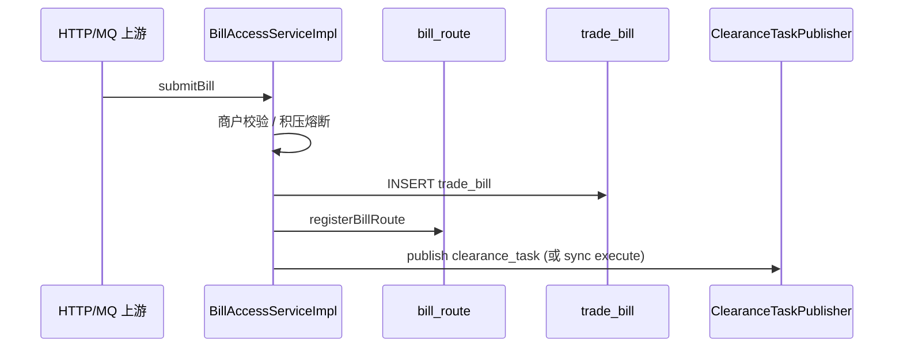

# pay-access

## 模块职责

**接入层**：对外 HTTP API + 交易/退款 MQ Consumer。负责落 `trade_bill`、注册 `bill_route`、触发清算；同时提供提现/控制台/DLQ 重放等入口。

## 主要数据流程

| 入口 | 路径 |
|------|------|
| HTTP 清算 | `POST /api/v1/clearance/bill/submit` |
| MQ 支付 | `trade_pay_topic` → `TradePayConsumer` |
| MQ 退款 | `trade_refund_topic` → `TradeRefundConsumer` |
| 结算 API | `/api/v1/settlement/**` |
| DLQ 重放 | `/api/v1/console/dlq/replay` |

补偿：

| Job | 职责 |
|-----|------|
| `ClearanceTaskCompensateJob` | PENDING 账单缺 `clearance_task` 时补建并触发；默认不对已有 PENDING 任务反复 republish（`pay.compensate.republish-pending-tasks`） |
| `BillRouteCompensateJob` | 补写缺失 `bill_route` |

## 核心内容

| 类 | 说明 |
|----|------|
| `BillAccessServiceImpl` | 接入主流程 |
| `ClearanceController` / `SettlementController` | HTTP |
| `TradePayConsumer` / `TradeRefundConsumer` | MQ |
| `ClearanceTaskCompensateJob` | 缺任务补偿（P0-3 / R6） |
| `BillRouteCompensateJob` | 路由补偿 |
| `DlqReplayService` | DLQ 重放 |

## 依赖

- 依赖：`pay-api`、`pay-domain`、`pay-calc`、`pay-control`、`pay-mq`、Web  
- 组装入口：由 `pay-app` 引入
