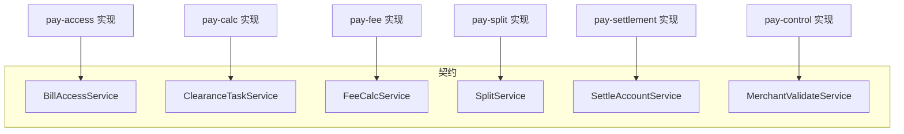

# pay-api

## 模块职责

**跨模块服务契约层**：定义 DTO 与 Service 接口，不包含实现。  
保证接入、算账、计费、清分、结算等模块通过稳定 API 协作，避免循环依赖。

## 主要数据流程

业务调用链（接口视角）：

1. `BillAccessService.submitBill` — 接入落单  
2. `ClearanceTaskService.executeTask` — 清算编排  
3. `FeeCalcService.calcShareFee` — 计费  
4. `SplitService.generateSplitDetail` — 清分 + Outbox  
5. `SettleAccountService.creditBalance` — 入账/提现/T+1  

## 核心内容

| 包 | 说明 |
|----|------|
| `api.service` | 业务服务接口 |
| `api.dto` | 请求/响应/结果 DTO |

## 依赖

- 依赖：`pay-common`
- 被依赖：`pay-access` / `pay-calc` / `pay-fee` / `pay-split` / `pay-settlement` / `pay-control` 等
