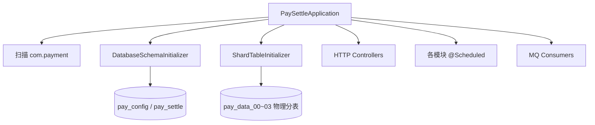

# pay-app

## 模块职责

**可运行启动模块（Spring Boot 宿主）**：聚合各业务模块依赖，加载配置/数据源/分片初始化，暴露 HTTP 与 Actuator。  
本身几乎不含业务逻辑，是部署与联调的入口。

## 主要数据流程



常用 Profile：

| Profile | 用途 |
|---------|------|
| `mysql` | 单库 `pay_settle`（config/data 同库） |
| `h2` | 内存库单测 |
| `mq` | 启用 RocketMQ |
| `sharding` | config=`pay_config`，data=ShardingSphere 16 分片 |

启动示例：

```bash
# 开发单库 + MQ
java -jar pay-app/target/pay-app-*.jar --spring.profiles.active=mysql,mq

# 分片联调（Local MQ，推荐）
java -jar pay-app/target/pay-app-*.jar --spring.profiles.active=mysql,sharding
```

## 核心内容

| 类/资源 | 说明 |
|---------|------|
| `PaySettleApplication` | 启动类 |
| `DatabaseSchemaInitializer` | 建表/种子 |
| `ShardTableInitializer` | 分片物理表 |
| `application-*.yml` / `shardingsphere.yaml` | 环境配置 |
| `db/*.sql` | Schema 与种子数据 |

## 依赖

- 聚合：`pay-access`、`pay-calc`、`pay-fee`、`pay-split`、`pay-settlement`、`pay-control`、`pay-mq` 等
