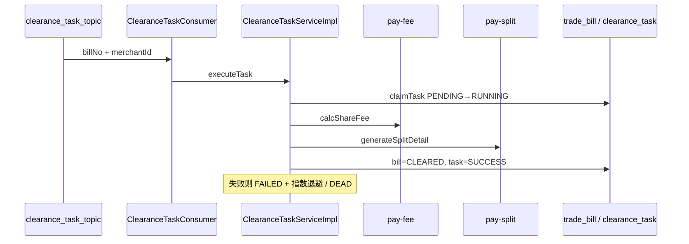

# pay-calc

## 模块职责

**清算编排（算账层）**：创建/抢占/执行 `clearance_task`，串联「商户校验 → 计费 → 清分」，维护账单与任务状态，并负责失败重试与看门狗。

## 主要数据流程

补偿：

- `ClearanceRetryJob`：按分片扫描可重试 FAILED，再发 MQ 或本地执行  
- 退款等待原单：原单成功后激活退款任务并投递 MQ  

## 核心内容

| 类 | 说明 |
|----|------|
| `ClearanceTaskServiceImpl` | 清算主流程 |
| `ClearanceTaskConsumer` | MQ 消费 |
| `ClearanceTaskPublisher` | 有序发布清算任务 |
| `ClearanceRetryJob` | 重试与超时看门狗 |

## 依赖

- 依赖：`pay-api`、`pay-domain`、`pay-fee`、`pay-split`、`pay-mq`、`pay-control`  
- 上游触发：`pay-access`（落单后 publish）
