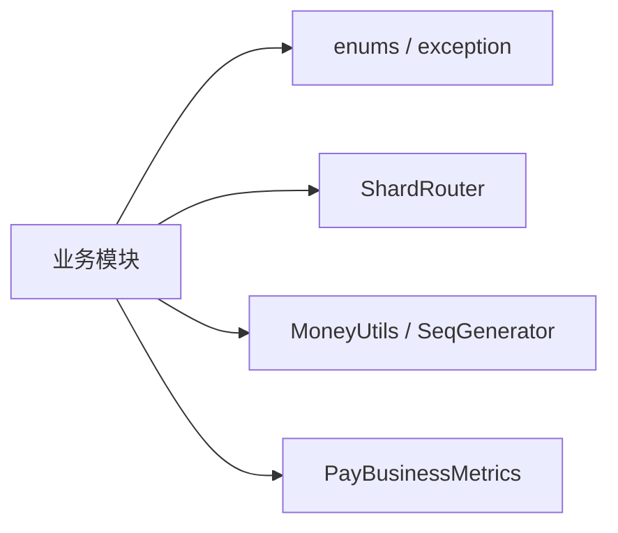

# pay-common

## 模块职责

公共基础库：枚举、异常、金额工具、分片路由常量、业务指标等横切能力。  
**无业务编排、无持久化**，供各业务模块依赖。

## 主要数据流程

本模块不承载业务流水线，仅提供被引用的类型与工具：

## 核心内容

| 包 | 说明 |
|----|------|
| `enums` | 账单状态、任务状态、结算模式、分润对象等 |
| `exception` | `BizException`、`ErrorCode` |
| `shard` | `ShardRouter`、`ShardConstants`（`merchant_id % 16`） |
| `metrics` | 业务阶段吞吐指标 |
| `util` | 金额、序列号等 |

## 依赖

- 几乎无业务依赖；可被任意模块引用
- 下游：几乎所有 `pay-*` 模块
