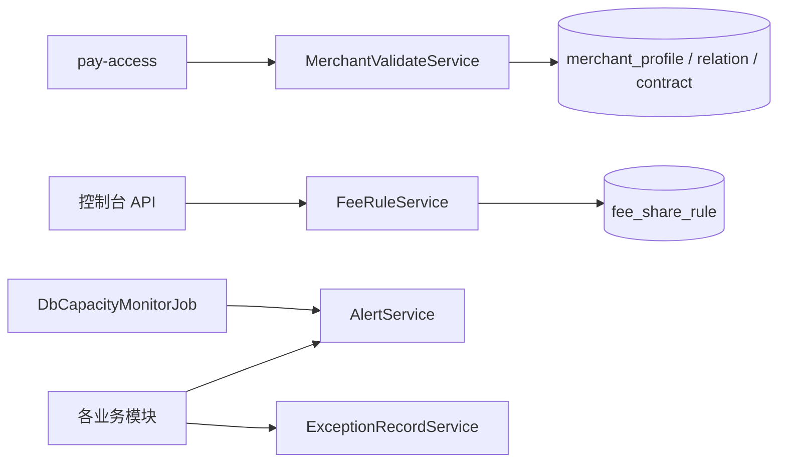

# pay-control

## 模块职责

**管控与校验横切层**：商户/单据校验、计费规则管理、告警、异常工单、库容量监控。  
不直接跑清算主链路，为接入/算账/结算提供门禁与运维能力。

## 主要数据流程

| 能力 | 说明 |
|------|------|
| 接入前校验 | 商户状态、代理关系、单据合法性 |
| 规则管理 | 写入/维护分润规则供计费使用 |
| 告警 | MQ 积压、清算 DEAD、出款失败等 |
| 工单 | 非自愈异常落 `exception_record` |

## 核心内容

| 类 | 说明 |
|----|------|
| `MerchantValidateServiceImpl` | 商户与单据校验 |
| `FeeRuleServiceImpl` | 规则提交 |
| `AlertService` | 告警 |
| `ExceptionRecordService` | 异常工单 |
| `DbCapacityMonitorJob` | 库表容量巡检 |

## 依赖

- 依赖：`pay-api`、`pay-domain`  
- 被依赖：`pay-access` / `pay-calc` / `pay-mq` / `pay-settlement` 等
