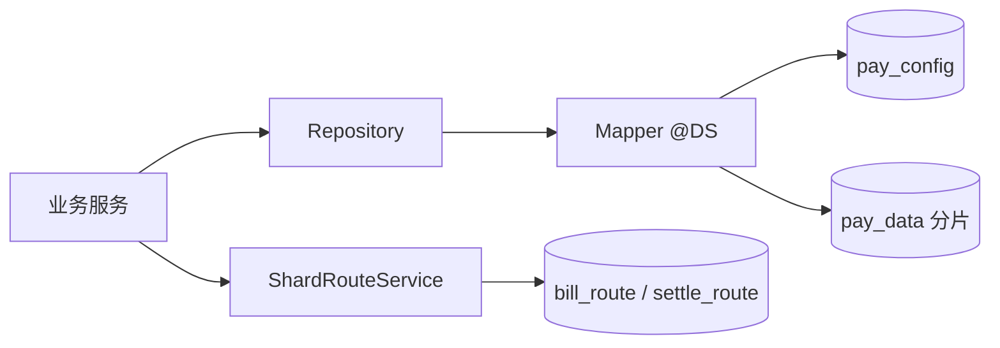

# pay-domain

## 模块职责

**领域持久化层**：Entity、Mapper、Repository、分片路由服务。  
统一访问 `pay_config`（配置/路由）与 `pay_data`（业务分片）数据源（`@DS` + 可选 ShardingSphere）。

## 主要数据流程

典型读写：

| 场景 | 路径 |
|------|------|
| 落单 | `TradeBillRepository` → data；`ShardRouteService.registerBillRoute` → config |
| 仅持 bill_no 查询 | `ShardQueryHelper` 查路由补 `merchant_id` → 精准分片 |
| 清分写库 | split / voucher / outbox 同 merchant 同分片本地事务 |
| 账户变更 | settle_account + account_flow 同分片 |

## 核心内容

| 包 | 说明 |
|----|------|
| `entity` | 表映射实体（含分片键 `merchant_id`） |
| `mapper` | MyBatis-Plus Mapper，`@DS(config\|data)` |
| `repository` | 仓储接口与实现 |
| `service.ShardRouteService` | 路由注册/查询 |
| `support` | `ShardQueryHelper`、`ShardScanSupport`、`MapperHelper` |

## 依赖

- 依赖：`pay-common`、MyBatis-Plus、dynamic-datasource  
- 被依赖：几乎全部业务模块
