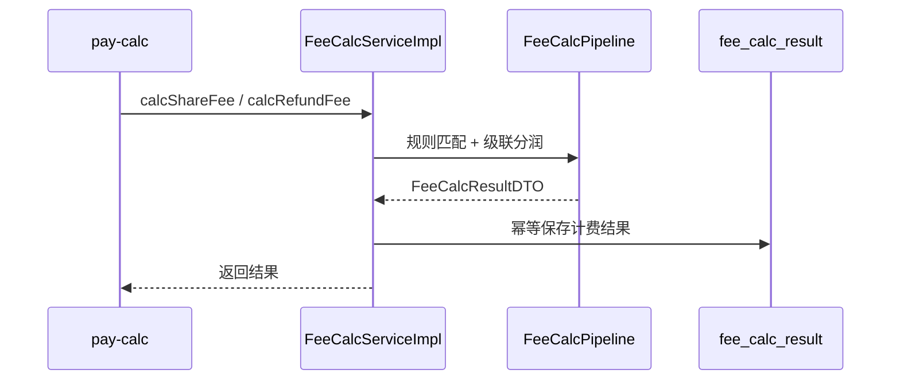

# pay-fee

## 模块职责

**计费引擎**：按商户/业务维度匹配 `fee_share_rule`，计算平台费、代理/合伙人分润与商户净收入，并幂等落库 `fee_calc_result`。

## 主要数据流程

正向：`平台 → 一级代理 → 二级代理 → 合伙人 → 商户净额`  
退款：按原单结果冲销/按比例回退。

## 核心内容

| 类 | 说明 |
|----|------|
| `FeeCalcServiceImpl` | 计费服务实现 |
| `FeeCalcPipeline` | 分润计算流水线 |
| `RuleMatcher` | 规则匹配 |

## 依赖

- 依赖：`pay-api`、`pay-domain`  
- 调用方：`pay-calc`（清算编排中同步调用）
