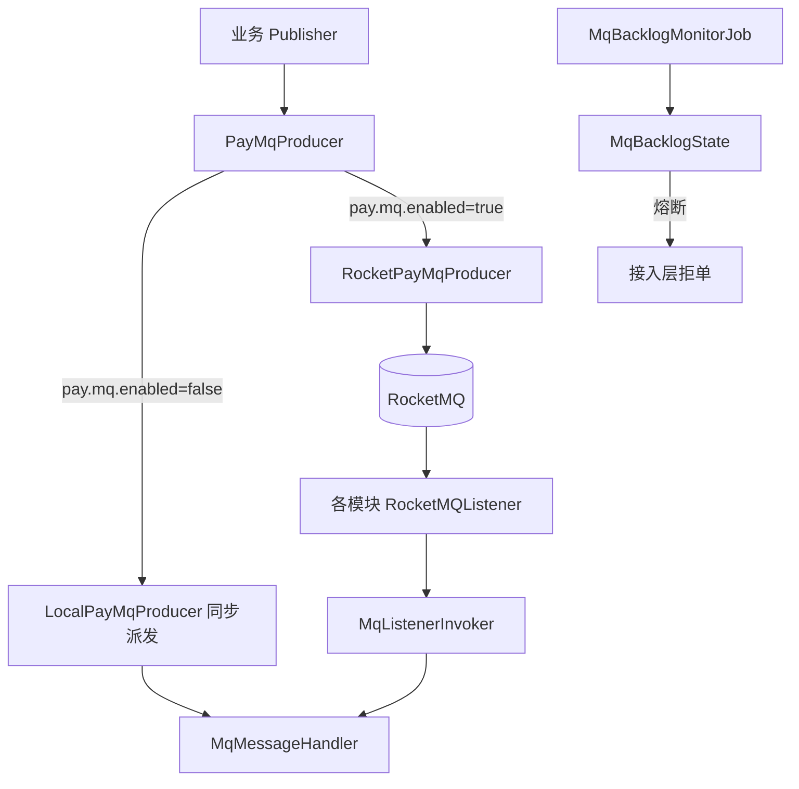

# pay-mq

## 模块职责

**消息基础设施**：Topic/Tag/ConsumerGroup 常量、统一 Producer、Local/RocketMQ 双模式、消费异常分类、积压熔断与 DLQ 巡检。

## 主要数据流程

主链路 Topic：

| Topic | 方向 | 说明 |
|-------|------|------|
| `trade_pay_topic` / `trade_refund_topic` | 入 | 交易/退款接入 |
| `clearance_task_topic` | 中 | 清算任务（按 merchant 有序） |
| `settle_amount_topic` | 中 | 清分后入账 |
| `payment_result_topic` | 入 | 出款结果回调 |

## 核心内容

| 包/类 | 说明 |
|-------|------|
| `PayMqProducer` | 发送/有序发送抽象 |
| `MqTopics` / `MqTags` / `MqConsumerGroups` | 常量 |
| `MqListenerInvoker` | 异常分类 + 消费指标 |
| `MqBacklogMonitorJob` | Outbox/Pending 积压与熔断 |
| `DlqInspectJob` | DLQ 巡检 |

## 依赖

- 依赖：`pay-common`、`pay-domain`、`pay-control`、RocketMQ Spring  
- 被依赖：`pay-access` / `pay-calc` / `pay-split` / `pay-settlement` / `pay-app`
