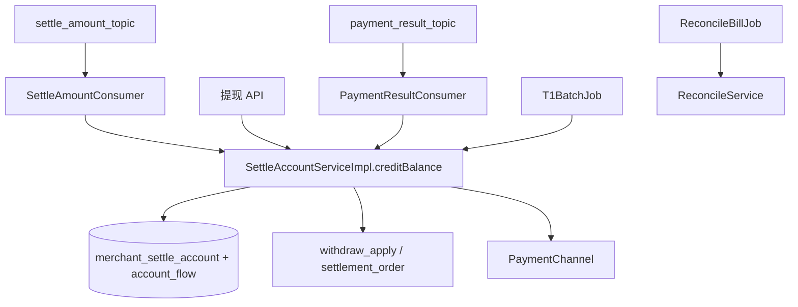

# pay-settlement

## 模块职责

**结算与资金账户**：中间户入账/出账、冻结提现、T+1 批结、支付渠道回调、日终对账。保证同一商户账户变更在同分片内串行（有序消费 + 乐观锁）。

## 主要数据流程

| 流程 | 说明 |
|------|------|
| 入账 | Outbox 消息 → 增加 `wait_balance` + 流水 |
| 提现 | 冻结合额 → 调渠道 → 回调解冻/扣减 |
| T+1 | 定时扫描可结商户批量出款 |
| 对账 | 按商户日生成对账单 |

## 核心内容

| 类 | 说明 |
|----|------|
| `SettleAccountServiceImpl` | 账户与结算服务 |
| `SettleAmountConsumer` | 入账 MQ（ORDERLY） |
| `AccountOperator` | 乐观锁余额操作 |
| `T1BatchJob` / `PaymentRetryJob` / `ReconcileBillJob` | 定时任务 |
| `MockPaymentChannel` | 本地出款桩 |

## 依赖

- 依赖：`pay-api`、`pay-domain`、`pay-mq`、`pay-control`  
- 上游：`pay-split` Outbox；HTTP 来自 `pay-access` Controller
