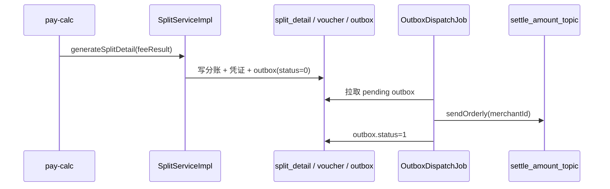

# pay-split

## 模块职责

**清分与可靠投递**：根据计费结果生成分账明细、会计凭证，写入 Outbox；由 Job 将 Outbox 投递到 `settle_amount_topic`，保证「清分落库 → 入账消息」最终一致。

## 主要数据流程

补偿 Job：

- `OutboxCompensateJob`：有分账无 Outbox 时补写  
- `SplitCompensateJob`：计费成功但分账缺失时补清分  

## 核心内容

| 类 | 说明 |
|----|------|
| `SplitServiceImpl` | 清分主实现 |
| `VoucherGenerator` | 复式凭证生成 |
| `OutboxDispatchJob` | Outbox → MQ |
| `OutboxCompensateJob` / `SplitCompensateJob` | 补偿 |

## 依赖

- 依赖：`pay-api`、`pay-domain`、`pay-mq`、`pay-control`  
- 上游：`pay-calc`；下游：`pay-settlement`（消费 settle_amount）
