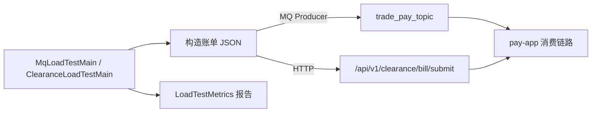

# pay-test

## 模块职责

**独立压测工具模块**：不参与运行时装配。提供 HTTP 清算灌单与 MQ `trade_pay_topic` 压测入口，输出 TPS/延迟报告。

## 主要数据流程

| 工具 | 脚本/入口 | 说明 |
|------|-----------|------|
| HTTP 压测 | `run-load-test.sh` / `ClearanceLoadTestMain` | 直连清算 API |
| MQ 压测 | `run-mq-load-test.sh` / `MqLoadTestMain` | 多 Producer + 限流 TPS |

默认示例：`NAME_SERVER=127.0.0.1:9877 CLIENTS=10 TPS=1000 ./pay-test/run-mq-load-test.sh`

## 核心内容

| 类 | 说明 |
|----|------|
| `MqLoadTestRunner` | MQ 压测执行器 |
| `ClearanceLoadTestRunner` | HTTP 压测执行器 |
| `LoadTestMetrics` | 成功率 / TPS / P99 |
| `TpsRateLimiter` | 全局限流 |

## 依赖

- 仅依赖客户端库（Jackson、RocketMQ Client 等），**不依赖**业务 jar 运行时装配  
- 目标环境：已启动的 `pay-app` +（可选）RocketMQ
